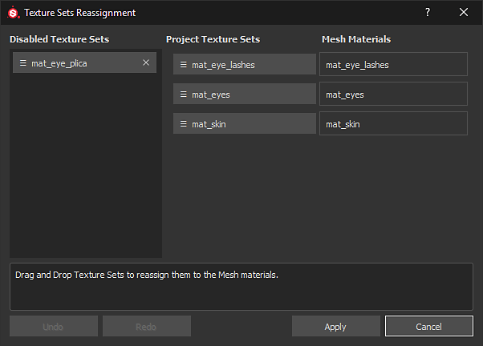
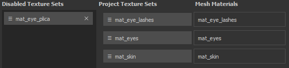

# Texture Set reassignment

The Texture Set Reassignment window allows to change the layer stack assignation to a different part of the scene mesh. This is useful for example when after importing a new mesh into an existing project where some Texture Sets become disabled. This happens because the layer stack was assigned to a Material that doesn't exist anymore. With the reassignment window it is possible to bring back that layer stack (see "Restoring Disabled Texture Sets" below).

To access the Texture Set Reassignment window go into the [Texture Set list](../../../interface/texture-set/texture-set-list/texture-set-list.md) window and choose **Settings &gt; Reassign Texture Sets**.

The window is divided in three sections :

* **Disabled Texture Sets** : List all the Texture Sets that are currently unused.
* **Project Texture Sets** : List all the Texture Sets that are currently assigned to a Mesh material.
* **Mesh Materials** : List the Mesh materials of the project.

The window has also additional button that perform the following actions :

* **Undo** : Revert back to the previous state of the window
* **Redo** : Reapply ya change that has been undone.
* **Apply** : Close the window and perform the reassignment(s).
* **Cancel** : Close the window and discard any changes that were in progress.

## Reassigning Texture Sets

Reassigning Texture Sets can be done by a simple drag and drop of the buttons.

## Restoring disabled Texture Sets

A Texture Set can be disabled when it is not associated with a Mesh Material anymore.  
This can happens when importing a new mesh into a project where the material names differ between the project and the new mesh.

To restore a Texture Set simply **swap** its position with one in the "**Project Texture Sets**" list.

## Deleting disabled Texture Sets

Clicking on the **cross** next to a Texture Set in the **Disabled Texture Sets** list will **mark it for deletion**.   
The deletion will happen when clicking on the **Apply** button at the bottom of the window.

>[!WARNING]
>
> This action is not undoable once the the window is closed with the "Apply" button.
