# Texture Set settings

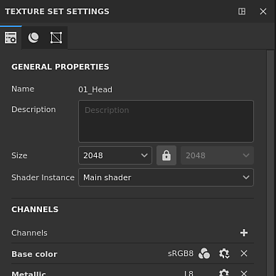{width="300px"}

The **Texture Set settings** control the parameters of the currently selected Texture Set. This is where the resolution, channels and associated mesh maps can be managed.

## General properties

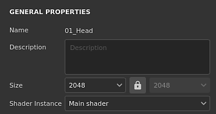

| Setting | Description |
| --- | --- |
| **Name** | Name of the Texture Set. Inherited for the material name assigned on the 3D model. |
| **Description** | Text field that allows to add information about a Texture Set. This text is displayed in the [Texture Set list](../texture-set-list/texture-set-list.md) and [Baking](../../../baking/baking.md) windows. |
| **Size** | Controls the channels resolution in pixels inside a Texture Set. To use  **non-square**  resolutions (for example 2048x1024) disable the  **lock button**  between the two dropdowns.Texture Set resolutions are  **dynamic**  because of the  **non-destructive workflow**. This means it is possible to work at a low resolution to get good performances and then use an higher resolution later to get better quality. Inside the application the maximum resolution of a channel is 4096x4096 pixels, while when exporting the maximum is instead 8192x8192 (if supported by the GPU). Changing the resolution may trigger a long computation of the engine. |
| **Shader instance** | Define which [Shader](../../shader-settings/shader-settings.md) to use to render the given Texture Set in the [viewport](../../viewport/viewport.md). |

## Channels

### Channels list

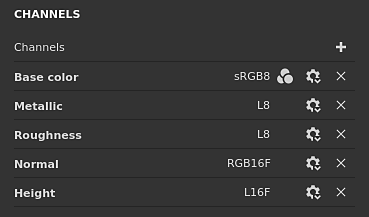

The list can be modified at any timeby adding or removing channels (unless overridden by the [ Material Layering ](../../../features/dynamic-material-layering/dynamic-material-layering.md)workflow).

| Button / Icon | Description |
| --- | --- |
| <b>Add channel</b>  

 | Click on this button to add a new channel to the list.The pop-up menu that opens is split into three categories:<ul data-preserve-html="true"><li data-preserve-html="true"><strong>Supported channels</strong>: these channels can be used by the current shader in the viewport.</li><li data-preserve-html="true"><strong>Unsupported channels</strong>: these channels are ignored by the current shader in the viewport.</li><li data-preserve-html="true"><strong>User channels</strong>: additional channels for painting more informaiton, usually unsupported by the shaders.</li></ul>  **Note:**  There is not limit in how many channels can be added, however too many channels can severely impact performances and will require more memory. |
| <b>Remove channel</b>  
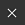
 | Remove a channel from the list.  **Note:**  The painting information inside the project is not deleted with the channel, so the channel can be added back later if needed to recover the texturing (after a recomputation). |
| <b>Channel name</b>  
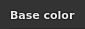
 | The name of a given channel.User channels can be renamed by double-clicking on the current name: 
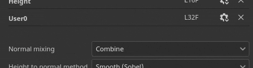
 |
| <b>Channel Settings</b>  
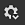
 | This button opens the channel's settings menu with several actions.The first list of action control the storage type and precision of the channel:<ul data-preserve-html="true"><li data-preserve-html="true"><strong>sRGB8</strong>: RGB colors, gamma corrected values, stored on 8bits.</li><li data-preserve-html="true"><strong>L8</strong>: Grayscale values, stored on 8bits.</li><li data-preserve-html="true"><strong>RGB8</strong>: RGB colors, stored on 8bits.</li><li data-preserve-html="true"><strong>L16</strong>: Grayscale values, stored on 16bits.</li><li data-preserve-html="true"><strong>RGB16</strong>: RGB colors, stored on 16bits.</li><li data-preserve-html="true"><strong>L16F</strong>: Grayscale values - positive and negatives, stored on 16bits floating.</li><li data-preserve-html="true"><strong>RGB16F</strong>: RGB colors - positive and negatives, stored on 16bits floating.</li><li data-preserve-html="true"><strong>L32F</strong>: Grayscale values - positive and negatives, stored on 32bits floating.</li><li data-preserve-html="true"><strong>RGB32F</strong>: RGB colors - positive and negatives, stored on 32bits floating.</li></ul>  **Note:**  The storage type  **is not**  a color space/gamma control. The data used for storing the information of a channel (for example sRGB8 or L32F) has no effect on the way the application will read them. For example the Roughness channel will still be considered as data/raw, and the Base Color will still be considered as gamma corrected.  The last action of the menu can be used to enable or disable [color management](../../../features/color-management/color-management.md) on the channel:<ul data-preserve-html="true"><li data-preserve-html="true"><strong>Color channel</strong>: if enabled, the channel is color managed. This option can only be manually modified for User channels.</li></ul> |
| <b>Color managed</b>  
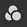
 | If present, indicates the channel is color managed. Only user channels can be marked as color managed or not, other channels behavior is fixed.For a detailed list of which channels are color managed or not, see: [Color management](../../../features/color-management/color-management.md). |

### Mixing settings

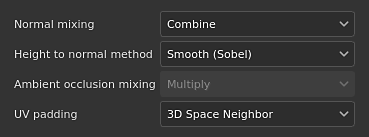

These settings control various behavior on how channels are generated, notably how channels are combined with the baked textures (mesh maps).

| Setting | Description |
| --- | --- |
| **Normal mixing** | Controls how the "baked normal map" should be combined with the "Normal" channel. Possible values are:<ul data-preserve-html="true"><li data-preserve-html="true"><strong> Replace </strong> : Ignore the "baked normal map" and will only use the "Normal" channel for this Texture Set. Can be used to paint over a baked normal map. See the [advanced channel painting](../../../painting/advanced-channel-painting/normal-map-painting/normal-map-painting.md)documentation for more information. if the Normal channel is not present or if the Normal channel output is empty the baked normal map will still be used.</li><li data-preserve-html="true"><strong> Combine </strong> (default) : Use a detail oriented function to combine the "Normal" channel and the "baked normal map".</li></ul>  **Note:**  This setting may be disabled if the channel is missing in the channels' list. If the channel is missing, the default mixing value is used. |
| **Height to normal method** | Controls which method to use to convert the height channel into a normal map. Possible values are:<ul data-preserve-html="true"><li data-preserve-html="true"><strong>Sharp</strong>: produce a more defined normal map at the risk of introducing noise and aliasing. Adapted for repeating patterns like fabrics.</li><li data-preserve-html="true"><strong>Smooth (Sobel)</strong> (default): produce a smoother normal map with a Sobel filter at the risk of losing details. Adapted for most cases.</li></ul> |
| **Ambient occlusion mixing** | Controls how the "baked ambient occlusion" should be combined with the "Ambient Occlusion" channel. Possible values are:<ul data-preserve-html="true"><li data-preserve-html="true"><strong> Replace </strong> : Ignore the  "baked ambient occlusion"  and will only use the "Ambient Occlusion" channel for this Texture Set. Can be used to paint over a baked ambient occlusion. See the  [advanced channel painting](../../../painting/advanced-channel-painting/ambient-occlusion-pai/ambient-occlusion-painting.md)  documentation for more information.  </li><li data-preserve-html="true"><strong> Multiply </strong> (default) : Use a multiply operation to combine the  "Ambient Occlusion" channel and the  "baked ambient occlusion".  </li></ul>  **Note:**  This setting may be disabled if the channel is missing in the channels' list. If the channel is missing, the default mixing value is used. |
| **UV padding** | Controls how the  [padding](https://helpx.adobe.com/substance-3d/unlisted/documentation/spdoc/padding-134643719.html) outside the UV island is generated. Possible values are:  <ul class="steps" data-preserve-html="true"> <li class="step" data-preserve-html="true">    <strong>3D Space Neighbor</strong> (default): Look at the other side of the UV seam to find the neighbor pixel color and use it at the UV border. This setting is recommend when painting across UV seams with continuous patterns. Example with regular padding at left, and the 3D Neighbor on the right:            <!-- Modal -->   </li> <li class="step" data-preserve-html="true">    <strong>2D Space Neighbor</strong>: Copy the pixel inside an UV island to the border outside the UV island before generating the padding. This settings is recommended when UV islands have very opposed information and don't overlap. Example with a sphere where bands have each a unique color per UV islands, on the left with the 2D neighbor setting setting and 3D neighbor on the right (notice the bleeding):        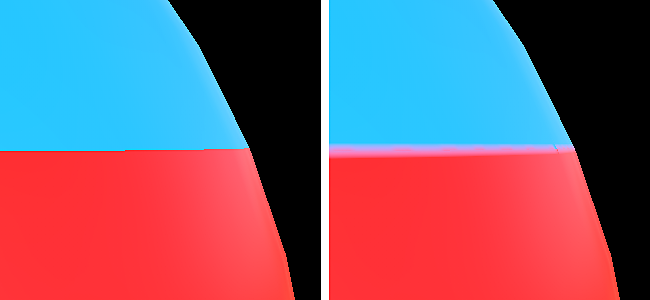    <!-- Modal -->   </li> </ul>  **Note:**  This padding setting is saved per Texture Set and taken into account during the texture export and visualization into the viewport.Because of how the the 3D space neighbor works it cannot be be used with the normal channel and will use the 2D version instead. |

## Mesh maps

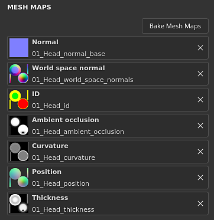

The Mesh maps are baked textures specific to the mesh and Texture Set used to augment the quality of the texturing with the help of filters, Smart Materials and Smart Masks. For more details see the [ baking ](../../../baking/baking.md)documentation.
