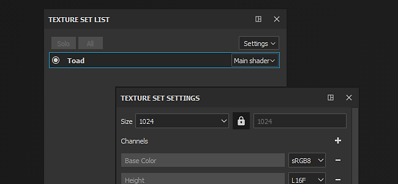

# Texture Set

Substance 3D Painter will automatically create a new Texture Set each time it finds a material ID on an imported mesh ([unless a project use the UV Tile workflow](../../features/uv-tiles/uv-tiles.md)).

Each Material ID is expected to have unique UVs (or logical overlapping for mirrored geometry).

For more details about the  **Texture Set**  properties and manipulations see:

* [Texture Set list](texture-set-list/texture-set-list.md)
* [Texture Set settings](texture-set-settings/texture-set-settings.md)
* [Texture Set reassignment](texture-set-reassignment/texture-set-reassignment.md)
