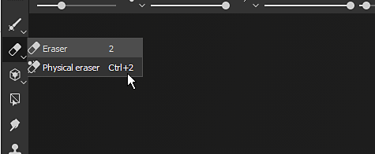
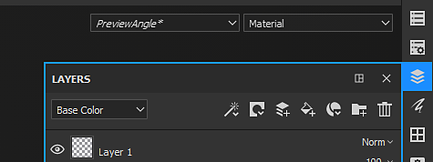
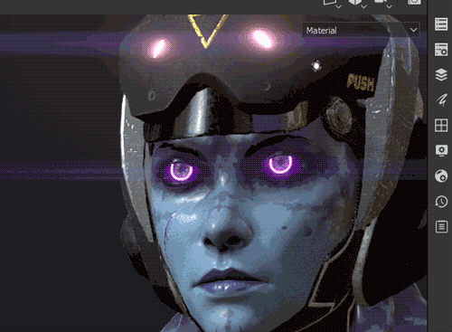
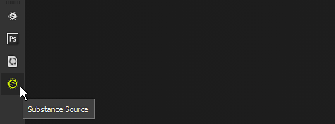
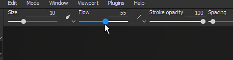

# Toolbars

This page gives a quick overview of all the toolbar available. Each of them containing different actions and settings.

Below is a list of all the available toolbars.

## Tools

{width="450px"}

The **Tools toolbar** is available by default at the top left of the main interface. It lists all of the [ painting tools ](../../help/painting/painting.md) that can be used to texture the 3D mesh of the currently open project. These tools are only accessible when a paint layer is selected.

Some tools have a second mode named "Physical" which enable particle painting. Particle painting can also be accessed by clicking on Particle brush presets in the [Assets](../../help/interface/assets/assets.md) window.

This toolbar can only be docked vertically on the left or right side of the main interface.

## Docks

{width="450px"}

The <b>Docks Toolbar</b> is available by default at the top right of the main interface. Its purpose is to offer a quick access to the dock windows to quickly open and close them.

Clicking on one of the buttons in the toolbar will display the Dock next to its button and floating above the rest of the interface, re-clicking on the button will close it. If the dock move away from its button, it becomes a regular floating window which can be docked in the interface. If closed, the button will be available again in the Dock Toolbar.

{width="450px"}

This toolbar can only be docked vertically on the left or right side of the main interface.

## Plugins

{width="450px"}

The  **Plugins Toolbar**  list the installed (and currently enabled) scripting plugins of Substance 3D Painter. To know more about plugins and their use see [Plugins](../../help/features/plugins/plugins.md).

## Contextual

{width="450px"}

The Contextual Toolbar is a toolbar for which parts of its content change depending on the current tool selected or other property being modified. The left side of the toolbar can change but the right side is fixed and list shortcuts to modify the display of the [Viewport](../../help/interface/viewport/viewport.md).

This toolbar can list properties for the following elements:

* [Painting](../../help/painting/painting.md)
* [Manipulators for Fill Layer projections](../../help/painting/fill-projections/fill-projections.md)

This toolbar cannot be moved and always sits at the top of the viewports.
