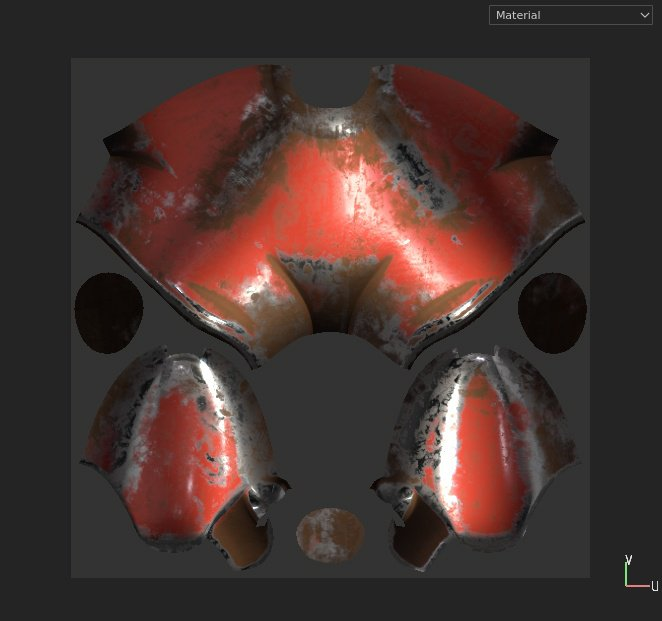
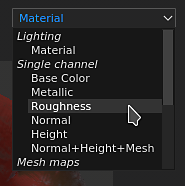
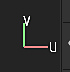
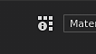
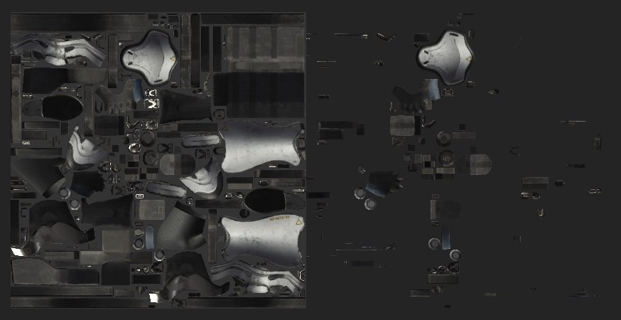
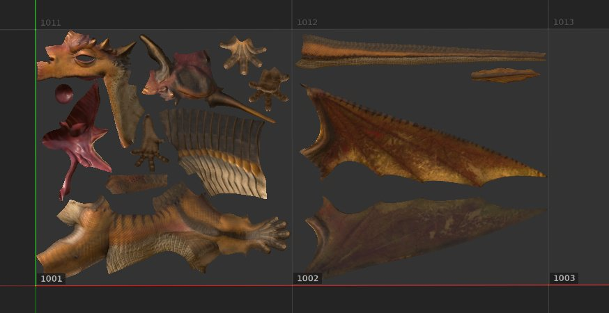

# 2D view

{width="450px"}

The 2D View displays the mesh UV islands from the currently selected [Texture Set](../../texture-set/texture-set.md). It allows to see the textures from the Layer Stack but also to paint on the mesh UV islands.

## Display Mode

At the top right of the viewport is the display mode dropdown. This control allows to change what information should be visible in the viewport. It allows to display single channels, mesh maps or the final material result with lighting.

## Axis Information

At the bottom right of the viewport is the **Axis Information**, which indicates the direction of the two dimensional axes. In the case if the 2D view the axes are U and V.

## UV Tile Information

Next to the **Display Mode** is the **UV Tile information** button which allows to show/hide information related to UV Tiles. This button is not visible with regular projects.

## Project Workflow

Depending of the workflow defined when creating a project, the 2D view may look and behave differently:

| *Project Workflow* | *Behaviors* |
| --- | --- |
| **Regular project** | With regular project, only the UV withing the UV range &#91;0-1&#93; can be painted on. Anything outside this range will be visible but won't be interactive.In this example only the UV islands on the left can be painted on (with the light gray background behind). 

 |
| **UV Tile project** | With UV Tile project, each UV range is a new set of textures, which can be painted on. The 2D view displays as well a grid to see better how each tile is organized. Each tile will have a UDIM number assigned. 

 |
