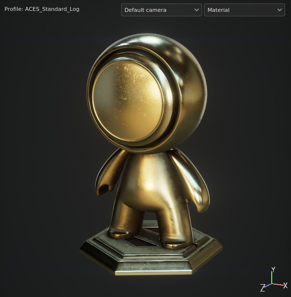
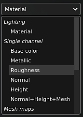
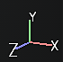

# 3D view

{width="370px"}

The 3D View shows the 3D model under lighting conditions which helps look at how the surface material is defined. This is also where it is possible to directly paint over the 3D model.

## Profile

At the top left of the viewport may appear a text indicating the currently loaded profile. For more information see the [Color Profile](../../../features/post-processing/color-profile/color-profile.md) page.

## Camera selection

If the 3D model file used to create the project or import the mesh has cameras defined, they can be imported into the project and used to change the Camera location and orientation. This dropdown allows to switch between the camera available in the project. If there is no other camera than the default, the dropdown won't be displayed.

Switched between camera can be quickly done by using the dedicated [keyboard shortcut](../../settings/shortcuts/shortcuts.md). For more information see the [Camera management](../camera-management/camera-management.md) page.

## Display mode

By default the viewport display mode is set to material to show the environment lighting. The dropdown allow to switch the display mode to solo which isolate channels and mesh maps individually.

This lighting can be controlled via the [Display settings](../../display-settings/display-settings.md) as well as other rendering settings. The lighting orientation can be changed with the help of [keyboard shortcut](../../settings/shortcuts/shortcuts.md) as well.

## Axis

At the bottom right of the viewport is the 3D view axis which indicates how the scene is oriented in comparison of the camera.

## Additional settings

The viewport display can be affected by other settings:

* [Shader settings](../../shader-settings/shader-settings.md)
* [Post Processing](../../../features/post-processing/post-processing.md)
