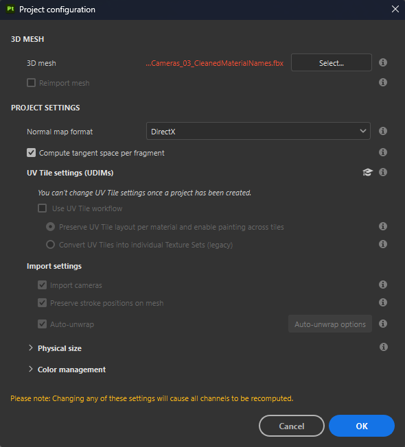
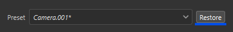

# Camera management

Cameras created in Maya, Max, Blender, Modo, and DAE can be imported into Substance 3D Painter.

>[!NOTE]
>
> Orthographic cameras and display ratios are not correctly supported in ABC (Alembic) format.

## Import cameras in Substance 3D Painter

The cameras should be included in the mesh file, either in FBX or ABC (Alembic) format.

The name, the transform parameters, the FOV, and the aspect ratio (if it exists) are imported.

In the New project window, select the mesh file that includes the cameras, and verify that the **Import Cameras** checkbox is checked. If you toggle on **Reimport mesh** in the **Edit &gt; Project configuration window**, you can also toggle on **Import cameras** if you missed them on the initial project creation.

Then click **OK**:

<table>
  <tr>
    <td></td>
    <td></td>
  </tr>
</table>

## Select Cameras

When cameras have been imported in your current project, you can select which camera is active from the **dropdown** in the **3D Viewport**.

By default, the Painter camera named "Default camera" is selected and is in perspective mode.

In the given example above, 3 cameras are imported, giving a total of 4 cameras in the dropdown when the Default camera is included.

## Control the cameras

When an imported camera is selected, moving the camera by panning, zooming, or rotating in the Viewport will switch to the Default Camera. This prevents your imported cameras from being moved in the scene.

>[!NOTE]
>
> If you need to change the imported camera position, you can update them in your chosen scene editing application and reimport the scene with **Edit &gt; Project configuration**.

You can control the parameters of the imported cameras in the **Display settings window**.

Use the **Preset** dropdown to select the camera to modify.

If any of the attributes are modified, it is possible to revert to their original values with the **Restore button**.

If a parameter has been modified for an imported camera, the camera name is italicized, and a '\*' is added to the camera name.

### Camera attributes

The Field of view or FOV is expressed in degrees.

The Focal length is expressed in mm.

In Viewport mode (OpenGL), the Focus distance and Aperture are deactivated. To activate them, Post Effects and DOF must be activated.

### Display ratio

If the display ratio is present in the mesh file, it will be displayed in the Camera section. If a camera doesn't have a defined display ratio it will be listed as **Unspecified** (like the default camera).

### Lock

A camera can be locked by clicking on the lock icon. Locking a camera prevents changes to parameters of the camera.

## Camera frame

The camera frame can be toggled in **Display Settings &gt; Viewport Settings**:

You can also adjust the opacity of the area outside the frame with the **Gate mask opacity**.

<table>
  <tr style="border: 0;">
    <td style="border: 0;" valign="top"></td>
    <td style="border: 0;" valign="top"></td>
  </tr>
</table>