# Camera management

Cameras created in the softwares Maya, Max, Blender, Modo and DAE can be imported in Substance 3D Painter.

>[!NOTE]
>
> Orthographic cameras and display ratio are not correctly supported in abc alembic format.

## Import cameras in Substance 3D Painter

The camears should be included in the mesh file either in the format fbx or abc (Alembic).

The name, the transform parameters, the FOV and the aspect ratio (if it exists) are imported.

Simply select the mesh file that includes the cameras in a New project window and verifies that the check box "Import Cameras" is checked.

Then click ok:

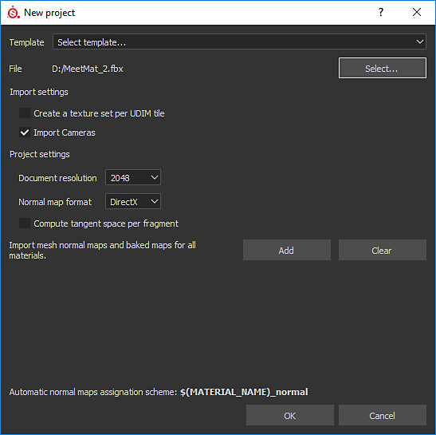

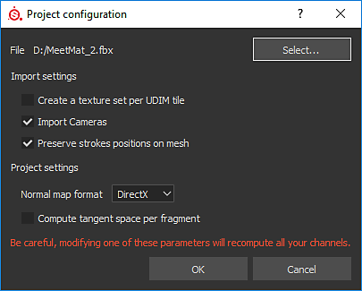

## Select Cameras

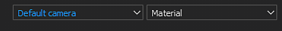

In the given example, 8 cameras are imported (5 in orthographic mode and 3 in perspective mode).

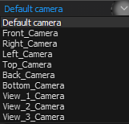

By default, the Painter camera named "Default camera" is selected and is in perspective mode.

Default camera (perspective mode):

## Control the cameras

Controlling of the cameras in the Viewport: by panning, zooming or rotating in the Viewport will have as consequence to switch to the Default camera of Substance 3D Painter.

The control of the intrinsic parameters or attributes of the cameras can be found in the window Display Settings:

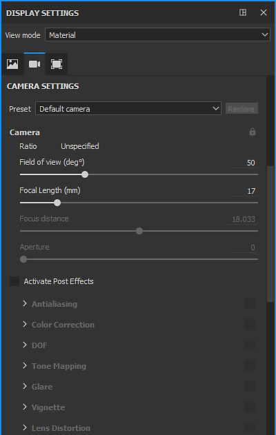

A combobox allows to select the camera and is synchronized with the combobox of the 3D Viewport:

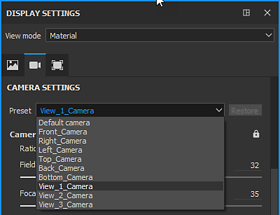

If any of the attributes is modified, it is possible to restore to their original values thanks to the "Restore button".

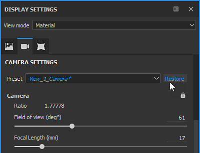

If for an imported camera, one the attributes is modified, the text of the camera name is displayed in italic and a '\*' is added to the camera name.

### Camera attributes:

The Field of view or FOV is expressed in degrees.

The Focal length is expressed in mm.

In Viewport mode (openGL) the Focus distance and Aperture are deactivated. To activate them, Post Effects and DOF must be activated.

### Display ratio:

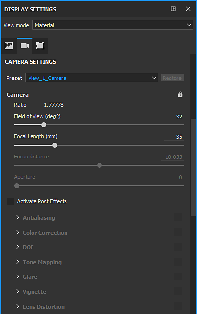

If the display ratio is present in the mesh file, it will be taken into account and display below Camera section, if not it will considered as unspecified.

### Lock:

A camera can be lock by clicking on the lock icon:

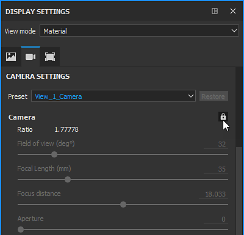

Then the attributes can not be modified and also in the viewport it is not possible to move the camera unless by unlocking the camera:

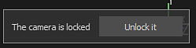

or in Display Settings &gt; Camera Settings:

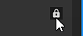

## Camera frame

The camera frame can be controlled in Display Settings &gt; Viewport Settings:

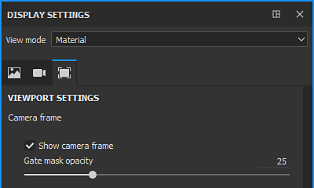

There are two controls: a checkbox and a slider:

With the checkbox: to display or not the frame in the 3D Viewport the checkbox "Show camera frame" must be checked or unchecked.

With the slider: the gate mask opacity can be modified from "0": full transparent, to "100": opaque.

<table>
<tr style="border: 0;">
<td style="border: 0;" valign="top">

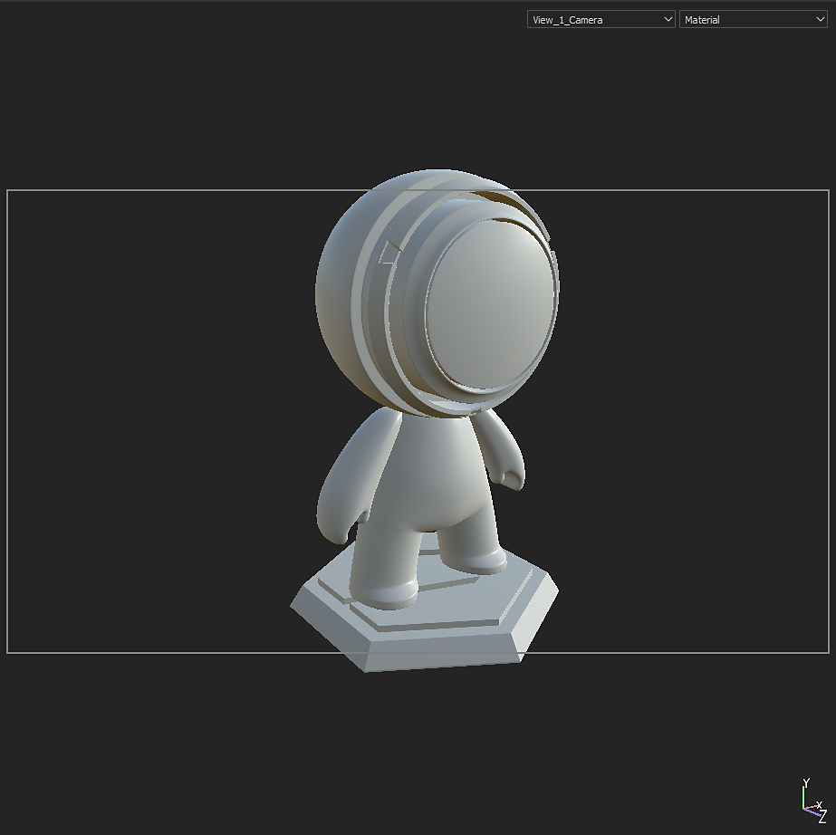

</td>
<td style="border: 0;" valign="top">

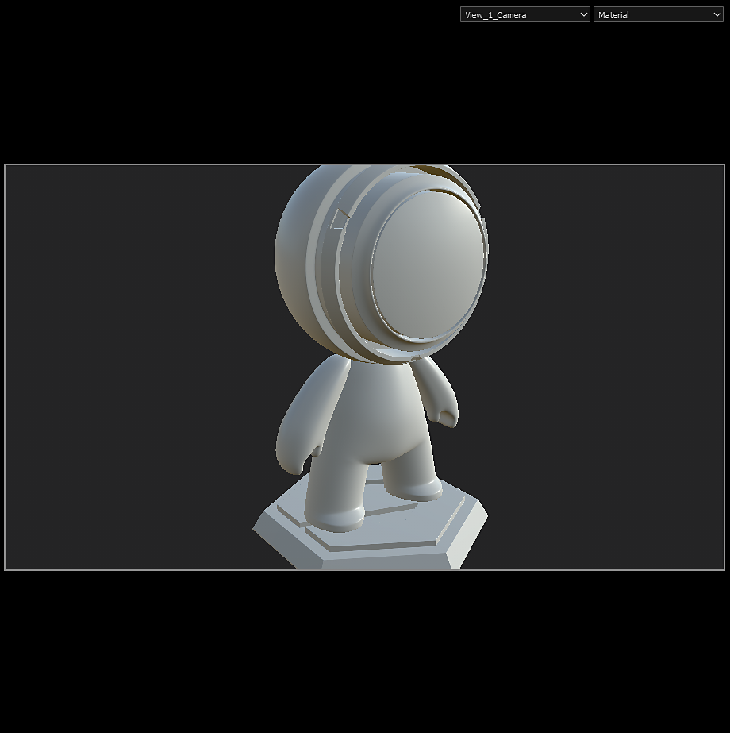

</td>
</tr>
</table>
