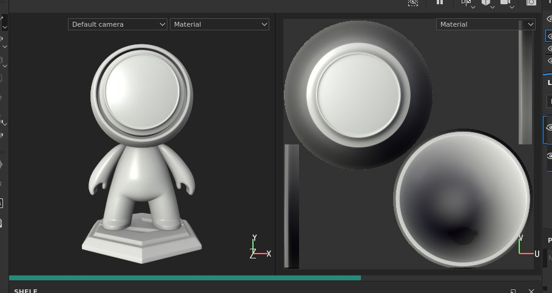
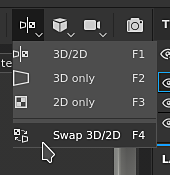
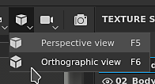
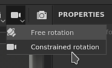
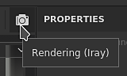

# Viewport

{width="600px"}

The viewport is where the 3D mesh and its textures are displayed. This is also where it is possible to paint on the 3D mesh surface.

## Overview

The viewport is divided into fours parts:

* **Contextual toolbar**: this toolbar sits at the top of the viewport and offer shortcut to various properties depending on the current context (brush parameters when painting for example).
* **3D view**: this view shows the 3D mesh from a specific angle, defined by a camera.
* **2D view**: this view shows UV unwrapping of the 3D mesh for the currently selected [Texture Set](../../help/interface/texture-set/texture-set-list/texture-set-list.md).
* **Progress bar**: this gray/green bar at the bottom of the viewport appears when a computation is in progress (for example when the engine is generating textures).

For more details, see the dedicated pages:

* [2D view](../../help/interface/viewport/2d-view/2d-view.md)
* [3D view](../../help/interface/viewport/3d-view/3d-view.md)
* [Camera management](../../help/interface/viewport/camera-management/camera-management.md)

The 3D and 2D views can be adjusted to display additional or different information via the [Display settings](../../help/interface/display-settings/display-settings.md).

## Changing The Layout

The default layout puts the 3D view on the left and the 2D view on the right. A few parameters are available from the **Contextual Toolbar** which allow to change the layout:

| *Setting* | *Description* |
| --- | --- |
| **Viewport Mode** 

 | These settings control the layout of the viewport:<ul data-preserve-html="true"><li data-preserve-html="true"><strong>3D/2D</strong> (default): display both the 3D and 2D views in the viewport</li><li data-preserve-html="true"><strong>3D only</strong>: maximize the 3D view and hide the 2D view.</li><li data-preserve-html="true"><strong>2D only</strong>: maximize the 2D view and hide the 3D view.</li><li data-preserve-html="true"><strong>Swap 3D/2D</strong>: exchange the order in which the views are displayed. If the 3D view was on the left it will be on the right after choosing this action.</li></ul> |
| **Perspective Mode** 

 | These setting control how the 3D mesh will appear in the 3D view:<ul data-preserve-html="true"><li data-preserve-html="true"><strong>Perspective view</strong> (default): displays the 3D mesh as it would be seen by the human eye or a camera.</li><li data-preserve-html="true"><strong>Orthographic view</strong>: displays the 3D mesh as every direction measure the same length.</li></ul> |
| **Camera Rotation Mode** 

 | This settings control on how many axes the viewport camera can rotate.<ul data-preserve-html="true"><li data-preserve-html="true"><strong>Free rotation</strong>: the camera rotate on the X, Y and Z axes.</li><li data-preserve-html="true"><strong>Constrained rotation</strong> (default): the camera rotate only on the X and Y axes (no roll).</li></ul> |
| **Rendering Mode** 

 | Switch to the [rendering mode](../../help/features/iray-renderer/iray-renderer.md). |
