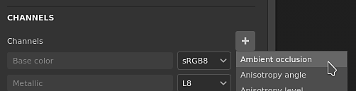
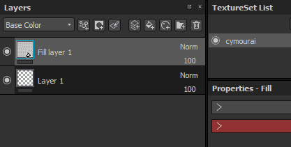
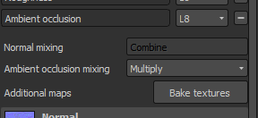
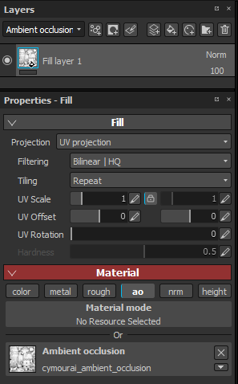
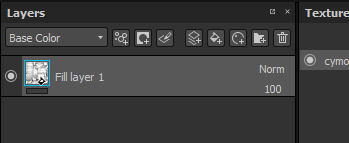
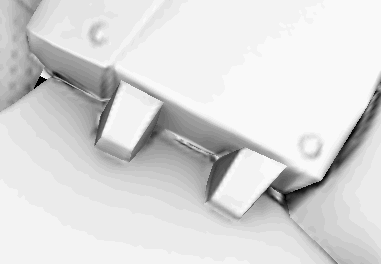

# Ambient Occlusion Painting

The ambient occlusion channel allow to paint details in the ambient shadows of an object. It can be used to add AO details coming from Materials, or simply fix manually baking errors when needed.

> 

In computer graphics, ambient occlusion is a shading and rendering technique used to calculate how exposed each point in a scene is to ambient lighting&#46; The interior of a tube is typically more occluded &#40;and hence darker&#41; than the exposed outer surfaces, and the deeper you go inside the tube, the more occluded &#40;and darker&#41; the lighting becomes&#46; Ambient occlusion can be seen as an accessibility value that is calculated for each surface point&#46;  
Source: &lt;https://en&#46;wikipedia&#46;org/wiki/Ambient&#95;occlusion&gt;

The  **result**  of this computation is stored in a bitmap named the "Ambient Occlusion" map. This map can be baked in the application directly, see: [Baking](../../../help/baking/baking.md).

## Painting Ambient Occlusion

To paint custom occlusion details, an Ambient Occlusion channel is required. It can be added via the [Texture Set settings](../../../help/interface/texture-set/texture-set-settings/texture-set-settings.md):

Once the channel has been added to a Texture Set, any layer can be used to paint new information. Since the AO channel contains only grayscale information, recommended blending mode are **Normal** (paint over) and **Multiply** (combine).

To know more about them and how to change them per channel, see: [Blending modes](../../../help/interface/layer-stack/blending-modes/blending-modes.md).

## Painting over the Ambient Occlusion additional map

In some situation, it can be useful to paint over the baked Ambient Occlusion in order to hide details or even fix baking issues.

The default setup of a project in Substance 3D Painter will combine the Ambient Occlusion  **channel**  with the Ambient Occlusion map from the  **additional maps**  . This means that painting over the baked additional map is not possible by default, the results of each maps (the baked maps and the channels) will be multiplied together. This can be changed however with the following setup :

### 1 - Add an Ambient Occlusion channel

Add an ambient occlusion channel in the current texture set :   
 

Set its mixing mode to "  **replace**  " instead of "  **multiply**  " :   
 

### 2 - Setting a fill layer with the baked ambient occlusion

Create a new fill layer and put the baked ambient occlusion inside the "ambient occlusion" slot, via the properties panel. Don't forget to change the default tilling of the fill layer if it not already set to 1.   
 

### 3 - Changing the fill layer blending mode

By default the blending mode of the AO channel on any new layer is set to "  **Multiply**  ". Since it is preferable to use the fill layer as the base, we chose the "normal" blending mode since the bitmap don't have any alpha, it will replace everything below (including the default color of the shader).   
 

### 4 - Creating a layer to paint over the baked ambient occlusion map

Create a new layer (regular or fill) and change its blending mode to "normal" for the AO channel. Once this setup is done, anything painted on the AO channel will take over the baked AO map that is on the layer below.   
 
