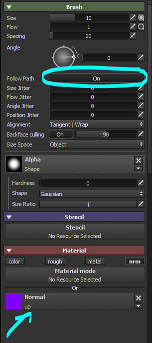
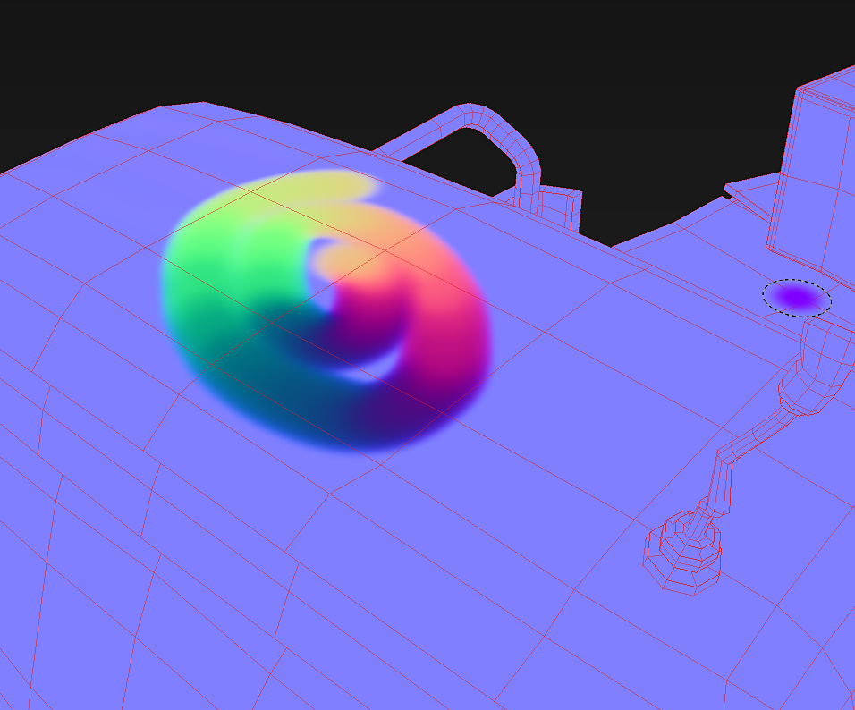

# Flow Map Painting

A dedicated channel is planned, but meanwhile by using the Normal channel and some brush parameter it is possible to paint flow maps in Substance 3D Painter.

## Step 1 : Create the normal map

Create a normal map texture of 16 by 16 pixels. The color has to be 128, 255, 128 which should give the following color :    
(This color is the equivalent of a vector looking up, in DirectX)

## Step 2 : Add normal channel

In your Substance 3D Painter project, add a  **Normal**  channel via the  **texture set settings**  if this channel doesn't already exist.

## Step 3 : Setup of the brush

Enable the follow path feature in the brush parameters. Load the normal map texture (step 1) into the normal channel slot. Disable the other channels.

{width="300px"}

## Step 4 : Paint !

By painting on the mesh with the follow path setting enabled, the brush strokes will draw directions into the normal map.

{width="700px"}
