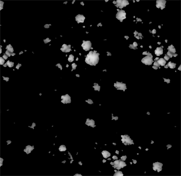
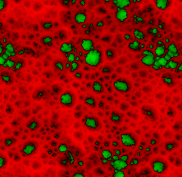

# Height Map Painting

## General Idea

Working on a heightmap instead of directly on a normal offers multiple advantages such as better quality, better control, flexibility and better consistency between assets.

The process goes as follows:

* A normal map, baked from a high poly mesh, is loaded on the low poly mesh.
* You will paint additional details on the heightmap channel.
* The Height you paint is composited through all the layers and converted to a normal map in real time, and finally blended with the normal from the high poly mesh.

All you have to worry about is painting that height, all the rest is done automatically.

### Height HDR Format

The Height channel uses an **HDR** color format, which allows to paint positive and negative values without ever reaching a limit in brightness, contrary to traditional height maps which will saturate between 0 and 255.

* When painting with a bitmap or substance on a height, that source is remapped from its original &#91;0,255&#93; range to a &#91;-1,1&#93; range.

A mid grey will be remapped to 0. Therefore, values below 127 will **substract** from the heightmap while values above 127 will **add** to it when using the default blending mode set for the height maps, **Linear Dodge (Add)**.

* When painting with plain color, you will be able to select values between -1 and 1 directly.

### Height Visualization

When visualizing the Height map in Solo mode, the default preview will only show positive values, with strong black saturation for negative values.

The **+/- color** setting allow to visualize the full range using a differetn color for the positive and negative values.

The **Scale** setting allows to modify the visible range of that HDR map in case you've added or subtracted more than the default &#91;-1,1&#93; range.

<table>
<tr style="border: 0;">
<td style="border: 0;" valign="top">

</td>
<td style="border: 0;" valign="top">

</td>
</tr>
</table>
