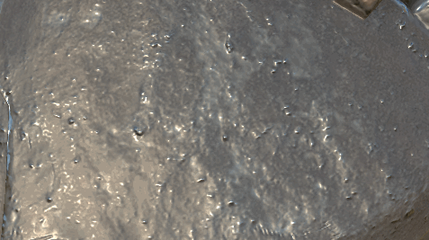
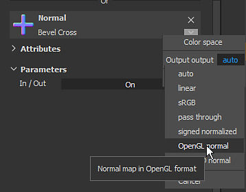
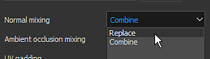
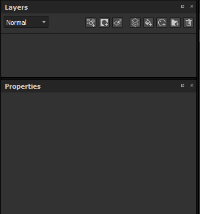
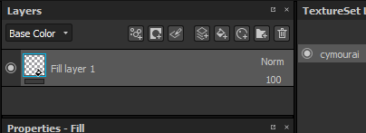
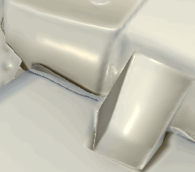

# Normal Map Painting

Painting details can be done by painting directly Normal map data directly on the mesh. This page regroups different way to manage normal map painting.

## Painting Normal Map Details

To paint normal map details:

1. Add a normal channel in the current current Texture Set (if not already present)
1. Enable the normal channel in the current painting tool
1. Load a Normal resource in the Normal slot of the Material section of the current painting tool.

From there, painting with a normal map is very similar to [Height Map Painting](../height-map-painting/height-map-painting.md) , with the added precision of a baked normal.

## Normal blending modes

Normal maps have their own blending modes in the layer stack:

* **Normal map Detail**  (default)
* **Normal map Inverse Detail**
* **Normal map Combine**

To learn about them see the [Blending modes](../../../interface/layer-stack/blending-modes/blending-modes.md) page.

## Normal Color Space

When loading a normal map into the slot of a material (tool properties or fill layer), it is possible to change the default color space.

This setting can be used to specify the Normal map format since by default a DirectX (Y-) normal map is expected (it is not affected by the project setting). Therefore when using an OpenGL (Y+) normal map, it is required to click on the little arrow to open the color space menu and then change the color space of the bitmap.

## Painting over a baked normal map

In some situations, it can be useful to be able to paint over the baked normal map in order to hide details (or even fix baking issues).   
The default setup of a project in Substance 3D Painter doesn't allow that, as it computes the normal channel and the baked normal separately. This behavior can be changed via the [Texture Set settings](../../../interface/texture-set/texture-set-settings/texture-set-settings.md) .

### 1 - Changing the Texture Set blending mode

By default a Texture Set is created with the  **normal mixing**  setting set to  **combine**  .

In order to override/paint the normal map it is important to set this setting to  **replace**  instead. The normal map will disappear from the viewport, but that is expected. Changing this mode to  **replace**  indicates to Substance 3D Painter to only take into account the normal channel and the height channel when generating the final normal map.

### 2 - Setting a fill layer with the baked normal map

Create a new fill layer and put the baked normal inside the "normal" slot, via the properties panel. Don't forget to change the default tilling of the fill layer if it not set to 1.

### 3 - Changing the fill layer blending mode

By default, the blending mode of the normal channel on any new layer is set to "Normal map details". Since it is preferable to use the fill layer as the base, we chose the "normal" blending mode since the bitmap don't have any alpha, it will replace everything below (including the default color of the shader).

### 4 - Creating a layer to paint over the baked normal map

Create a new layer (regular or fill) and change its blending mode to "normal" for the normal channel. Once this setup is done, anything painted on the normal channel will take over the baked normal map that is on the layer below.

