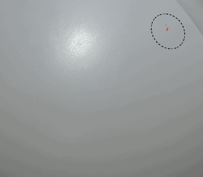

# Dynamic strokes

<table>
<tr style="border: 0;">
<td style="border: 0;" valign="top">

{width="400px"}

</td>
<td style="border: 0;" valign="top">

{width="350px"}

</td>
</tr>
</table>

**Dynamic Strokes** are regular brush strokes powered by **Substance files** that can **change** for each stamp inside a **brush stroke**.

Each individual element alongside a brush stroke can be modified based on specific behavior designed in the Substance file itself.

For further details, see the following pages :

* [Enabling Dynamic Stroke Feature](enabling-dynamic-stroke/enabling-dynamic-stroke-feature.md)
* [Dynamic Stroke Performances](dynamic-stroke-per/dynamic-stroke-performances.md)
* [Creating Custom Dynamic Strokes](creating-custom-dynamic/creating-custom-dynamic-strokes.md)
