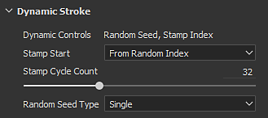

# Enabling Dynamic Stroke Feature

To enable the Dynamic Strokes feature a specific resource is required first.

## Finding Dynamic Strokes compatible resources

When browsing the [Assets](../../../interface/assets/assets.md) window, a dedicated icon at the bottom right of a thumbnail indicates the compatibility type of the resource. If there is no icon visible it means the resource can't take advantage of the feature.

| *Icon* | *Description* |
| --- | --- |
| 

 | This resource can use one or more of the following behaviors :<ul data-preserve-html="true"><li data-preserve-html="true">Stamp Index</li><li data-preserve-html="true">Time</li><li data-preserve-html="true">Random Seed</li></ul> |
| 

 | This resource only exposes the Random Seed parameter. |

It is also possible to search resources by using the search field in the Shelf with the following keywords :

* dynamicstroke
* randomseed

## Dynamic Strokes parameters

When a Dynamic Stroke resource has been loaded a new list of parameters is added just before the Substance parameter group.

| *Parameter* | *Description* |
| --- | --- |
| **Dynamic Controls** | List the parameters that are available with the Substance file currently used. |
| **Stamp Start** | Only available if the resource has the dynamic control "Stamp Index". Indicates from which value the index of the stamps inside the brush stroke should start from :<ul data-preserve-html="true"><li data-preserve-html="true"><strong>From beginning (0)</strong>: Default. Index starts from zero at each new stroke.</li> <li data-preserve-html="true"><strong>From Random Index</strong>: Index starts from a random value (with its maximum defined by the Stamp Cycle Count). Note that the following values will still be in sequence and not fully random.</li> </ul> |
| **Stamp Cycle Count** | Only available if the resource has the dynamic control "Stamp Index". This parameters controls when Substance 3D Painter should stop generating new Substance variations and start recycling the existing ones. This parameter has a big impact on performances, which you can read more about [Dynamic Stroke Performances](../dynamic-stroke-per/dynamic-stroke-performances.md). |
| **Random Seed Type** | Only available if the resource has the dynamic control "Random Seed". Controls how the Random Seed should change:<ul data-preserve-html="true"><li data-preserve-html="true"><strong>Single</strong>: Default. Use a single Random Seed value which can be manually set via the Substance parameters.</li> <li data-preserve-html="true"><strong>Random Per Stroke</strong>: Generates a new Random Seed value for each new brush stroke.</li> <li data-preserve-html="true"><strong>Random Per Stamp</strong>: Generates a new Random Seed value for each stamp inside a brush stroke. <em><strong>Be careful with parameter as it can be very expensive</strong>.</em></li> </ul> |
| **Time** | The time dynamic control doesn't have any parameter. Time is driven by how long the painting of a brush stroke is. |

## List of compatible Tools

The Dynamic Stroke settings are only available with the following Tools and contexts :

| *Tool Type* | *Compatible Resource Slot* |
| --- | --- |
| **Paint** | <ul data-preserve-html="true"><li data-preserve-html="true">Alpha</li><li data-preserve-html="true">Material</li></ul> |
| **Eraser** | <ul data-preserve-html="true"><li data-preserve-html="true">Alpha</li><li data-preserve-html="true">Material</li></ul> |
| **Projection** | <ul data-preserve-html="true"><li data-preserve-html="true">Alpha</li></ul> |
| **Smudge** | <ul data-preserve-html="true"><li data-preserve-html="true">Alpha</li></ul> |
| **Clone** | <ul data-preserve-html="true"><li data-preserve-html="true">Alpha</li></ul> |

>[!NOTE]
>
> Dynamic Strokes are not compatible with  **Particles**  , which is why the feature is disabled when using any Tool in Physics mode.
