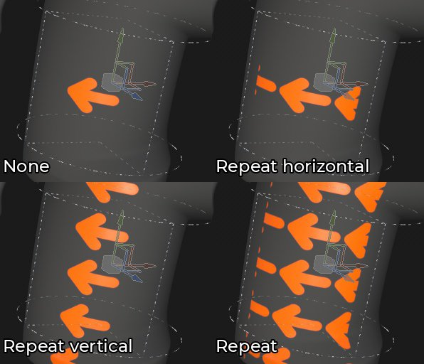
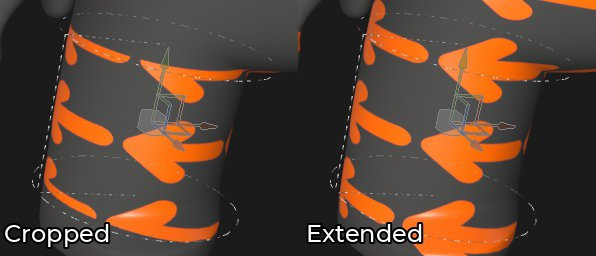
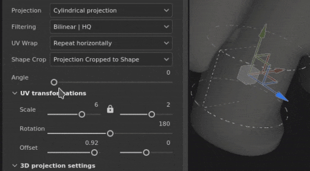
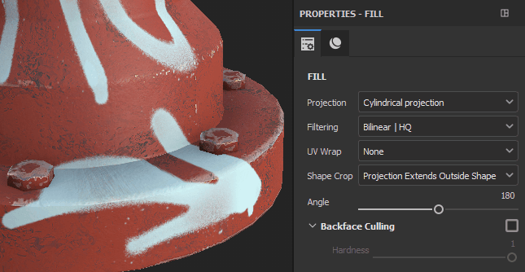
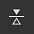
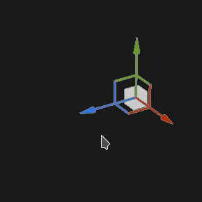
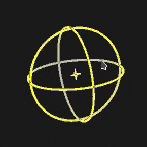
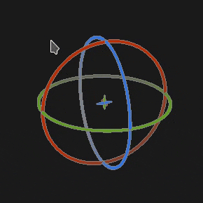

# Cylindrical projection

The Cylindrical projection of the fill allows to project images and patterns around an object. It can be useful to fit pillars or columns as well as organic shapes like arms.

## Properties

| Setting | Description |
| --- | --- |
| **Filtering** | Controls how the texture or material will be filtered. This setting can impact how the texture looks when repeated multiple times. With high scaling values using a different filtering than the default may produce better looking result. Current settings available:<ul data-preserve-html="true"><li data-preserve-html="true"><strong>Bilinear &#124; HQ</strong> (default): Advanced bilinear filtering that tries to improve the quality of the texture when the tiling values are high.</li><li data-preserve-html="true"><strong>Bilinear &#124; Sharp</strong>: Simple bilinear filtering that smooths the texture slightly but try to preserve details.</li><li data-preserve-html="true"><strong>Nearest</strong>: No filtering, useful if the Bilinear filtering gives a blurry result and breaks fine details. Can introduce aliasing in the texture.</li></ul> |
| **UV wrap** | Control how the texture repeats within the projection. Possible values are:<ul data-preserve-html="true"><li data-preserve-html="true"><strong>None</strong>: the texture doesn't repeat. Anything outside the texture is black/transparent.</li><li data-preserve-html="true"><strong>Repeat horizontally</strong>: the texture only repeats horizontally.</li><li data-preserve-html="true"><strong>Repeat vertically</strong>: the texture only repeats vertically.</li><li data-preserve-html="true"><strong>Repeat</strong> (default): the texture repeats on both axes.</li></ul> 

 **Note:**  In the image above, the angle setting is set to 90, limiting how far the projection applies. |
| **Shape crop** | Define if the projected texture should be visible outside of the projection area. Possible values are:<ul data-preserve-html="true"><li data-preserve-html="true"><strong>Project cropped to shape</strong>: the projection is confined within the projection area.</li><li data-preserve-html="true"><strong>Projection extends outside shape</strong> (default): the projection continues beyond the projection area.</li></ul> 

 |
| **Angle** | Control the size of projection on the perimeter of the cylinder. 

 |
| **Backface Culling** | Enabling Backface Culling allows to cull projection at a perpendicular angle to the cylinder. The Hardness slider defines how soft the projection is at intermediate angles (which are not a full 90 degrees). 

 |

### UV transformation

The UV transformation settings control the texture/material within the projection.

<table data-preserve-html="true" style="width: 100.0%;"><colgroup> <col style="width: 40.0%;"/> <col style="width: 20.0%;"/> <col style="width: 40.0%;"/> </colgroup><tbody><tr><th>Scale mode</th><th>Setting</th><th>Description</th></tr><tr><td>
<strong>Tiling</strong> (default)<strong>  </strong>

Allows to manually set the repeating amount for the current texture.
</td><td><strong>Tiling</strong></td><td>Controls the number of times the texture is repeated.</td></tr><tr><td rowspan="2">  </td><td colspan="1"><strong>Rotation</strong></td><td colspan="1">Controls the angle at which the texture is projected onto the mesh.</td></tr><tr><td colspan="1"><strong>Offset</strong></td><td colspan="1">Controls from where the texture will be projected. Default value means the texture center is at the center of the mesh's UVs.</td></tr><tr><th colspan="1"> </th><th colspan="1"> </th><th colspan="1"> </th></tr><tr><td rowspan="4">
<strong>Physical Size</strong>

Automatic adjustment of a texture according to the mesh size and embedded physical size. It uses width and length (X and Y measurements) to calculate the correct physical size. Z measurement is not taken into account.

(For more information see the dedicated [documentation page](https://helpx.adobe.com/substance-3d-painter/features/physical-size.html))
</td><td><strong>Custom Size</strong></td><td>
If enabled, allows to enter a physical size manually and override the one provided by an asset.

It is automatically selected if no physical size is detected or if multiple assets with different physical sizes are used within the same layer/effect.
</td></tr><tr><td colspan="1"><strong>Size (cm)</strong></td><td colspan="1">Embedded physical sizes are expressed in centimeters. It is possible to work with a mesh file that was created using different units of measurement - it will retain correct proportions. However asset size is currently displayed in centimeters only.</td></tr><tr><td colspan="1"><strong>Rotation</strong></td><td colspan="1">Controls the angle at which the texture is projected onto the mesh.</td></tr><tr><td colspan="1"><strong>Offset</strong></td><td colspan="1">
Controls from where the texture will be projected. Default value means the texture center is at the center of the mesh's UVs.
</td></tr></tbody></table>

### 3D projection settings

The 3D projection settings control the transformation of the projection in 3D space.

| Setting | Description |
| --- | --- |
| **Offset** | Position of the origin of the projection in 3D space. The units are based on the bounding box of the whole scene. 0 is the center of this box. |
| **Rotation** | Angles in degrees to rotate the whole projection on each axes. |
| **Scale** | Size of the whole projection on each axes. |

## Contextual Toolbar

Several settings and tools are available from the [Contextual toolbar](../../../interface/toolbars/toolbars.md) sitting at the top of the viewport which give controls over the manipulator and the projection:

| Icon | Name | Description |
| --- | --- | --- |
| 

 | Show/Hide manipulator | If enabled, the manipulator is visible and controllable in the viewport. |
| 

 | Manipulator settings | This menu contains three settings:<ul data-preserve-html="true"><li data-preserve-html="true"><strong>Manipulator size</strong>: control how big the manipulator is in the viewport.</li><li data-preserve-html="true"><strong>Grid steps</strong>: define the size of the step when translating with a constraint.</li><li data-preserve-html="true"><strong>Angle steps</strong>: define the angle of the step when rotating with a constraint.</li></ul> |
| 

 | Translation manipulator | Allow to move the projection in the scene along the main axes (X, Y, Z). |
| 

 | Rotation manipulator | Allow to rotate the projection in the scene along the main axes (X, Y, Z). |
| 

 | Scale manipulator | Allow to scale the projection in the scene along the main axes (X, Y, Z). |
| 

 | Surface manipulator | Allow to move the projection by snapping it on the 3D model surface.  **Note:**  This manipulator is only available with the Planar and Warp projection types. |
| 

 | Manipulator space | Define in which space the transformation are performed. Possible values are:<ul data-preserve-html="true"><li data-preserve-html="true"><strong>Local space</strong>: axes are aligned with the current transformation.</li><li data-preserve-html="true"><strong>World space</strong>: axes are aligned with scene.</li></ul> |
| 

 | Mirror on X | Flip the transformation on the X axis. |
| 

 | Mirror on Y | Flip the transformation on the Y axis. |
| 

 | Mirror on Z | Flip the transformation on the Z axis. |
| 

 | Reset transformation | Restore the projection transformation back to its default state. |

## Manipulator

This projection manipulator is only available in the [3D viewport](../../../interface/viewport/3d-view/3d-view.md).

| Action | Shortcut | Description |
| --- | --- | --- |
| **Translation** | Mouse click | With the Translation manipulator, clicking on the axes move the projection:<ul data-preserve-html="true"><li data-preserve-html="true"><strong>One axis</strong>: only move in one direction the projection.</li><li data-preserve-html="true"><strong>Two axes</strong>: move the projection on the plans aligned with the axes.</li><li data-preserve-html="true"><strong>Three axes</strong>: move the projection in the space of the camera (plan facing it).</li></ul>   <table> <tr style="border: 0;"> <td style="border: 0;" valign="top">  

  </td> <td style="border: 0;" valign="top">  

  </td> <td style="border: 0;" valign="top">  

  </td> </tr> </table> |
| **Translation constrained** | SHIFT+Mouse click | With the Translation manipulator, move the projection along the selected axes but only at specific intervals (stepping). The size of the interval is defined via the manipulator settings. 

 |
| **Rotation** | Mouse click | With the Rotation manipulator, clicking on one axes rotate the projection. Click in-between the axes allow to rotate all the axes at the same time.   <table> <tr style="border: 0;"> <td style="border: 0;" valign="top">  

  </td> <td style="border: 0;" valign="top">  

  </td> </tr> </table> |
| **Rotation constrained** | SHIFT+Mouse click | With the Rotation manipulator, clicking on one axis to rotate the projection will only happen at specific intervals. The step is defined by an angle via the manipulator settings. 

 |
| **Scale** | Mouse click | With the Scale manipulator, clicking on one axis handle resize the projection along the given axis.   <table> <tr style="border: 0;"> <td style="border: 0;" valign="top">  

  </td> <td style="border: 0;" valign="top">  

  </td> <td style="border: 0;" valign="top">  

  </td> </tr> </table> |
| **Scale constrained** | SHIFT+Mouse click | With the Scale manipulator, clicking on one axis handle while maintaining the shortcut will resize the projection in steps. The step size is the same as for the Translation manipulator. 

 |
| **Surface** | Mouse click | With the Surface manipulator, clicking and dragging it over the 3D model will snap it on the surface. 

 **Note:**  This manipulator is only available with the **Planar** and **Warp** projection types. |
