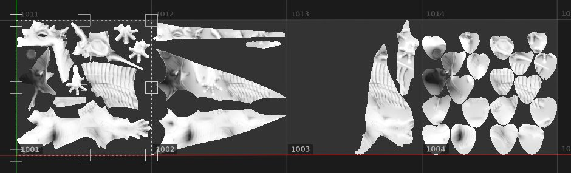
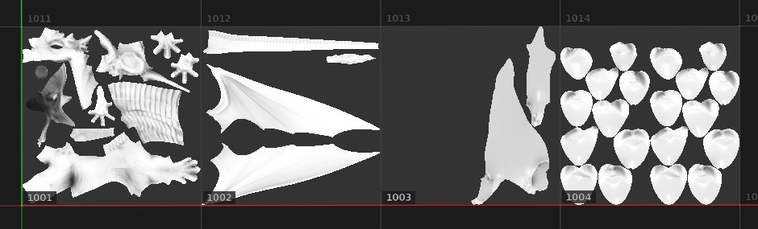

# Fill (match per UV Tile)

The **Fill (match per UV Tile)** is a special 2D projection that is useful for [UV Tile](../../../features/uv-tiles/uv-tiles.md) projects. It allows to assign a UDIM texture from a sequence for each UV Tile.

This projection doesn't have any dedicated settings, as a single image or more are assigned to fill each UV Tile. Since there are no settings, this mode is also better for performance.

| Mode | Description |
| --- | --- |
| **UV projection** | A single image or the first image from a sequence is applied to all UV tiles. This also give deformation controls, see [UV projection](../uv-projection/uv-projection.md) for more details. 

 |
| **Fill (match per UV Tile)** | Each image from a sequence is assigned to the dedicated UV Tile. There is no deformation controls. 

 |
