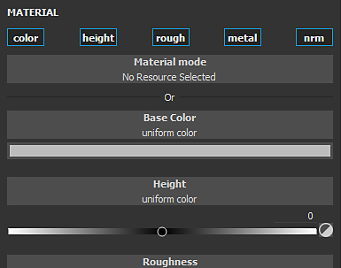

# Fill projections

Fill layer and fill effects project a texture directly onto the mesh based on a specific mode. This type of layer/effect avoid to manually paint textures on the 3D model. The settings of the projection can be edited via the Properties window.

The properties are divided in two categories: **Fill properties** and **Material**.

## Fill properties

The Fill properties controls how the Material is applied and/or projected onto the mesh. The projection mode can be changed via the **Projection** dropdown in the [Properties](../../interface/properties/properties.md) window.

The current projection modes available are:

* [Fill (match per UV Tile)](../../painting/fill-projections/fill-match-per-uv-tile/fill-match-per-uv-tile.md)
* [UV projection](../../painting/fill-projections/uv-projection/uv-projection.md)
* [Tri-planar projection](../../painting/fill-projections/tri-planar-projection/tri-planar-projection.md)
* [Planar projection](../../painting/fill-projections/planar-projection/planar-projection.md)
* [Spherical projection](../../painting/fill-projections/spherical-projection/spherical-projection.md)
* [Cylindrical projection](../../painting/fill-projections/cylindrical-projection/cylindrical-projection.md)
* [Warp projection](../../painting/fill-projections/warp-projection/warp-projection.md)

## Material (and grayscale)

The Material / Grayscale controls are identical to the other tools. See the [Paint tool documentation](../../painting/tool-list/paint-brush/paint-brush.md) for more details.
