# UV projection

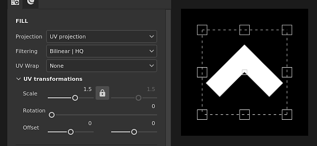

The UV Projection of the fill is a 2D Projection that only works in the 2D texture space. It offers controls to move, rotate and scale an image.

## Properties

| *Setting* | *Description* |
| --- | --- |
| **Filtering** | Controls how the texture or material will be filtered. This settings can impact what the texture looks like when repeated multiple times. With high scaling values, using a different filtering method than the default may produce better looking result. Currently available settings:<ul data-preserve-html="true"><li data-preserve-html="true"><strong>Bilinear &#124; HQ </strong>: (default) Advanced bilinear filtering which tries to improve the quality of the texture when tiling values are high.</li><li data-preserve-html="true"><strong>Bilinear &#124; Sharp </strong>: Simple bilinear filtering that smooths the texture slightly but tries to preserve details.</li><li data-preserve-html="true"><strong>Nearest </strong>: No filtering, useful if the Bilinear filtering gives a blurry result and breaks fine details. Can introduce aliasing in the texture.</li></ul> |
| **UV Wrap** | Controls how the Material / Image projected should repeat inside the projection shape. Possible values are:<ul data-preserve-html="true"><li data-preserve-html="true"><strong>None</strong> : There is no repetition of the projection.</li><li data-preserve-html="true"><strong>Repeat horizontally</strong> : Repeat only horizontally.</li><li data-preserve-html="true"><strong>Repeat vertically</strong> : Repeat only vertically.</li><li data-preserve-html="true"><strong>Repeat</strong> (default) : Repeat both horizontally and vertically.</li></ul> 
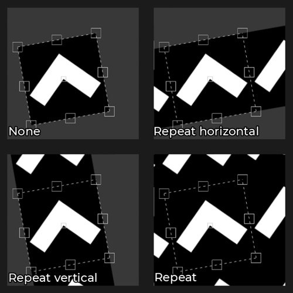
 |

### UV transformation

The UV transformation settings control the texture/material within the projection.

<table data-preserve-html="true" style="width: 100.0%;"><colgroup> <col style="width: 40.0%;"/> <col style="width: 20.0%;"/> <col style="width: 40.0%;"/> </colgroup><tbody><tr><th>Scale mode</th><th>Setting</th><th>Description</th></tr><tr><td>
<strong>Tiling</strong> (default)<strong>  </strong>

Allows to manually set the repeating amount for the current texture.
</td><td><strong>Tiling</strong></td><td>Controls the number of times the texture is repeated.</td></tr><tr><td rowspan="2">  </td><td colspan="1"><strong>Rotation</strong></td><td colspan="1">Controls the angle at which the texture is projected onto the mesh.</td></tr><tr><td colspan="1"><strong>Offset</strong></td><td colspan="1">Controls from where the texture will be projected. Default value means the texture center is at the center of the mesh's UVs.</td></tr><tr><th colspan="1"> </th><th colspan="1"> </th><th colspan="1"> </th></tr><tr><td rowspan="4">
<strong>Physical Size</strong>

Automatic adjustment of a texture according to the mesh size and embedded physical size. It uses width and length (X and Y measurements) to calculate the correct physical size. Z measurement is not taken into account.

(For more information see the dedicated [documentation page](https://helpx.adobe.com/substance-3d-painter/features/physical-size.html))
</td><td><strong>Custom Size</strong></td><td>
If enabled, allows to enter a physical size manually and override the one provided by an asset.

It is automatically selected if no physical size is detected or if multiple assets with different physical sizes are used within the same layer/effect.
</td></tr><tr><td colspan="1"><strong>Size (cm)</strong></td><td colspan="1">Embedded physical sizes are expressed in centimeters. It is possible to work with a mesh file that was created using different units of measurement - it will retain correct proportions. However asset size is currently displayed in centimeters only.</td></tr><tr><td colspan="1"><strong>Rotation</strong></td><td colspan="1">Controls the angle at which the texture is projected onto the mesh.</td></tr><tr><td colspan="1"><strong>Offset</strong></td><td colspan="1">
Controls from where the texture will be projected. Default value means the texture center is at the center of the mesh's UVs.
</td></tr></tbody></table>

## Contextual Toolbar

Several settings and tools are available from the [Contextual toolbar](../../../interface/toolbars/toolbars.md) sitting at the top of the viewport which give control over the manipulator and the projection:

| Icon | Name | Description |
| --- | --- | --- |
| 

 | Show/Hide manipulator | If enabled, the manipulator is visible and controllable in the viewport. |
| 
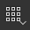
 | Manipulator handles size | This menu contains three settings that define how big the handles of the transform are in the viewport:<ul data-preserve-html="true"><li data-preserve-html="true"><strong>Small</strong></li><li data-preserve-html="true"><strong>Medium</strong></li><li data-preserve-html="true"><strong>Large</strong></li></ul> |
| 

 | Mirror on X | Flip the transformation on the X axis. |
| 

 | Mirror on Y | Flip the transformation on the Y axis. |
| 

 | Reset pivot point | Restore the pivot point back to the middle of the transformation. |
| 

 | Reset transformation | Restore the projection transformation back to its default state. |

## Manipulator

The UV Projection uses a manipulator that is only available in the [2D view](../../../interface/viewport/2d-view/2d-view.md).

| Action | Shortcut | Description |
| --- | --- | --- |
| **Translate** | Mouse click | Click and drag any area inside the transformation to move it. 
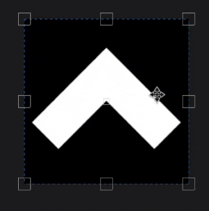
 |
| **Translate constrained** | SHIFT+Mouse click | Click and drag any area inside the transformation while pressing and maintaining the shortcut to move it only along one axis. The axis can be either horizontal or vertical and aligned with the camera, it is based on the mouse direction. 
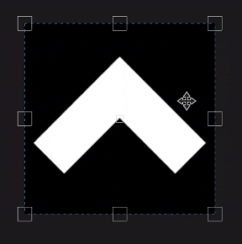
 |
| **Rotation** | Mouse click | Clicking and dragging from outside of the transformation allows to rotate it. Moving the pivot also allows to change the rotation origin point.   <table> <tr style="border: 0;"> <td style="border: 0;" valign="top">  
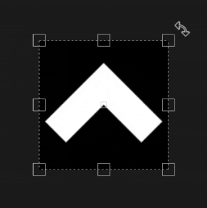
  </td> <td style="border: 0;" valign="top">  
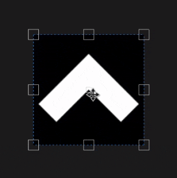
  </td> </tr> </table> |
| **Rotation constrained** | SHIFT+Mouse click | Clicking and dragging from outside of the transformation while pressing and maintaining the shortcut allows to rotate it only every 45 degrees. 
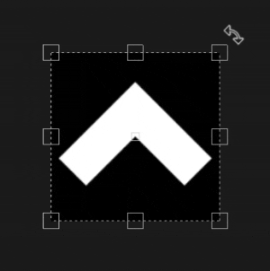
 |
| **Scale** | Mouse click | Clicking and dragging any handles of the manipulator allows to deform the transformation.   <table> <tr style="border: 0;"> <td style="border: 0;" valign="top">  
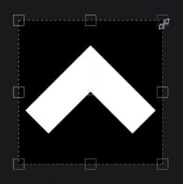
  </td> <td style="border: 0;" valign="top">  
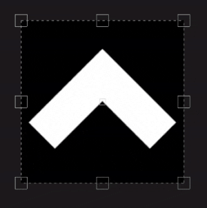
  </td> </tr> </table> |
| **Scale constrained** | SHIFT+Mouse click | By pressing and maintaining the shortcut while dragging an handle, the transformation is forced to keep its ratio.   <table> <tr style="border: 0;"> <td style="border: 0;" valign="top">  
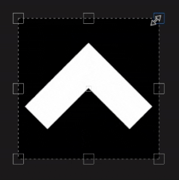
  </td> <td style="border: 0;" valign="top">  
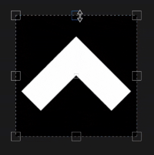
  </td> </tr> </table> |
| **Scale mirrored** | CTRL+Mouse click | When moving any handle while pressing the shortcut, the other handles will perform a similar movement. It allows to deform the transformation in symmetry around the pivot point.   <table> <tr style="border: 0;"> <td style="border: 0;" valign="top">  
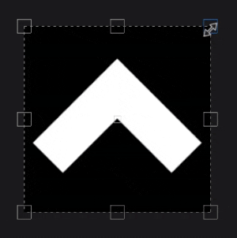
  </td> <td style="border: 0;" valign="top">  
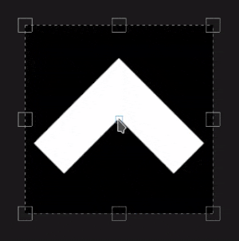
  </td> </tr> </table> |
| **Scale mirrored and constrained** | SHIFT+CTRL+Mouse click | Combining both shortcuts allow to deform the transformation in symmetry while preserving the aspect ratio. 
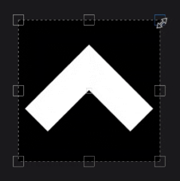
 |
