# Warp projection

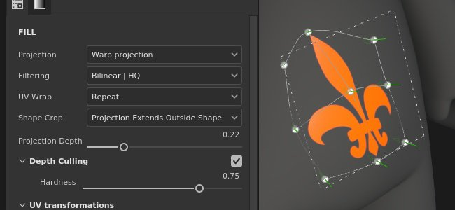

The Warp projection of the fill is a 3D projection that allows to deform a texture by editing points of a grid. It can be used to fit patterns and logo on a non-planar surface.

## Quick setup

It is possible to quickly setup a layer with the warp projection by drag and dropping a resource from the [Assets window](../../../interface/assets/assets.md) onto the mesh. When releasing the mouse a menu will open allowing to choose in which channel the resource should be assigned.

Compatible resource types are:

* **Alpha**
* **Procedural**
* **Texture**
* **Material** (requires pressing the ALT key)

## Properties

| Setting | Description |
| --- | --- |
| **Filtering** | Controls how the texture or material will be filtered. This setting can impact how the texture looks when repeated multiple times. With high scaling values using a different filtering than the default may produce better looking result. Current settings available:<ul data-preserve-html="true"><li data-preserve-html="true"><strong>Bilinear &#124; HQ</strong> (default): Advanced bilinear filtering that tries to improve the quality of the texture when the tiling values are high.</li><li data-preserve-html="true"><strong>Bilinear &#124; Sharp</strong>: Simple bilinear filtering that smooths the texture slightly but try to preserve details.</li><li data-preserve-html="true"><strong>Nearest</strong>: No filtering, useful if the Bilinear filtering gives a blurry result and breaks fine details. Can introduce aliasing in the texture.</li></ul> |
| **UV wrap** | Control how the texture repeats within the projection. Possible values are:<ul data-preserve-html="true"><li data-preserve-html="true"><strong>None</strong>: the texture doesn't repeat. Anything outside the texture is black/transparent.</li><li data-preserve-html="true"><strong>Repeat horizontally</strong>: the texture only repeats horizontally.</li><li data-preserve-html="true"><strong>Repeat vertically</strong>: the texture only repeats vertically.</li><li data-preserve-html="true"><strong>Repeat</strong> (default): the texture repeats on both axes.</li></ul> |
| **Shape crop** | Define if the projected texture should be visible outside of the projection area. Possible values are:<ul data-preserve-html="true"><li data-preserve-html="true"><strong>Project cropped to shape</strong>: the projection is confined within the projection area.</li><li data-preserve-html="true"><strong>Projection extends outside shape</strong> (default): the projection continues beyond the projection area.</li></ul> 
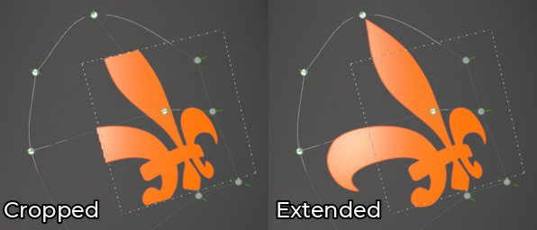
 |
| **Projection depth** | Control how far the projection goes along its Z axis. This setting helps reaching the mesh surface when the grid point or the projection plane is too far away.The green arrows indicate the direction and distance of the projection for each points of the grid. 
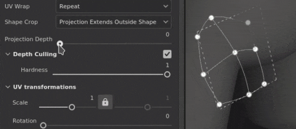
 **Alert:** A high value can severely impact performance. It is recommended to keep this parameter low as much as possible. |
| **Depth culling** | Fade the projection based on the distance. One parameter is available:<ul data-preserve-html="true"><li data-preserve-html="true"><strong>Hardness</strong>: control how hard or soft the fading transition is.</li></ul> 
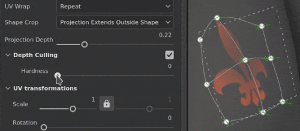
 |

### UV transformation

The UV transformation settings control the texture/material within the projection.

<table data-preserve-html="true" style="width: 100.0%;"><colgroup> <col style="width: 40.0%;"/> <col style="width: 20.0%;"/> <col style="width: 40.0%;"/> </colgroup><tbody><tr><th>Scale mode</th><th>Setting</th><th>Description</th></tr><tr><td>
<strong>Tiling</strong> (default)<strong>  </strong>

Allows to manually set the repeating amount for the current texture.
</td><td><strong>Tiling</strong></td><td>Controls the number of times the texture is repeated.</td></tr><tr><td rowspan="2">  </td><td colspan="1"><strong>Rotation</strong></td><td colspan="1">Controls the angle at which the texture is projected onto the mesh.</td></tr><tr><td colspan="1"><strong>Offset</strong></td><td colspan="1">Controls from where the texture will be projected. Default value means the texture center is at the center of the mesh's UVs.</td></tr><tr><th colspan="1"> </th><th colspan="1"> </th><th colspan="1"> </th></tr><tr><td rowspan="4">
<strong>Physical Size</strong>

Automatic adjustment of a texture according to the mesh size and embedded physical size. It uses width and length (X and Y measurements) to calculate the correct physical size. Z measurement is not taken into account.

(For more information see the dedicated [documentation page](https://helpx.adobe.com/substance-3d-painter/features/physical-size.html))
</td><td><strong>Custom Size</strong></td><td>
If enabled, allows to enter a physical size manually and override the one provided by an asset.

It is automatically selected if no physical size is detected or if multiple assets with different physical sizes are used within the same layer/effect.
</td></tr><tr><td colspan="1"><strong>Size (cm)</strong></td><td colspan="1">Embedded physical sizes are expressed in centimeters. It is possible to work with a mesh file that was created using different units of measurement - it will retain correct proportions. However asset size is currently displayed in centimeters only.</td></tr><tr><td colspan="1"><strong>Rotation</strong></td><td colspan="1">Controls the angle at which the texture is projected onto the mesh.</td></tr><tr><td colspan="1"><strong>Offset</strong></td><td colspan="1">
Controls from where the texture will be projected. Default value means the texture center is at the center of the mesh's UVs.
</td></tr></tbody></table>

### 3D projection settings

The 3D projection settings control the transformation of the projection in 3D space.

| Setting | Description |
| --- | --- |
| **Offset** | Position of the origin of the projection in 3D space. The units are based on the bounding box of the whole scene. 0 is the center of this box. |
| **Rotation** | Angles in degrees to rotate the whole projection on each axes. |
| **Scale** | Size of the whole projection on each axes. |

## Contextual Toolbar

Several settings and tools are available from the [Contextual toolbar](../../../interface/toolbars/toolbars.md) sitting at the top of the viewport which give controls over the manipulator and the projection:

| Icon | Name | Description |
| --- | --- | --- |
| 

 | Show/Hide manipulator | If enabled, the manipulator is visible and controllable in the viewport to edit the projection transformation or the grid points. If disabled, both the manipulator and the grid are hidden. |
| 

 | Manipulator settings | This menu contains three settings:<ul data-preserve-html="true"><li data-preserve-html="true"><strong>Manipulator size</strong>: control how big the manipulator is in the viewport.</li><li data-preserve-html="true"><strong>Grid steps</strong>: define the size of the step when translating with a constraint.</li><li data-preserve-html="true"><strong>Angle steps</strong>: define the angle of the step when rotating with a constraint.</li></ul> |
| 

 | Warp edition menu | This menu contains five actions:<ul data-preserve-html="true"><li data-preserve-html="true"><strong>Transform warp</strong>: edit the warp transformation. Allow to manipulate the global grid position, rotation and scale.</li><li data-preserve-html="true"><strong>Edit vertices</strong>: edit the warp grid points individually (or in group).</li><li data-preserve-html="true"><strong>Split warp crosswise</strong>: start the split warp tool to insert a new grid division both horizontally and vertically.</li><li data-preserve-html="true"><strong>Split warp horizontally</strong>: start the split warp tool to insert a new grid division horizontally.</li><li data-preserve-html="true"><strong>Split warp vertically</strong>: start the split warp tool to insert a new grid division vertically.</li></ul> |
| 

 | Warp projection settings | This menu regroups settings that affect only the current warp projection:<ul data-preserve-html="true"><li data-preserve-html="true"><strong>Row and columns</strong>: specify the number of divisions that the warp grid has. This setting can only be edited if no points of the grid have been modified.</li><li data-preserve-html="true"><strong>Handle size</strong>: define the size of the grid points in <strong>Edit vertices</strong> mode.</li><li data-preserve-html="true"><strong>Grid color</strong>: define the color of the warp grid lines.</li></ul> |
| 

 | Automatic tangents | If enabled, align the tangents of a point automatically toward its neighbors points when moved. |
| 

 | Translation manipulator | Allow to move the projection or the grid points along the main axes (X, Y, Z). |
| 

 | Rotation manipulator | Allow to rotate the projection or the grid points in the along the main axes (X, Y, Z). |
| 

 | Scale manipulator | Allow to scale the projection in the scene along the main axes (X, Y, Z). |
| 

 | Surface manipulator | Allow to move the projection or the grid points by snapping them on the 3D model surface. |
| 
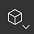
 | Manipulator space | Define in which space the transformations are performed. Possible values:<ul data-preserve-html="true"><li data-preserve-html="true"><strong>Local space</strong>: axes are aligned with the current transformation.</li><li data-preserve-html="true"><strong>World space</strong>: axes are aligned with scene.</li></ul> |
| 

 | Mirror on X | Flip the transformation on the X axis. |
| 

 | Mirror on Y | Flip the transformation on the Y axis. |
| 

 | Mirror on Z | Flip the transformation on the Z axis. |
| 

 | Reset transformation | This menu contains three actions:<ul data-preserve-html="true"><li data-preserve-html="true"><strong>Restore the global transformation</strong>: reset the position, rotation and scale of the projection back to the initial values. This action doesn't affect the grid points themselves.</li><li data-preserve-html="true"><strong>Reset all vertices</strong>: reset all the position and tangents of the grid points of the warp grid.</li><li data-preserve-html="true"><strong>Reset selected vertices</strong>: reset the position and tangents of only the selected points of the warp grid.</li></ul> |

## Manipulator

This projection manipulator is only available in the [3D viewport](../../../interface/viewport/3d-view/3d-view.md).

| Action | Shortcut | Description |
| --- | --- | --- |
| **Translation** | Mouse click | With the Translation manipulator, clicking on the axes move the projection:<ul data-preserve-html="true"><li data-preserve-html="true"><strong>One axis</strong>: only move in one direction the projection.</li><li data-preserve-html="true"><strong>Two axes</strong>: move the projection on the plans aligned with the axes.</li><li data-preserve-html="true"><strong>Three axes</strong>: move the projection in the space of the camera (plan facing it).</li></ul>   <table> <tr style="border: 0;"> <td style="border: 0;" valign="top">  

  </td> <td style="border: 0;" valign="top">  

  </td> <td style="border: 0;" valign="top">  
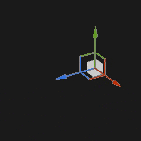
  </td> </tr> </table> |
| **Translation constrained** | SHIFT+Mouse click | With the Translation manipulator, move the projection along the selected axes but only at specific intervals (stepping). The size of the interval is defined via the manipulator settings. 

 |
| **Rotation** | Mouse click | With the Rotation manipulator, clicking on one axes rotate the projection. Click in-between the axes allow to rotate all the axes at the same time.   <table> <tr style="border: 0;"> <td style="border: 0;" valign="top">  
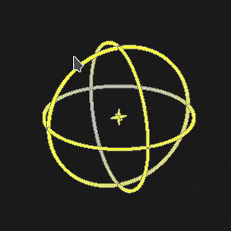
  </td> <td style="border: 0;" valign="top">  

  </td> </tr> </table> |
| **Rotation constrained** | SHIFT+Mouse click | With the Rotation manipulator, clicking on one axis to rotate the projection will only happen at specific intervals. The step is defined by an angle via the manipulator settings. 

 |
| **Scale** | Mouse click | With the Scale manipulator, clicking on one axis handle resize the projection along the given axis.   <table> <tr style="border: 0;"> <td style="border: 0;" valign="top">  
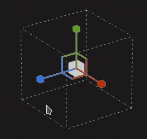
  </td> <td style="border: 0;" valign="top">  
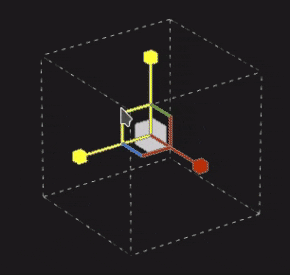
  </td> <td style="border: 0;" valign="top">  

  </td> </tr> </table> |
| **Scale constrained** | SHIFT+Mouse click | With the Scale manipulator, clicking on one axis handle while maintaining the shortcut will resize the projection in steps. The step size is the same as for the Translation manipulator. 
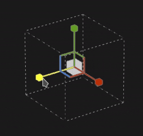
 |
| **Surface** | Mouse click | With the Surface manipulator, clicking and dragging it over the 3D model will snap it on the surface. 

 **Note:**  This manipulator is only available with the **Planar** and **Warp** projection types. |

## Editing grid points

The warp projection is represented by a plane and a grid of points. Each points can be modified to make the projection fit better the 3D model but also to distort the texture.

To edit the grid point, switch the edition mode to **Edit vertices** from the Contextual toolbar:

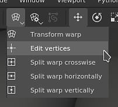

>[!NOTE]
>
> A keyboard shortcut is available to quickly switch between **Transform warp** and **Edit vertices**. See the **Toggle warp edition mode** in the [Shortcuts](../../../interface/settings/shortcuts/shortcuts.md) page.

### Selecting points

| Action | Description |
| --- | --- |
| 
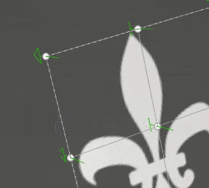
 | <ul data-preserve-html="true"><li data-preserve-html="true">A single click on a point will select it.</li><li data-preserve-html="true">Clicking away from a point or the manipulator will deselect points.</li><li data-preserve-html="true">Clicking on points while pressing <strong>SHIFT</strong> allow to select multiple points.</li><li data-preserve-html="true">Clicking on a point while pressing <strong>CTRL</strong> allow to deselect only this point and not the other.</li></ul> |
| 
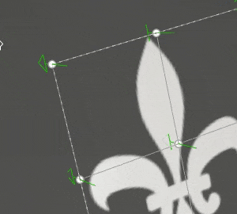
 | <ul data-preserve-html="true"><li data-preserve-html="true">Clicking and dragging allow to do a rectangular selection. Any points within the rectangle will be selected when the mouse is released.</li><li data-preserve-html="true">Clicking and dragging while pressing <strong>SHIFT</strong> allow to add more points to the current selection.</li><li data-preserve-html="true">Clicking and dragging while pressing <strong>CTRL</strong> allow to remove points from the current selection.</li></ul> |

### Moving points

| Action | Description |
| --- | --- |
| 
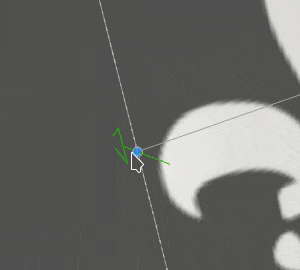
 | <ul data-preserve-html="true"><li data-preserve-html="true">Use the Translation manipulator to move a point.</li><li data-preserve-html="true">Use the Surface manipulator to move on point on the 3D model surface.</li></ul> |
| 
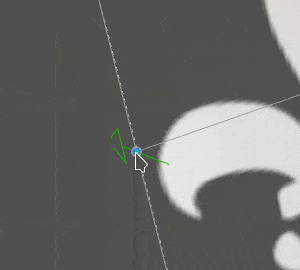
 | <ul data-preserve-html="true"><li data-preserve-html="true">Click and drag a point to quickly move it without having to select it first.</li><li data-preserve-html="true">Clicking and dragging a point will move it like the Surface manipulator.</li><li data-preserve-html="true">Clicking and dragging a point while pressing <strong>CTRL</strong> will move it like the Translation manipulator (in camera space on three axes).</li></ul> |

### Adjusting tangents

The Warp projection grid is a [Bézier patch](https://en.wikipedia.org/wiki/B%C3%A9zier_surface), this means each point has its own set of tangents to control the curve of the lines that join points together. Adjusting tangents give more control on how the texture is deformed.

| Action | Description |
| --- | --- |
| 
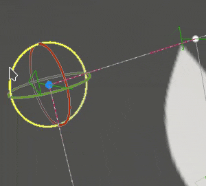
 | <ul data-preserve-html="true"><li data-preserve-html="true">To modify the tangents of a point (displayed in red), simply select the given point then use the Rotation or Scale manipulator.</li></ul> |

>[!NOTE]
>
> Tangent will be reset and adjusted automatically when moving points if the setting **Automatic tangents** from the Contextual toolbar is enabled.
> 
> 

### Increasing or decreasing the number of points

The warp grid can be subdivided to increase the number of points and give more control on how to deform the texture.

| Action | Description |
| --- | --- |
| 
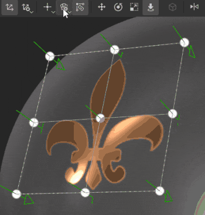
 | <ul data-preserve-html="true"><li data-preserve-html="true">Divide the grid by rows and columns from the Warp settings menu. (This is only possible if no points have been moved)</li><li data-preserve-html="true">Subdivide the grid by using one of the three split tools.</li><li data-preserve-html="true">Any of the split tools can be cancelled by pressing <strong>Escape</strong>.</li></ul> |
