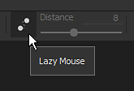

# Lazy mouse

The Lazy Mouse is a distance offset between the mouse cursor and the actual painting which allows to paint more precise or smooth strokes.

It can be enabled via the [contextual toolbar](../../interface/toolbars/toolbars.md). It makes painting clean and continuous line easier.

## Enabling Lazy Mouse

To enable or disable the Lazy Mouse simply click on the button available in the contextual toolbar :

Once enabled, a gray circle should be visible around the brush cursor in the viewport :

## Lazy Mouse Radius

In the contextual toolbar it is possible to change the Lazy Mouse distance. The distance defines a radius at which the brush stamps will be painted from the original paint location. The smaller the distance is, the sooner the stamps will be painted which allows quick turns but reduce the smoothing of the painted line.

* Large distance :

  {width="400px"}
* Small distance :

  {width="400px"}
