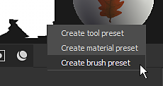
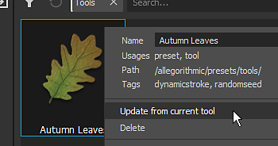

# Create and save presets

Use the [Properties window](../../../interface/properties/properties.md) to tweak brush parameters, then save the brush configuration as a preset for quick re-use in the future.

>[!NOTE]
>
> With the [Path tool](../../../painting/tool-list/path/path.md) equipped, a Presets section is available in the [Properties panel](../../../interface/properties/properties.md) where you can quickly access Path related presets. You can also add path presets to your favorites. Learn more about managing your favorite [path presets here](../../../painting/tool-list/path/path.md).

## Create a new preset

Presets can be created by right clicking in the Properties window when Tool properties are available (paint layer or paint effect).

Right-click in the Properties window to open a context menu with the following options:

* <b>Create tool preset</b> : Save the brush parameters and the materials with all required resources within the same preset file.
* <b>Create material preset</b> : Only save the material properties and material resources inside a preset file.
* <b>Create brush preset</b> : Only save the brush parameters and the alpha and stencil resources inside a preset file.

## Update an existing preset

It is possible to update an existing preset based on the current values in the Properties window. Right-click on the asset in the [Assets](../../../interface/assets/assets.md) window and select "Update from current tool" to update the preset.
