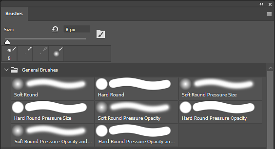
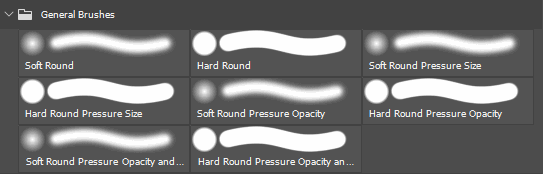
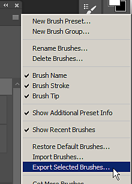

# Exporting Brush Presets from Photoshop

ABR files (Photoshop Brush presets) can be created from Adobe Photoshop only. To create an ABR containing presets, simply follow the steps below:

1. <b>Open Adobe Photoshop.</b>

   ABR files can only be created from within Photoshop.
1. <b>Open the Brushes panel.</b>

   Open the Brushes panel from <b>Window &gt; Brushes. </b>

   {width="500px"}
1. <b>Select the Brush presets (or groups) to export.</b>

   Press and hold CTRL to select multiple brushes or presets.

   {width="500px"}
1. <b>Export to an ABR file.</b>

   Open the settings menu of the Brush Window and select <b>Export Selected Brushes</b>.

   A file dialog will appear asking for a filename and location to save the exported ABR file.

   
