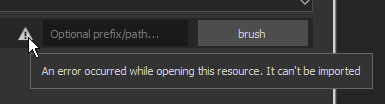
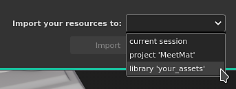
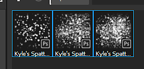

# Importing Photoshop Brush Presets

This page gives a step by step on how to import an ABR file into Substance 3D Painter.

1. <b>Open the import resources window.</b>

   The Import Resource window can be opened in three different ways:

   * Drag and drop the ABR file into the Assets panel.
   * Use <b>File &gt; Import resources </b>in the Main menu.
   * Use the <b>+ </b>button in the Assets panel.
1. <b>Add the ABR file to the Import resources window.</b>

   If you didn't drag and drop the ABR file into the Assets window to open the import window, it will be empty by default.

   To add the ABR file, you can either:

   * **Drag and drop**  the ABR file into the window.
   * Click on the  **Add resources**  button to select and load the ABR file.

   >[!NOTE]
   >
   > 
   > 
   > A warning icon can appear next to the ABR file if there are some issues with it. Such as:
   > 
   > * No compatible preset found. See the [Photoshop Brush Parameters Compatibility](../../../../painting/presets/photoshop-brush-presets/photoshop-brush-par/photoshop-brush-parameters-compatibility.md) list for more information.
   > * The file cannot be read (ex: it is corrupted).
1. <b>Select how to import the ABR file.</b>

   At the bottom of the Import Resources window, choose where to load the ABR file:

   * <b> Project</b>: the ABR file will be loaded into the currently open project. The brushes will only be available when the current project is open, and are attached to the project file.
   * <b> Session</b>: the ABR file will be loaded into memory. The brush presets will be available until the application is closed.
   * <b> Library</b>: the ABR file will be copied to the Shelf on the disk. Brush presets will be available whenever Painter is opened, for all projects.

   
1. <b>Access the brush presets from the Shelf.</b>

   

   If there were no issues importing the Brush Presets, they will appear in the [Assets](../../../../interface/assets/assets.md) window.

   >[!NOTE]
   >
   > If a brush preset is based on a bitmap, the image it uses will also be available in Alpha section of the Shelf under the same name as the brush preset.
