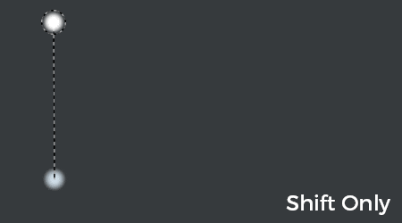

# Straight line

The Straight Line is an easy way of drawing a line with any painting tool with less clicks and more precision.

It is a modification that is temporarily applied with the help of a keyboard shortcut.

The straight line position is computed from the viewport, which means that if between between brush strokes the camera is moved the next straight line may be wrongly positioned.

## Enabling Straight Line

Simply pressing "Shift" on the keyboard when a painting tool is selected will show the dotted lines indicating the path the paint tool will follow. When "Shift" is being pressed, clicking anywhere will draw the line.

{width="400px"}

## Snapping Straight Line

In addition to "Shift" it is possible to press "Ctrl" as well to snap the straight line every 5 degrees.

{width="400px"}
