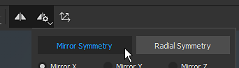
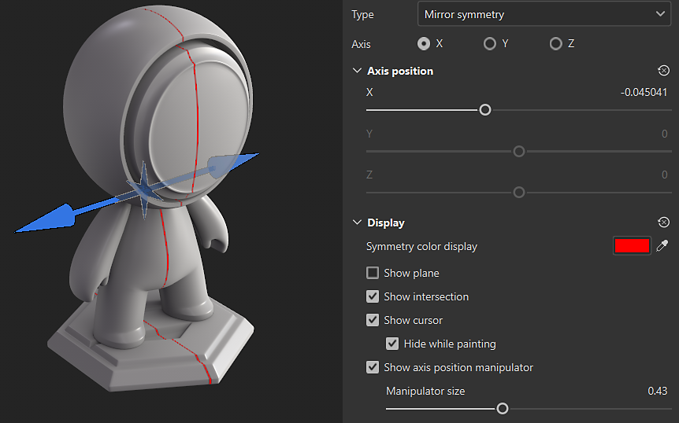
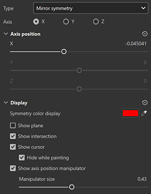

# Mirror Symmetry

The mirror symmetry is an axial based symmetry that can be enabled in the contextual toolbar :

## Use the manipulator to position the axis of symmetry

You can access the Symmetry display settings from the <b>Symmetry settings button</b> in the Contextual toolbar at the top of the 3D view. Under the display settings, you can enable and customize the manipulator. Drag the manipulator handles in the 3D view to change the position of the axis of symmetry.

## Mirror symmetry parameters

{width="300px"}

| *Parameter* | *Description* |
| --- | --- |
| <b>Axis</b> | Defines which axis of the scene is used to perform the symmetry. |
| <b>Axis position</b> | Defines the offset of the axis in the project. This value can be edited with the sliders or with the Manipulator (see above). |
| <b>Show Plane</b> | If enabled, a transparent plane will be visible in the viewport to delimit each side of the mirrored symmetry. |
| <b>Show Intersection</b> | If enabled, a line will be drawn on the mesh in the viewport to delimit each side of the mirrored symmetry. |
| <b>Show Cursor</b> | If enabled, a second cursor will be shown on the other side of the symmetry to indicates when the painting will be performed. |
| <b>Hide While Painting</b> | If enabled, the second cursor will be hidden while painting is in progress (until the release of the mouse click). |
| <b>Manipulator Size</b> | Controls the size of the Manipulator in the viewport. |
