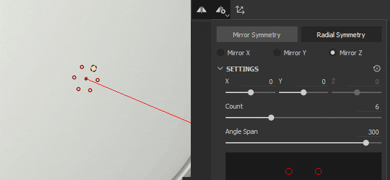
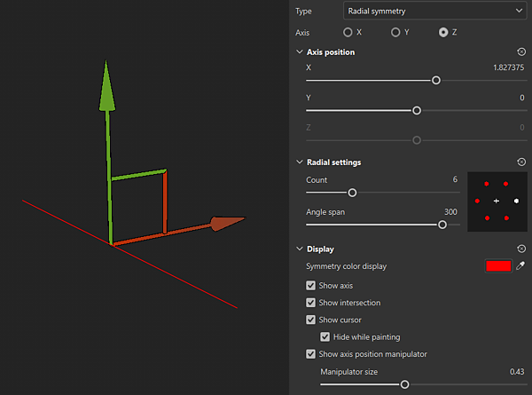
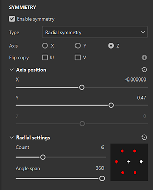

# Radial Symmetry

Radial symmetry duplicates strokes or fill layer content radially around an axis:

## Use the manipulator to position the axis of symmetry

You can access the Symmetry display settings from the <b>Symmetry settings button</b> in the Contextual toolbar at the top of the 3D view. Under the display settings, you can enable and customize the manipulator. Drag the manipulator handles in the 3D view to change the position of the axis of symmetry.

{width="600px"}

## Radial symmetry parameters

{width="300px"}

| *Parameter* | *Description* |
| --- | --- |
| <b>Axis</b> | Defines which axis of the scene is used to perform the symmetry. |
| <b>Flip copy</b> | Flip alternating copies on the U or V axis. This helps when using symmetry on content that has direction like text. |
| <b>Axis position: X, Y, Z</b> | Defines the offset of the axis in the project. This value can be edited with the sliders or with the Manipulator (see above). |
| <b>Show Axis</b> | If enabled, a transparent line will be visible in the viewport representing the axis of symmetry. |
| <b>Show Intersection</b> | If enabled, a point will be drawn on the mesh in the viewport to show where the axis of symmetry intersects with the mesh. |
| <b>Show Cursor (brush tool)</b> | If enabled, a second cursor will be shown on the other side of the symmetry to indicates when the painting will be performed. |
| <b>Hide While Painting (brush tool)</b> | If enabled, the second cursor will be hidden while painting is in progress (until the release of the mouse click). |
| <b>Show Axis position manipulator</b> | Toggle visibility of the Manipulator in the viewport. |
| <b>Manipulator Size</b> | Controls the size of the Manipulator in the viewport. |
