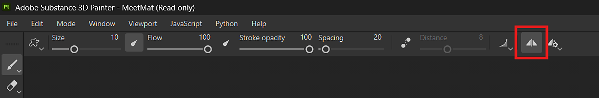
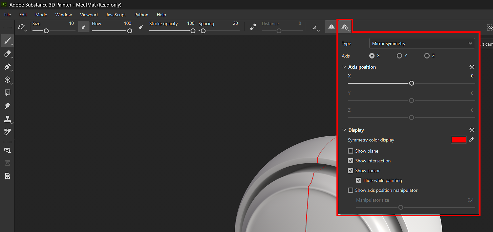
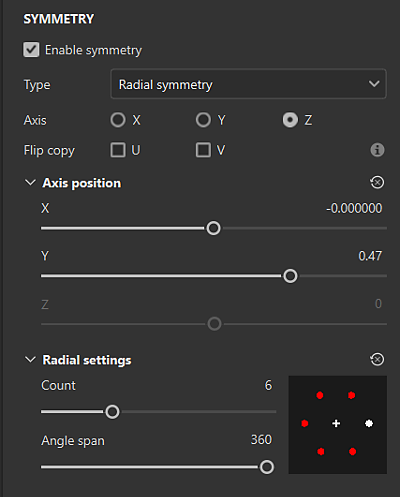

# Symmetry

Symmetry is a helpful setting that you can use on brush and fill layers to easily and precisely duplicate content based on geometric constraints:

* With Brush layers, use symmetry to duplicate your individual brush strokes in other locations on your mesh based on the axis of symmetry.
* With Fill layers, use symmetry to duplicate the entire fill layer around the axis of symmetry.

Learn more about the types of symmetry you can use in Painter:

* [Mirror Symmetry](../../painting/symmetry/mirror-symmetry/mirror-symmetry.md)
* [Radial Symmetry](../../painting/symmetry/radial-symmetry/radial-symmetry.md)

## Use Symmetry with the Paint tool

You can enable symmetry with the<b> Symmetry button</b> in the contextual toolbar.

Adjust Symmetry options with the <b>Symmetry settings button</b> in the contextual toolbar.

>[!NOTE]
>
> Paint projection and stencil projection in the 2D view don't support symmetry. We recommend using the 3D view instead if needed.

## Use Symmetry with Fill layers

When a Fill Layer is selected, you can use the <b>Symmetry button</b> in the contextual toolbar, just like with Brush tool symmetry. With Fill layers, you can also enable and access Symmetry options from the <b>Properties panel</b>. Symmetry is only available with the following projection methods:

<table>
<tr style="border: 0;">
<td style="border: 0;" valign="top">

* Tri-planar projection
* Planar projection
* Sphere projection
* Cylindrical projection
* Warp projection

When an eligible projection method is selected,  Enable symmetry in the Symmetry section of the properties panel to access symmetry options.

If an unsupported projection method is selected, the <b>Enable symmetry</b> option won't be available, and the <b>Symmetry button</b> in the contextual toolbar will be greyed out.

</td>
<td style="border: 0;" valign="top">

{width="400px"}

</td>
</tr>
</table>

>[!NOTE]
>
> Symmetry display options are only available from the <b>Symmetry settings button</b> in the Contextual toolbar. You cannot modify symmetry display settings from the <b>Properties panel</b>.
