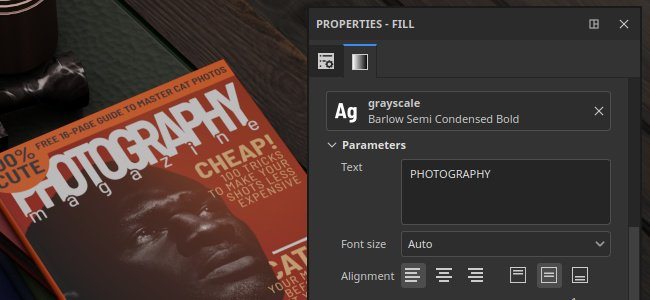
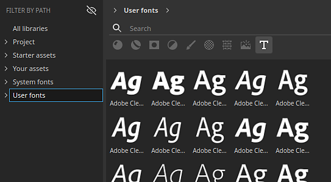
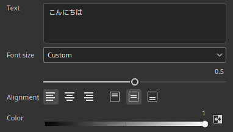
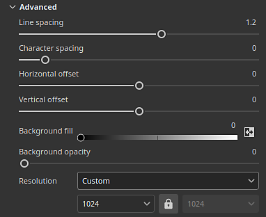

# Text resource

The <b>Text resource</b> in can be used to write text into textures with the use of specific <b>font files</b>. Several parameters are available to adjust the look of the final text drawn.

## Browsing fonts

To browse the available font files, simply click on the font filter (the <b>T</b> button) in the [Assets window](../../interface/assets/assets.md):

Font can also be filtered by paths depending on where they are located on the system:

The font locations available depend on the current operating system:

|  |  |
| --- | --- |
| Windows | <ul data-preserve-html="true"> <li data-preserve-html="true"><b>System</b>: C:/Windows/Fonts</li> <li data-preserve-html="true"><b>User</b>: C:/Users/username/Appdata/Local/Microsoft/Windows/Fonts</li> </ul> |
| MacOS | <ul data-preserve-html="true"> <li data-preserve-html="true"><b>System</b>: /System/Library/Fonts</li> <li data-preserve-html="true"><b>Local</b>: /Library/Fonts</li> <li data-preserve-html="true"><b>User</b>: /Users/username/Library/Fonts</li> </ul> |
| Linux | <ul data-preserve-html="true"> <li data-preserve-html="true"><b>System</b>: /usr/share/fonts/</li> <li data-preserve-html="true"><b>Local</b>: /usr/local/share/fonts/</li> <li data-preserve-html="true"><b>User</b>: /home/username/.local/share/fonts/</li> </ul> |

### Importing fonts

Fonts can be imported manually or put into an existing Painter's library like any regular resources. To do so see the [import documentation](../../content/importing-assets/import-drag-and-drop/import-drag-and-drop.md).

Painter support both <b>.ttf</b> and <b>.otf</b> font formats.

>[!NOTE]
>
> If a resource fails to load/import with the error message "cannot be imported because of the font's licensing restriction" it means it cannot be used by Painter. Only font marked as <b>embedable</b> in their metadata can be used.

### Using a font as a text resource

A texture resource works like other resources (images or Substance materials for example) and can be used in brush parameters, fill projections or Substance image inputs.

To create a text resource simply add a font into a resource slot. Drag and dropping a font in the viewport is also possible.

### Text resource parameters

A text resource has the following basic parameters:

| <b>Parameter</b> | <b>Description</b> |
| --- | --- |
| <b>Text</b> | Text to be rendered.  **Note:**  The text field in the interface uses a generic font with a wide range of characters which may create discrepancy between what was typed in the field and what the selected font is be able to render in the texture. |
| <b>Font size</b> | Specify the mode used to compute the font size. Available modes are:<ul data-preserve-html="true"> <li data-preserve-html="true"><b>Auto</b>: the size is automatically computed from the text content and fit the texture.</li> <li data-preserve-html="true"><b>Custom</b>: the size can be controlled manually via the dedicated setting.</li> </ul> |
| <b>Alignment</b> | Control the vertical and horizontal alignment. Use the buttons to choose which mode to use. |
| <b>Color</b> | The color the rendered text. This setting may be grayscale if the text resource is used in a mask or a grayscale channel. |

More advanced parameters are also available:

| <b>Parameter</b> | <b>Description</b> |
| --- | --- |
| <b>Line spacing</b> | Distance between lines of text (“leading”) relative to the font size. |
| <b>Character spacing</b> | The amount of space between adjacent characters relative to the font size. Can be negative to subtract spacing. |
| <b>Offset</b> | Horizontal and vertical offset of the text. Normalized to the font size. |
| <b>Background fill</b> | Color of the background behind the text. |
| <b>Background opacity</b> | How much of the background color is visible. |
| <b>Resolution</b> | Specify the mode used to compute the size of the texture used to render the text. Available mode are:<ul data-preserve-html="true"> <li data-preserve-html="true"><b>Auto</b>: Resolution is automatically computed.</li> <li data-preserve-html="true"><b>Custom</b>: Resolution can be manually defined via the dedicated setting.</li> </ul> |
