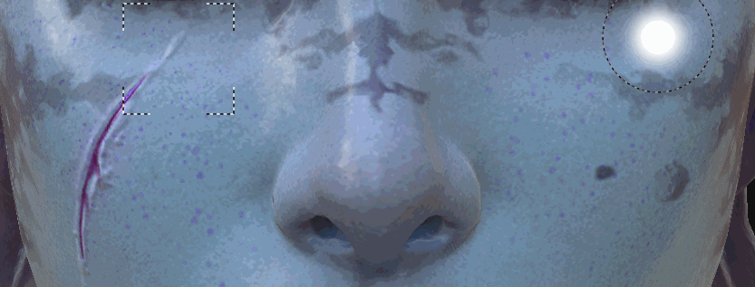
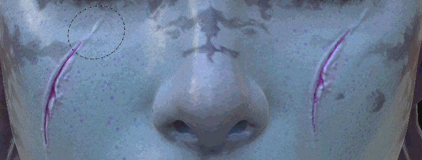

# Clone Tool

Introduced in Substance 3D Painter 2 the Clone tool shares the same type of parameters as as the  [paint tool](https://support.allegorithmic.com/documentation/display/SPDOC/Paint+brush)  . As its name suggests the clone tool allows you to duplicate the content of a specific layer or the full layer stack from one point to one another.

## Usage

The simplest way to use the Clone tool is to use it on the content of a painting layer.

This can be done in 2 steps:

* Select the source location by placing the mouse on the model and pressing the "  **V**  " key.
* Then placing the mouse where the duplicated area will appear and start painting.

It is possible to update the source at any moment by pressing "  **V**  " again.

By default when painting with the clone tool, the source location will follow and update its location once the brush has been released. By disabling the button used for the "  **Clone source behavior**  ", the source will go back where it was defined when pressing "  **V**  ". This can be useful when painting multiple times with the same source area.

A smarter way to use the Clone tool is to create a painting layer and set the blending mode of all the channels to "Pass through". This will allow duplicate any information in a non destructive way from all the layers located below the "Clone layer". The layers below remain intact and any modifications applied later will be taken in account by the Clone layer:

