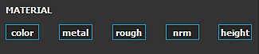

# Eraser

The Eraser is a paint tool that erase/hide what has been painted previously by other tools. This tool only affect one layer at a time.

The Eraser share common parameters and behaviors with the Paint tool. To know more about the brush, alpha and stencil controls take a look at the [Paint tool page](../../../painting/tool-list/paint-brush/paint-brush.md).

>[!NOTE]
>
> Technically, **the eraser doesn't really remove information**. It simply set the layer alpha back to zero which erase/hide the previous painting information. This means :
> 
> * Any previous brush strokes that was painted are still computed when a project is reopened before the brush strokes with the eraser are applied.
> * A Substance filter can retrieve the paint information if it ignores the alpha information
> 
> This is why sometimes it is more advised to **delete a layer and recreate it** rather than using the eraser as it can improve performances.

## Material

When erasing information, it possible to only affect specific channels.

>[!NOTE]
>
> Contrary to the Paint tool, the Eraser only allows to define which Channels will be affected. It is not possible to load a resource from the Shelf to affect each channel.

* If all channels are enabled, the eraser will remove information inside all the channels:

  

  {width="325px"}
* If specific channels are selected, the eraser will remove information from those channels only:

  

  {width="325px"}
