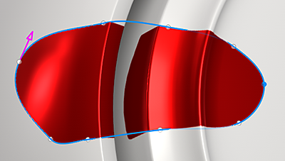

# Filled path

The filled path tool is a type of path tool which allows to create shapes on the surface of the 3D model filled with a uniform color.

The <b>Filled path</b> tool can be accessed from the Path tools menu:

## Settings

The Path fill settings are:

| Setting | Description |
| --- | --- |
| Opacity | Control the final opacity of the filled shape. |
