# Paint brush

The Paint tool is the default tool of Substance 3D Painter to apply colors and material properties on a 3D mesh. It has specific parameters which can be edited via the [Properties](../../../interface/properties/properties.md) .

The Paint tool simulates brush strokes via various behavior and settings to give the feeling of painting onto the 3D mesh.

## Toolbar

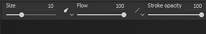

The [Toolbars](../../../interface/toolbars/toolbars.md) will display the following shortcuts (see their explanation in next sections) :

* Size
* Flow
* Stroke Opacity
* Spacing

Additional shortcuts are available which are common across some other tools :

* [Lazy mouse](../../lazy-mouse/lazy-mouse.md)
* [Symmetry](../../symmetry/symmetry.md)

## Preview

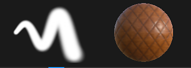

At the top of the [Properties](../../../interface/properties/properties.md) are the brush and material previews. They can be used to quickly glance at how the current tool is setup.

| *Name* | *Description* |
| --- | --- |
| **Brush Preview** | The brush preview displays how the brush will behave based on the brush parameters. It is possible to click in the preview to draw a custom stroke.   <table> <tr style="border: 0;"> <td style="border: 0;" valign="top">  
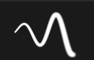
  </td> <td style="border: 0;" valign="top">  
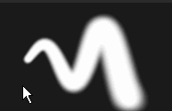
  </td> </tr> </table>   **Note:**  The Brush preview doesn't support Pen pressure. |
| **Material Preview** | The material preview shows the properties of the material currently used to paint. It is possible to click in the preview to rotate the lighting and see better how the material will behave before painting.   <table> <tr style="border: 0;"> <td style="border: 0;" valign="top">  
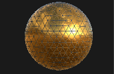
  </td> <td style="border: 0;" valign="top">  
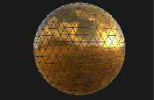
  </td> </tr> </table> |

## Brush

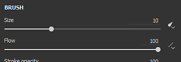

The Brush parameters are what defines the look and feel of the brush stroke when performed on the 3D mesh.

>[!NOTE]
>
> Some parameters may be controlled by Pen Pressure when using a graphic tablet. This information can also be saved in [Presets](../../presets/presets.md) .   
> Click on the dedicated button to enable or disable the pressure :
> 
> 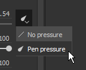

| Name | Description |
| --- | --- |
| **Size** | Controls how big the stamps inside a brush stroke will be. The brush size is relative can changed depending of the relative space is defined in (see the Alignment Size Space parameter below). *This parameter can be controlled by Pen Pressure.* |
| **Flow** | Intensity or opacity of the individual stamps inside the brush stroke. *This parameter can be controlled by Pen Pressure.* |
| **Stroke Opacity** | Maximum global opacity of a brush stroke. Contrary to the Flow parameter, the Stroke Opacity cannot be controlled via Pen Pressure because it is applied at the end of the stroke drawing process.Difference between Flow and Stroke Opacity :<ul data-preserve-html="true"><li data-preserve-html="true"><strong> Left </strong> : Flow at 50%, Stroke Opacity at 100%</li><li data-preserve-html="true"><strong> Right </strong> : Flow at 100%, Stroke Opacity 50%</li></ul> 

 **Note:**  It is possible to continue a previous stroke like in the animation above by pressing the shortcut "A". |
| **Spacing** | Distance between the individuals stamps of a brush stroke. Small values allow to create continuous lines but are more expansive to compute as they draw much more stamps in total. High values allow to create gap between the stamp which may be more suited for specific patterns (like Nails on wood). |
| **Angle** | Orientation of the stamps inside the brush stroke. Useful to rotate the Alpha if not properly aligned. Can be combined with the Follow Path. |
| **Follow Path** | Orients the stamps inside the brush stroke to follow the painting direction. 
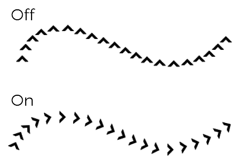
 **Note:**  To compute the stroke direction Substance 3D Painter compares the previous stamp with the current one, which is why when Follow Path is enabled a single click to paint will not produce any results. At least a minimum of two stamps are required to paint a brush stroke with this feature enabled. |
| **Size Jitter** | Apply a random size value per stamp inside the brush stroke. A value of 0 means no randomness, a value of 1 means full randomness. 
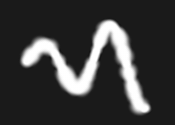
 |
| **Flow Jitter** | Apply a random flow value per stamp inside the brush stroke. A value of 0 means no randomness, a value of 1 means full randomness. 
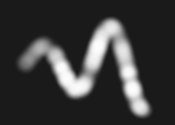
 |
| **Angle Jitter** | Apply a random additional rotation angle per stamp inside the brush stroke. A value of 0 means no randomness, a value of 1 means full randomness. 
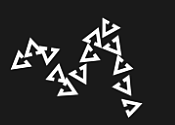
 |
| **Position Jitter** | Apply a random position offset per stamp inside the brush stroke. A value of 0 means no randomness, a value of 1 means full randomness. 
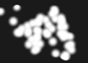
 |
| **Alignment** | Determines how the stamps inside the brush stroke will be projected / oriented on the surface of the 3D mesh. The following values are available :<ul data-preserve-html="true"><li data-preserve-html="true"><strong> Camera </strong> : Orient the stamp toward the viewport point of view</li><li data-preserve-html="true"><strong> Tangent &#124; Wrap (default) </strong> : Orient the stamp to align with the 3D mesh surface. The stamp will also be deformed to conform to the surface.</li><li data-preserve-html="true"><strong> Tangent &#124; Planar </strong> :  Orient the stamp to align with the 3D mesh surface. The stamp will fade its border are too far from the 3D mesh surface. </li><li data-preserve-html="true"><strong> UV </strong> : Orient the stamp based on the 3D mesh UVs.</li></ul> |
| **Backface Culling** | Allows to ignore surfaces on the 3D mesh that are not aligned with the stamp. To compute which parts of the 3D mesh should be ignored, the painting engine looks at the normal at the surface of the 3D mesh and compares its angle against the value defined. |
| **Size Space** | Controls in which relative space the brush size is computed. Possible values are :<ul data-preserve-html="true"><li data-preserve-html="true"><strong> Object (default) </strong> : The brush size is synced with the 3D mesh size. Moving the camera in the viewport will affect the size to keep it relative to the 3D mesh.</li><li data-preserve-html="true"><strong> Viewport </strong> : The brush size is linked to the viewport. Resizing the interface will affect the brush size. Moving the camera won't have any effect.</li><li data-preserve-html="true"><strong> Texture </strong> : The brush size is linked to the 2D viewport level of zoom.</li></ul> |

## Alpha

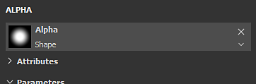

The Alpha is the grayscale mask that is applied over each stamp inside the brush stroke. It can be a Substance file or a bitmap.

>[!NOTE]
>
> If a Substance graph has a parameter "hardness" (identifier) exposed, it can be controlled with the Hardness [Shortcuts](../../../interface/settings/shortcuts/shortcuts.md).

## Physics

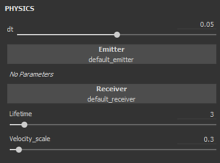

The Physics properties allow to control the particles that are projected when painting.

By default the Physics properties are not available but can be enabled by two means :

* By switching the tool to "Physical" in the [Toolbars](../../../interface/toolbars/toolbars.md) (or via the keyboard shortcut).
* By clicking on a Particle brush preset in the [Assets](../../../interface/assets/assets.md) window.

## Stencil

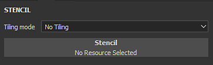

The Stencil is an additional grayscale mask for the brush stroke. Contrary to the alpha which is applied for each individual stamps, the Stencil is a global mask applied from the [Viewport](../../../interface/viewport/viewport.md) point of view.

>[!NOTE]
>
> It is possible to reset the Stencil transformation by pressing the  **S**  key and then clicking on the "  **Reset**  " button at the top right of the viewport :
> 
> 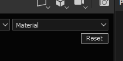

| *Mode* | *Viewport* |
| --- | --- |
| **No resource loaded** | When no resource is loaded, the stencil has no effect. 
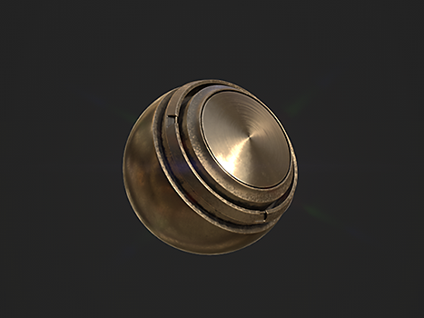
 **Note:**  It is possible to disable temporarily the Stencil mask without removing the resource by pressing and maintaining the [Shortcuts](../../../interface/settings/shortcuts/shortcuts.md) "N". |
| **Move Stencil** | Moving the Stencil can be done by pressing the  **S**  key and click and dragging with the  **Middle Mouse**  button. 
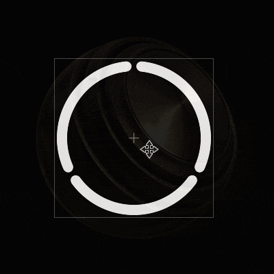
 |
| **Rotate Stencil** | Rotating the Stencil can be done by pressing the  **S**  key and click and dragging with the  **Left Mouse**  button. Additionally , pressing the  **Shift**  key allows to snap the rotation every  **90 degrees**  . 
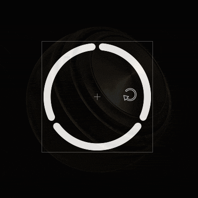
 |
| **Resize Stencil** | Resizing the Stencil can be done by pressing the  **S**  key and click and dragging with the  **Right Mouse**  button. 
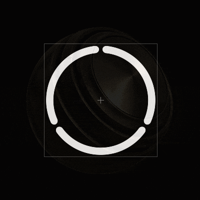
 |

The tiling mode setting controls how the Stencil mask is repeated over the viewport (this setting affects the texturing as well) :

| *Tiling Mode* | *Description* |
| --- | --- |
| **No Tiling (default)** | The Stencil mask is not repeated. 
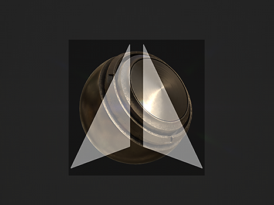
 |
| **Horizontal Tiling** | Repeat the Stencil mask only on the horizontal axis. 
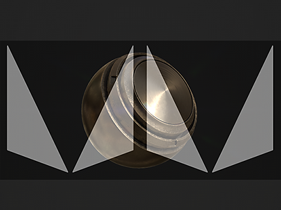
 |
| **Vertical Tiling** | Repeat the Stencil mask only on the vertical axis. 
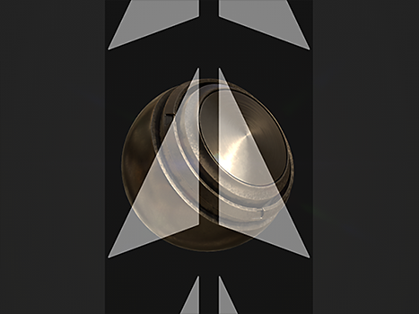
 |
| **H and V Tiling** | Repeat the Stencil mask on both the horizontal and vertical axis. 
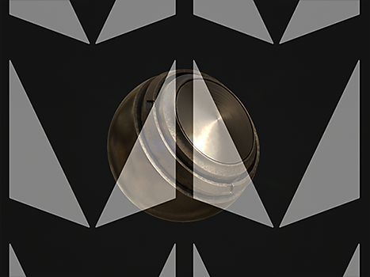
 |

## Material

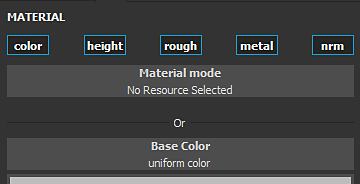

A Material is composed of multiple channels where each retain specific properties. The list of channels is dependent of those defined in [Texture Set settings](../../../interface/texture-set/texture-set-settings/texture-set-settings.md) .

The  **Material mode**  button is an easy way to load a Substance files or a preset to quickly assign and edit multiple channels at once.

Clicking on a channel button will select or deselect it. When deselected the channel property cannot be modified and won't be used during the painting process.

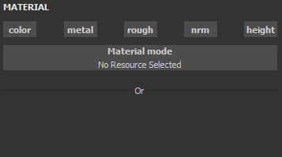
