# Path tool overview

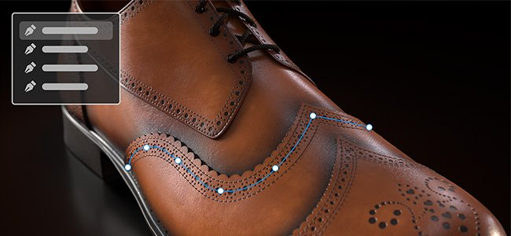

The <b>Path tools</b> allows you to define a curve with points on the surface of your mesh. Once the curve is created, the different Path tools allow you to create different effects along the curve.

## Creating a path

Paths can be created on paint layers and paint effects. There are two ways to access the Path tool:

* <b>Via the interface</b>: navigate to the tool's toolbar on the left-side and click the third icon from the top.
* <b>Via a keyboard shortcut</b>: by default the tool doesn't have any assigned. This can be changed in the Settings menu by editing the "Select paint along path tool" shortcut.

Once the tool is selected, points can be placed by clicking on the surface of the 3D model within the 3D viewport. At least two points (or vertices) are needed to create a path.

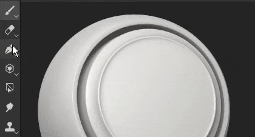

The Path tool has different modes, which can be similar to the other paint tools available in the application:

* Paint along path: Draw a regular brush stroke along a defined path.
* [Ribbon path](../../../help/painting/tool-list/ribbon-tool/ribbon-tool.md): Draws a repeated or stretched image along a path.
* [Filled path](../../../help/painting/tool-list/filled-path/filled-path.md): Fill the interior of a path with a uniform color.
* Erase along path: Draw a stroke that erase/remove information along a defined path.
* Smudge along path: Draw a stroke that smudges/blurs information along a defined path.

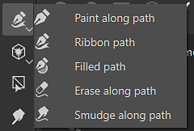

For example, here is the path tool in <b>Smudge</b> mode affecting other painting information:

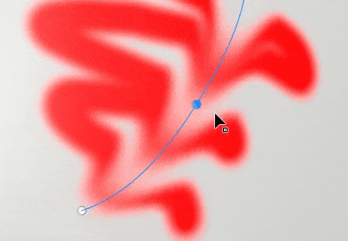

>[!NOTE]
>
> The <b>Path tools</b> only works in 3D space on the surface of the geometry. Creating a path in UV space or as a screen space projection is currently not supported.

### Editing a path

Path points (or vertices) adhere automatically to the surface of the mesh. They can be moved and adjusted at any time. It is possible to add new vertices to an existing path by clicking anywhere along the line. 

* Pressing <b>Escape </b>or <b>Enter </b>will exit path edition.
* Once exited, clicking on a blank surface of the mesh will begin a new path.
* Hovering and clicking on an existing path will select it, allowing to continue or edit that path. Paths can also be re-selected via the <b>Paths</b> panel (see below).

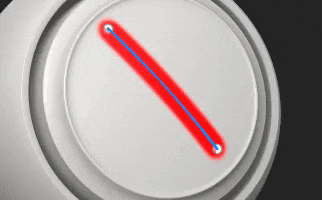

Some properties are specific to a path as a whole. This is the case for options found in the <b>Properties </b>window. Just like with a regular stroke (see the [Paint tool documentation](../../../help/painting/tool-list/paint-brush/paint-brush.md)), it is possible to define the following properties for a path:

* <b>Brush</b>
* <b>Alpha</b>
* <b>Material</b>

The <b>brush </b>section contains additional options which are only available with the Path tool:

| <b>Setting</b> | <b>Description</b> |
| --- | --- |
| <b>Projection depth</b> | Determines how close the path needs to be to the mesh surface for the brush stamps to appear. To see this visual feedback directly in the viewport, it is possible to enable <b>Normals</b> in the <b>Path display settings </b>(see below). |
| <b>Up axis</b> | The axis used to orient brush stamps when <b>Follow path</b> is off.   In some context, it makes more sense to have all the stamps aligned along a global axis/direcction and not along the path. For example with rivets on a metallic surface. |

Other properties are defined per points (vertices) on the path, such as the pressure. To edit a specific point, simply click on it (or use the rectangular selection). Then use the contextual toolbar to edit the selected points values.

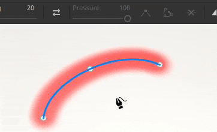

### Controlling tangents

There can be times where a smooth path is not ideal, either because it doesn't follow the best the 3D model surface or because it doesn't fit a specific look. To solve those issues, it is possible to modify the tangents of a given vertex. The tangents are the directions of a point that control how the path bend.

To switch between smooth or linear/broken tangents, simply double click on a vertex (or use the dedicated button in the contextual toolbar):

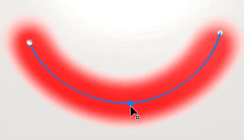

To control more precisely the orientation of the tangents, use the Custom tangents button in the contextual toolbar to override them manually:

Use the <b>ALT</b> keyboard shortcut to break the tangents while moving if the point wasn't already.

Use the <b>CTRL</b> keyboard shorcut to scale both tangents at the same time.

>[!NOTE]
>
> The tangent controls are defined along the plan that align with the normal of the given point in the path. This means that tangents cannot bend in some directions.

### Contextual toolbar

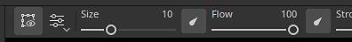

The <b>contextual toolbar</b> when the <b>Path</b> tool is selected provides several settings that allow to control the currently selected path:

| <b>Parameter</b> | <b>Description</b> |
| --- | --- |
| <b>Show / hide viewport interface</b>  
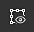
 | If enabled, the paths and vertices overlay will be visible in the viewport. |
| <b>Display settings</b>  
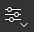
 | Control the look of the path visual feedback in the viewport:<ul data-preserve-html="true"> <li data-preserve-html="true"><b>Handle size</b>: control how big the path's points look like.</li> <li data-preserve-html="true"><b>Path width</b>: control the thickness of the path line.  </li> <li data-preserve-html="true"><b>Path color</b>: control the color of the path line.  </li> <li data-preserve-html="true"><b>Unselected path color</b>: control the color of the non-active paths.  </li> <li data-preserve-html="true"><b>Normals</b>: If enabled, show the projection direction on eahc points of a path.  </li> <li data-preserve-html="true"><b>Tangents</b>: If enabled, show the curve direction of the control points of the path.  </li> <li data-preserve-html="true"><b>Path direction</b>: If enabled, show a little arrow at the end of the path to indicate its painting direction. This is useful to know how stamps within the stroke will be oriented.</li> </ul>  
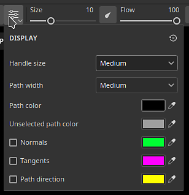
 |
| <b>Reverse path direction</b>  

 | Flip the direction of the current path. The direction defines the general orientation used to paint the stamps within the stroke. Inverting the path can help to re-orient the pattern drawn. |
| <b>Toggle corner / smooth</b>  

 | Break or align the tangent of the currently selected vertices, allowing to switch between a smooth or linear curve.  
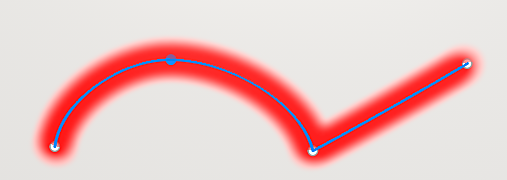
  **Note:**  Switch between the corner / smooth behavior can also be done by double-clicking on a point directly on the path. |
| <b>Custom tangents</b>  

 | If enabled, allow to manually control the tangents of a given point on the path.  
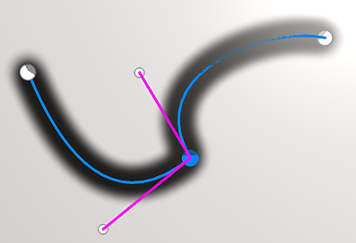
 |
| <b>Open / close path</b>  
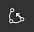
 | Open or close the current path. To close a path, one of the two end points of the current path need to be selected first.  
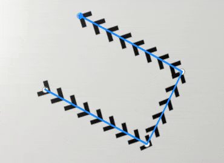
 |
| <b>Delete vertex</b>  

 | Remove the currently selected vertices on a path. |
| <b>Symmetry</b>  

 | Enable or disable symmetry for the current path. See the [symmetry documentation](../../../help/painting/symmetry/symmetry.md) for more information.  
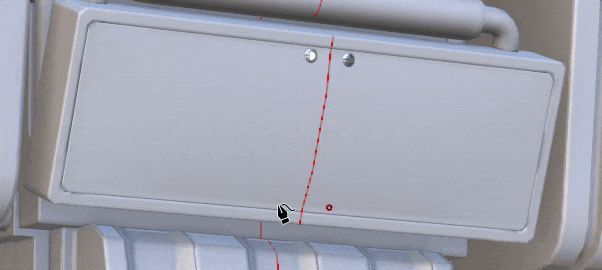
 |
| <b>Hide / ignore excluded geometry</b>  

 | If enabled, make the current path paint through the hidden geometry. See the [Geometry mask documentation](../../../help/interface/layer-stack/geometry-mask/geometry-mask.md) for more information. |

### Paths panel

>[!NOTE]
>
> The panel is hidden when the current tool is not the Path tool or if a fill layer/folder is selected.

Inside the viewport is the <b>Paths</b> panel where are listed all the paths of the currently selected paint layer / effect. It provides an easy way to select and manage paths.

With this panel, it is possible to:

* Double-click on a path to <b>rename</b> it.
* <b>Delete</b> a path by selecting it and then pressing the delete key.
* <b>Copy</b>/<b>Paste</b>/<b>Duplicate</b> a path with the dedicated keyboard shortcuts.
* <b>Show</b> or <b>hide</b> a path with the eye icon (which control if the path is applied to the texturing).

For convenience, it is also possible to right-click on a path to open the contextual menu which offers the same actions:

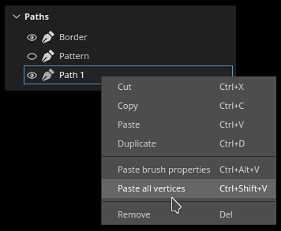

The right-click menu also open actions to copy the properties or position of a path onto another path. This allows to easily share or synchronize features across different paths:

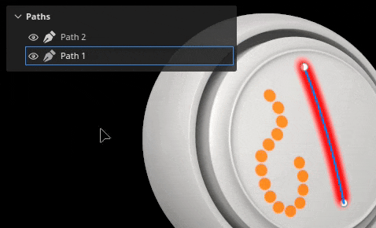

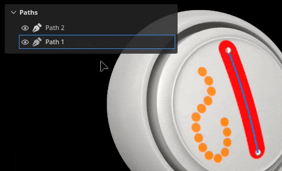

>[!NOTE]
>
> Copy and pasting properties only work when paths are based on the same painting tool. For example it is not possible to share properties between a path using smudge settings and another using brush settings.

## Tool presets

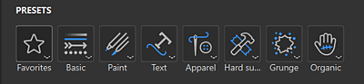{width="400px"}

When a path tool is selected, a Presets section is available at the top of the Properties panel. From here you can quickly access presets for the various path tools.

### Favorite path presets

The Favorites option in the Presets section only holds presets that you've favorited for even faster access. To start adding favorites, select Favorites, then "Show compatible presets in assets" for a full list of available path presets.

To favorite a preset, right-click the preset in the Assets panel or in the Presets section of the Properties panel, then select "Add to favorites". 

You can also remove presets from the favorites list. Right-click a Favorited preset, then select "Remove from favorites".

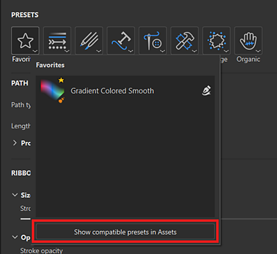{width="400px"}

### Create path presets

Like other tools, presets can be create to quickly restore brush settings / configurations. To do so, simply right-click in the <b>Properties</b> window and choose <b>Create tool preset.</b> This newly created preset will automatically switch to the Path tool when selected in the <b>Assets</b> window.
