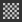

# Polygon fill

The **Polygon Fill** tool () allows you to draw masks quickly by turning selected polygons into a pixel mask. It might seem like a 3D selection tool from other 3DCC applications, but is actually a painting fill tool that results in pixel data. That means selecting and unselecting works by using it to paint white or black.

Polygon fill tool functions on [Paint Layers,](../../../help/interface/layer-stack/layer-stack.md) but is limited to basecolor only and not intended for this purpose. [Use it for masks only](../../../help/interface/layer-stack/masking-and-effects/masking-and-effects.md).

It has 4 selection modes:

*  **Triangle Fill** - fills individual mesh tri's.
*  **Polygon Fill** - fills entire polygons. Doesn't do anything different from Triangle Fill if your mesh is already triangulated upon export.
* ** Mesh Fill** - fills entire connected sub-meshes. Like "sub-object" mode in 3D applications, will fill every polygon connected to the one clicked.
* ** UV chunk Fill** - fills entire UV chunk or "island". Works like Mesh fill, but by looking at polygons connected in UV space. Filling stops at UV borders.

These 4 Modes can be combined and switched, meaning some smart usage lets you quickly mark and unmark sections in a mask using Mesh and UV chunk mode.

The (default) hotkeys associated to Polygon Fill tool are:

* *Numeric key 4* - selects the Polygon Fill tool.
* *X* - Inverts current color when painting masks. Will quickly swap black for white. In material painting mode this hotkey has no effect.
