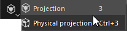
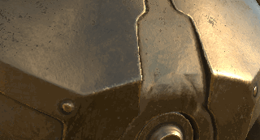

# Projection

{width="50px"}

The projection is a tool that allow to paint a material by projecting it in screen/viewport space. It shares similar controls to the stencil.

It is possible to edit the projection transformation by pressing the **shortcut S** :

* Use **S + Left Mouse click** to rotate the stencil.
* Use **S + Left Mouse click + SHIFT** to snap/constrain to rotation of the stencil.
* Use **S + Right Mouse click** to Zoom/Unzoom the stencil.
* Use **S + Middle Mouse** click to translate the stencil.

<table>
<tr style="border: 0;">
<td style="border: 0;" valign="top">

</td>
<td style="border: 0;" valign="top">

</td>
<td style="border: 0;" valign="top">

</td>
</tr>
</table>

* **Projection** : Paint tool based on screenspace projection. This tool will display and repeat a pattern over the viewport.
* **Physical projection** : Projection paint tool with physics properties based on particles presets.
