# Ribbon path

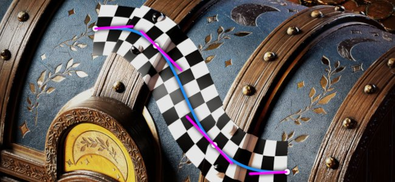

The <b>Ribbon </b>path tool allows you to create patterns that deform along a curve defined by points on the surface of the 3D model. The Ribbon can also be used to write text along a curve.

The Ribbon tool can be selected from the Path tool menu in the toolbar:

Or via the <b>Path type</b> button:

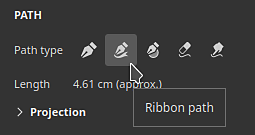

## Overview

The Ribbon path tool differ from the Paint along path tool in how it draw images and materials.

While with the Paint/Brush based tool an image is repeated multiple times on a path, with the Ribbon the image is repeated along the path and deformed to follow its curves. Individual component of a Paint brush are called <b>stamps</b>, while those in the Ribbon are called <b>patches</b>.

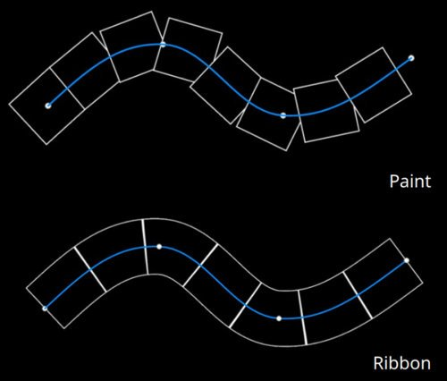

## Settings

### Size

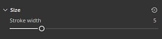

| Parameter | Description |
| --- | --- |
| <b>Stroke width</b> | Control the global width of the current stroke. |

### Opacity

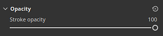

| Parameter | Description |
| --- | --- |
| <b>Stroke opacity</b> | Control the final opacity of the current stroke. |

### Stroke

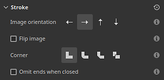

| Parameter | Description |
| --- | --- |
| <b>Image orientation</b> | Define the direction of the input image. This direction control how the image is placed on the path. |
| <b>Flip image</b> | Flip the image along the axis/width of the path. |
| <b>Corner</b> | Define how sharp corners (split tangents) should appear on the path. Possible behaviors are:<ul data-preserve-html="true"> <li data-preserve-html="true"><b>Miter join</b>: sharp/pointy corner</li> <li data-preserve-html="true"><b>Round join</b>: smooth/round corner</li> <li data-preserve-html="true"><b>Bevel join</b>: square/flat corner</li> <li data-preserve-html="true"><b>Cut join</b>: start the path again. This mode will create a new path with dedicated start/end sections.</li> </ul>Below are what the corners look like, in order:  
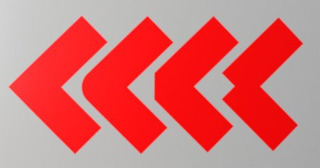
 |
| <b>Omit ends when closed</b> | If enabled, the start/end sections will be removed when a path is closed to make a continous loop. This applies to both stretch offsets and dynamic strokes. |

### Stretching &amp; Tiling

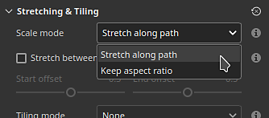

The Ribbon path can use two different modes to control how an image is repeated and stretched along a path:

* <b>Stretch along path</b>: (default) the image repeated along the path will be stretched to fit the path length
* <b>Keep aspect ratio</b>: the image repeated along the path will have its aspect ratio preserved. If the image is too long compared to the path it will be cropped.

#### Stretch along path

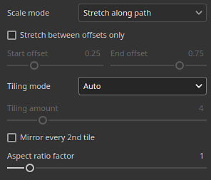

| Parameter | Description |
| --- | --- |
| <b>Stretch between offsets only</b> | If enabled, keeps the start and the end sections of an image intact while stretching the middle. Use the <b>Start offset</b> and <b>End offset</b> parameters to defined the size of these sections. The middle section will be automatically computed based on the start/end.  

 |
| <b>Tiling mode</b> | Define how an image is repeated along the path. Possible values are:<ul data-preserve-html="true"> <li data-preserve-html="true"><b>None</b>: the image will not be repeated. It will be stretched along the whole path.</li> <li data-preserve-html="true"><b>Auto</b>: (default) the image is automatically repeated a certain number of times based on its size and the stroke width.</li> <li data-preserve-html="true"><b>Custom</b>: the imaged is repeated by the number of times defined by the <b>Tiling amount</b> parameter.</li> </ul> |
| <b>Tiling amount</b> | Specify how many times an image is repeated in <b>Custom</b> tiling mode. |
| <b>Mirror every 2nd tile</b> | Flip the image used along the length of the path every second repetition. |
| <b>Aspect ratio factor</b> | Stretch or squeeze the current image aspect ratio. |

#### Keep aspect ratio

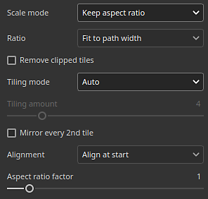

| Parameter | Description |
| --- | --- |
| <b>Ratio</b> | Define how the image is scaled while preserving its ratio:<ul data-preserve-html="true"> <li data-preserve-html="true"><b>Fit to path width</b>: (default) Scale the image to fit the path width. This can result in the image being cropped if too long.</li> <li data-preserve-html="true"><b>Fit to path length</b>: Adapt the image's dimension so that an exact number fits along the path while approximately keeping the aspect ratio.</li> </ul> |
| <b>Remove clipped tiles</b> | If enabled, will remove repetitions along the path that cannot be fully visible (if they are cropped). This setting is disabled if the <b>Ratio</b> setting is set to <b>Fit to path length</b>. |
| <b>Tiling mode</b> | Define how an image is repeated along the path. Possible values are:<ul data-preserve-html="true"> <li data-preserve-html="true"><b>None</b>: the image will not be repeated. It will be stretched along the whole path.</li> <li data-preserve-html="true"><b>Auto</b>: (default) the image is automatically repeated a certain number of times based on its size and the stroke width.</li> <li data-preserve-html="true"><b>Custom</b>: the imaged is repeated by the number of times defined by the <b>Tiling amount</b> parameter.</li> </ul> |
| <b>Mirror every 2nd tile</b> | Flip the image used along the length of the path every second repetition. |
| <b>Alignment</b> | Define where the image should start along the path. Possible values are:<ul data-preserve-html="true"> <li data-preserve-html="true"><b>Align at start</b>: the image is drawn starting from the first point on the path.</li> <li data-preserve-html="true"><b>Align at center</b>: the image is drawn in the middle of the path.</li> <li data-preserve-html="true"><b>Align at end</b>: the image is drawn starting from the last point on the path.</li> </ul> |
| <b>Aspect ratio factor</b> | Stretch or squeeze the current image aspect ratio. |

### Channel blending

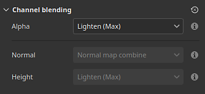

This section controls the blending result for when the path overlaps itself.

| Parameter | Description |
| --- | --- |
| <b>Alpha</b> | Control how the <b>Alpha</b> section of the Ribbon path is blended in regions where it overlaps itself, which affects the intensity of the blending of all the other channels. Possible values are:<ul data-preserve-html="true"> <li data-preserve-html="true"><b>Normal</b>: uses the alpha of the topmost segment.</li> <li data-preserve-html="true"><b>Lighten (Max)</b>: (default) uses the maximum alpha value, preserving the most opaque segment.</li> <li data-preserve-html="true"><b>Linear dodge (Add)</b>: adds the alpha of the segments to accumulate them together, resulting in a more saturated value.</li> </ul> |
| <b>Normal</b> | Define how the <b>Normal</b> channel is blended in regions where the path overlaps itself. Possible values are:<ul data-preserve-html="true"> <li data-preserve-html="true"><b>Normal</b>: uses the result of the topmost segment.</li> <li data-preserve-html="true"><b>Normal map combine</b>: (default) combine the segments with equal intensity.</li> <li data-preserve-html="true"><b>Normal map details</b>: consider the topmost segment as additional details while bottom regions will preserve their intensity.</li> </ul>This setting is separate from the <b>Normal</b> blending mode defined for the whole layer, which is applied after the path's own self-overlap blending. <b>Note</b>: this setting is disabled if the channel is a uniform color. It is compatible only with bitmaps and Substance resources. |
| <b>Height</b> | Define how the <b>Height</b> channel is blended in regions where the path overlaps itself. Possible values are:<ul data-preserve-html="true"> <li data-preserve-html="true"><b>Normal</b>: uses the result of the topmost segment.</li> <li data-preserve-html="true"><b>Linear dodge (Add)</b>: adds segments together while preserving their original intensity.</li> <li data-preserve-html="true"><b>Darken (Min)</b>: keep only the darkest/lowest value of the overlapping segments.</li> <li data-preserve-html="true"><b>Light (Max)</b>: (default) keep the lightest/highest value of the overlapping segments.</li> <li data-preserve-html="true"><b>Screen</b>: similar to <b>Linear Doge</b>, but gives a less saturated result.</li> </ul>This setting is separate from the <b>Height</b> blending mode defined for the whole layer, which is applied after the path's own self-overlap blending. <b>Note</b>: this setting is disabled if the channel is a uniform color. It is compatible only with bitmaps and Substance resources. |

Example of what the blending mode with the height channel can look like:

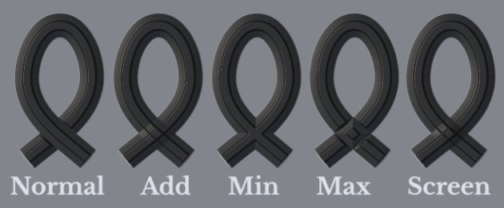

## Text and non-square images

When using a [Text resource](../../../painting/text-resource/text-resource.md) or an image with an aspect ratio that isn't square, it will be automatically scaled to fit the Ribbon path.

This behavior makes it possible to write text or repeat images like trim patterns along a path.

