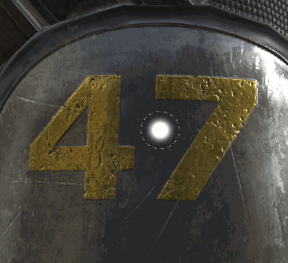

# Smudge tool

Introduced in Substance 3D Painter 2 the smudge tool shares the same type of parameters as as the  [paint tool](https://support.allegorithmic.com/documentation/display/SPDOC/Paint+brush)  .

## Usage

The simplest way to use the smudge tool is to use it directly on the content of a painting layer, as a regular paint tool.

A smarter way to use the smudge tool is to create a painting layer and set all the channels of the layer to the "Pass through" blending mode. This will allow to smudge in a non-destructive way over all the layers located below the "smudge layer". The layers below remain intact and all the modifications applied later will be taken in account by the smudge layer.
