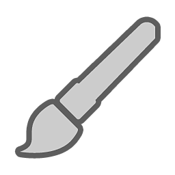
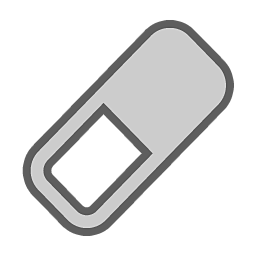
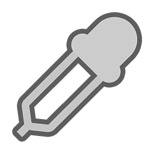

# Tool list

This page details all the painting tool available and how to use them.

| *Tool* | *Description* |
| --- | --- |
| 

 | The [Paint tool](../../help/painting/tool-list/paint-brush/paint-brush.md) allows you to apply brush strokes with a specific material over the mesh. |
| 

 | The [Eraser](../../help/painting/tool-list/eraser/eraser.md) allows you to remove any existing paint information. |
|  | [The Path tool](../../help/painting/tool-list/path/path.md) allows you to define a curve along the surface of your model that can create a few different effects. Add a brush stroke, erase paint, blur, or even add full details along the path like zippers, or cracks. |
| 

 | [Projection](../../help/painting/tool-list/projection/projection.md) allows you to apply a material or texture aligned to the current point of view. |
| 

 | [Polygon Fill](../../help/painting/tool-list/polygon-fill/polygon-fill.md) allows you to select polygons on the 3D mesh to create masks based on the geometry. |
| 

 | The [Smudge tool](../../help/painting/tool-list/smudge-tool/smudge-tool.md) allows you to stretch, mix, and blur color and other material properties. |
| 

 | The [Clone tool](../../help/painting/tool-list/clone-tool/clone-tool.md) allows you to duplicate or patch any part of the existing material on the 3D mesh. |
| 

 | The Material Picker allows you to copy material properties in your project from the surface of the 3D mesh.  This is a temporary tool; once a color is picked, the previous tool will be equipped. |
|  | [Quick Mask](../../help/painting/tool-list/quick-mask/quick-mask.md) allows you to create a temporary mask that provides more control over where you can apply paint. |
