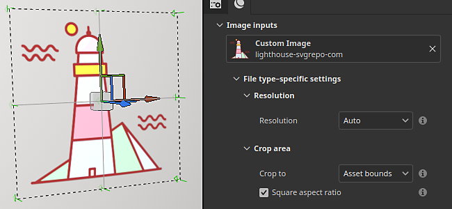
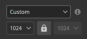
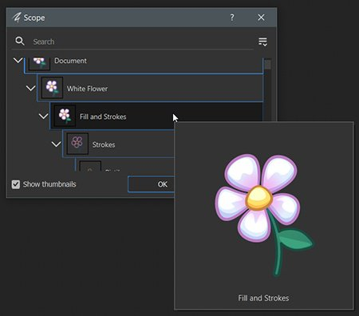

# Vector graphic (.svg &amp; .ai)

Vector graphic files (both <b>.svg</b> and Illustrator <b>.ai</b>) can be imported like regular images inside Painter. A few settings are available to adjust the look of the graphic and make it fit better the rest of the texturing.

* For more information about SVG files, [see this page](https://www.adobe.com/creativecloud/file-types/image/vector/svg-file.html).
* For more information about AI files, [see this page](https://www.adobe.com/ie/creativecloud/file-types/image/vector/ai-file.html).

SVG and AI files are automatically converted into pixel images when used inside the [Layer Stack](../../interface/layer-stack/layer-stack.md) (depending on the setting selected). This is a non destructive process, changing the resolution or updating the source file will update the final result accordingly.

## Properties

After importing an vectorial file and loading it inside a layer or tool properties, a set of parameters will be available:

| Section | Setting | Description |
| --- | --- | --- |
| <b>Artboard</b> | <b>Artboard</b> | Select which artboard included in the file is used.  **Note:**  This setting is only available with Illustrator (.ai) files. |
| <b>Resolution</b> | Resolution | Define at which size the svg will be converted into a bitmap image (pixels) when used for the texturing inside the Layer Stack.   Possible values:<ul data-preserve-html="true"> <li data-preserve-html="true"><b>Auto</b>: the resolution is determined by the resolution of the current Texture Set (when used in fill layer/effect) or to 512 pixels when using in a brush tool.  </li> <li data-preserve-html="true"><b>Asset</b>: the resolution is determined by the pixel size defined inside the SVG file itself.  </li> <li data-preserve-html="true"><b>Custom</b>: the resolution is determined by the resolution setting just under in the interface.</li> </ul>  

 |
|  |  |  |
| <b>Crop area</b> | Crop to | Define how the SVG shapes will be limited to the rendered area.   Possible values:<ul data-preserve-html="true"> <li data-preserve-html="true"><b>Asset bounds</b>: the area is defined by the bounds defined inside the SVG file.</li> <li data-preserve-html="true"><b>Custom</b>: the area is defined by explicit values via the settings of the interface just below.  </li> </ul> |
|  | Square aspect ratio | If the crop area is defined by <b>Asset bounds</b>, this setting ensure the original ratio is preserved, avoiding any incorrect stretching when rendering the SVG as a square image.   This setting can make some elements unexpectedly visible. To avoid this issue, disable this setting and instead adjust the UV settings manually when inside a fill layer/effect. |
|  | Top left Bottom right | If the crop are is set to Custom area, these settings allow to defined the area manually by specifying the top left and bottom right corners. |
|  |  |  |
| <b>Scope</b> | Scope | Define which elements inside the SVG file are included before rendering it.   It defaults to <b>Document</b>, which mean all the content of the SVG file is used. Use the <b>Change</b> button to adjust which elements to include. |

### Scope window

When editing the scope of a vector graphic (see the setting above) a window will appear with a list of elements to select to specify what to include or exclude from the final rendered image.

Use the <b>Show thumbnails</b> checbox to display an image for each element.

