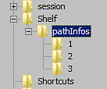
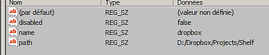
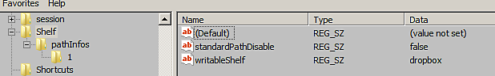

# Editing resource paths manually

This page is a guide on how to edit the preferences to add or remove resource path without launching the application.

## Preferences location

The resource location are managed with the application preferences which can change depending on the paltform:

<table data-preserve-html="true"> <colgroup> <col/> <col/> <col/> </colgroup> <tbody> <tr> <th>System</th> <th>Version</th> <th>Path</th> </tr> <tr> <td rowspan="2"><p><strong>Windows</strong></p><p>(registry)</p></td> <td><strong>7.2</strong> or newer</td> <td>HKEY&#95;CURRENT&#95;USER&#92;Software&#92;Adobe&#92;Adobe Substance 3D Painter</td> </tr> <tr> <td>Legacy</td> <td>HKEY&#95;CURRENT&#95;USER&#92;Software&#92;Allegorithmic&#92;Substance Painter</td> </tr> <tr> <td rowspan="2"><p><strong>Mac</strong></p><p>(library)</p></td> <td><strong>7.2</strong> or newer</td> <td>/Users/&#91;username&#93;/Library/Preferences/com.adobe.Adobe Substance 3D Painter.plist</td> </tr> <tr> <td>Legacy</td> <td>/Users/&#91;username&#93;/Library/Preferences/com.substance3d.Substance Painter.plist</td> </tr> <tr> <td rowspan="2"><strong>Linux</strong></td> <td><strong>7.2</strong> or newer</td> <td>/home/&#91;username&#93;/.config/Adobe/Adobe Substance 3D Painter.conf</td> </tr> <tr> <td>Legacy</td> <td>/home/&#91;username&#93;/.config/Allegorithmic/Substance Painter.conf</td> </tr> </tbody> </table>

## Adding a path on Windows

On Windows paths can be managed via the Windows Registry:

<table>
<tr style="border: 0;">
<td style="border: 0;" valign="top">



</td>
<td style="border: 0;" valign="top">



</td>
</tr>
</table>

1. Click on  **Start &gt; Run**  or press  **Windows + R**  .
1. Type "**regedit**" (without the quotes) in the dialog and press  **OK**.
1. Navigate in the tree view on the left of the  **Registry Editor**  window and go to the registry key mentioned above.
1. **Add a Key**  below **pathInfos** with a  **number**  as a name. Increment the number based on the already existing keys (starting at 1).
1. Do a  **right-click**  &gt;  **new**  &gt;  **String value**  in the right part of the window. Name it **disabled**  and set the value to **false**.
1. Do a  **right-click**  &gt;  **new**  &gt;  **String value**  in the right part of the window. Name it **name**  and enter the name of the custom shelf.
1. Do a  **right-click**  &gt;  **new**  &gt;  **String value**  in the right part of the window. Name it **path**  and set the value to path where the shelf is located.
1. Don't forget to increment by 1 the key "  **size**  " within "  **pathInfos**  ".
1. Close the window.
1. Start the application.

It is possible to define the new path as the default one (were new resources are created, like presets) by changing the value of the entry **writableShelf** to the name of the new location.



## Adding a path on Linux

On  **Linux**  additional paths can be created via the user application preference config file, stored in the home directory (see.

1. Navigate to the path mentioned above.
1. Open the file **Substance 3D Painter.config**
1. Scroll down to the **&#91;Shelf&#93;** section

Add a new shelf path by incrementing the last number visible, example:

```

pathInfos2disabled=false  

pathInfos2name=custom_resources 

pathInfos2path=/home/Username/Documents/custom_path 

writableShelf=custom_resources
```


Use the  **writableShelf**  variable to specify which path will be the default one (were new resources are created, like presets).

Save the changes and restart the application.
