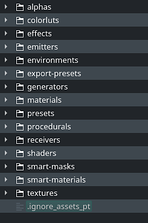

# Excluding resources in a resource path

This page explains how to setup an ignore file to specify resources and folders that will be ignored during the crawling process of the the [Assets](../../../interface/assets/assets.md) window. It allows to avoid unwanted resources from being displayed.

>[!NOTE]
>
> This functionality is available since version 7.2.3.

## Creating an ignore file

Navigate to the location of the resource folder in which you want to hide resources. Then create a file named as follow:

```

.ignore_assets_pt
```


>[!NOTE]
>
> Note that the filename must start with a dot.

It should look like this once created:



## Example

The following file content will discard any resources and folders other than the default library folders:

```

## exclude all

* 

 

## re-include library directories

!alphas 

!colorluts 

!effects 

!emitters 

!environments 

!export-presets 

!generators 

!materials 

!presets 

!procedurals 

!receivers 

!shaders 

!smart-masks 

!smart-materials 

!templates 

!textures
```


## Rules and guidelines

The following table shows the general rules that applies to the ignore file.

>[!NOTE]
>
> The pattern matching of the ignore file is case sensitive, independently from the Operating System behavior.

| Rule | Description | Example |
| --- | --- | --- |
| **Blank Line** | Empty line that doesn't match anything. Can be used as a separator for readability. |  |
| **Directory separator** | The forward slash is used as a directory separator. Separators may occur at the beginning, middle or end of a search pattern.If there is a separator at the beginning or middle (or both) of the pattern, then the pattern is relative to the directory level of the ignore file itself. Otherwise the pattern may also match at any level below the ignore file level. If there is a separator at the end of the pattern it will be ignored, the pattern will still match both files and directories. | ``` folder/filename.extension   folder/sub-folder ``` |
| **Comment line** | A line starting with the number sign (or hash) serves as a comment. | ``` # This is a comment ``` |
| **Asterisk** | An asterisk matches anything except a forward slash. | ``` # Match anything starting with Alpha   alpha*   # Match any file with given extension   *.jpg ``` |
| **Character range** | Range of characters can be specified between brackets to match folder and filenames.<ul data-preserve-html="true"> <li data-preserve-html="true"><strong>&#91;abc&#93;</strong> : Match one character in the given list</li> <li data-preserve-html="true"><strong>&#91;a-c&#93;</strong> : Match one character in the given range</li> <li data-preserve-html="true"><strong>&#91;&#33;abc&#93;</strong> : Match one character not in the given list</li> <li data-preserve-html="true"><strong>&#91;&#33;a-c&#93;</strong> : Match one character not in the given range</li> </ul>Range and list can be numbers as well with the format **&#91;0-9&#93;**. | ``` # Exclude any UDIM image in PNG   *_[0-9][0-9][0-9][0-9].png ``` |
| **Escaping character** | Indicate literal characters that would otherwise be ignored or used as rules. | ``` # This is a comment   [#]This/Is/A/Path ``` |
| **Trailing spaces** | Trailing spaces are ignored unless they are escaped. | ``` # Match a subfolder with trailing space   folder/subfolder[ ] ``` |
| **Exclamation Prefix** | Prefixing a pattern with an exclamation point allows to negate it.Any matching file excluded by a previous pattern will become included again. It is not possible to re-include a file if a parent directory of that file is excluded. Crawling doesn’t list excluded directories for performance reasons, so any patterns on contained files have no effect, no matter where they are defined. | ``` # Re-include specific file   !my_file_name.png ``` |
