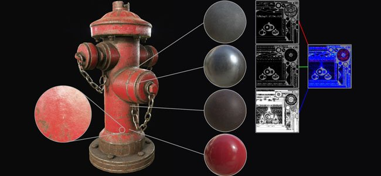
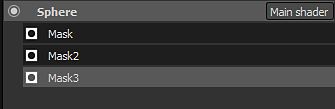
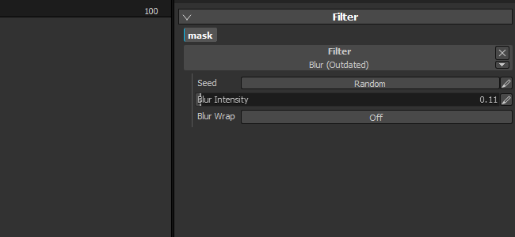

# Version 2.2

**Substance Painter 2.2** adds a new workflow which si the Dynamic Material Layering.

Release date : *21 July 2016*

## Major Features

### New Dynamic Material Layering workflow

With this new version we add a new **workflow** called the **Material Layering**. Traditional texturing workflows rely on creating textures at **high resolution** to **preserve details** but this is **not convenient** for the use case. A more interesting approach instead is to **create small tilling material** and **repeat them inside a shader**. It allows to preserve a certain quality and the ability to **zoom really close** to the object using this shader **without losing details**. The only problem is that to preview the end result it was previously mandatory to go to the game engine/renderer that display the final shader. That's not true anymore since in this new version it is now possible to use a similar shader inside Substance Painter, which let you **visualize the end result and paint at the same time**.

A **new sample project** named "**FireHydrant**" has been added to showcase the new workflow.

This new workflow opens two ways of working :

* Materials are defined in the shader, you can only paint masks to blend them
* Materials and Masks can be painted together

In any case, it is possible to define a new layer stack each time which gives more freedom when creating the masks and materials. Management of layers is much more easier this way and each stack can have its own set of specific channels that can be blended in the final shader.  
We also have a special shader for Unity 5 and Unreal Engine 4 available on Share :

* [Unity 5](https://share.allegorithmic.com/libraries/2126)
* [Unreal Engine 4](https://share.allegorithmic.com/libraries/2125)

For more details, see the dedicated page of the documentation : [Dynamic Material Layering](../../../help/features/dynamic-material-layering/dynamic-material-layering.md)

### New mini-shelf search field

We improved the **mini shelf** that appear in various place of the application with a dedicated search field. This improvement makes the search for ressources much more convneient and pleasant to use. The custom search is preserved during the current session of the application. For example, if you use a lot grunge noises, using this keyword will makes

## Tutorial

Our latest video tutorial cover the new features :

## Release Notes

### 2.2.0

(Released 21 July 2016)

**Added :**

* &#91;Shelf&#93; Improve search system and queries
* &#91;Shelf&#93; Add search field for mini-shelves
* &#91;Shader&#93; Allow to define step precision for sliders
* &#91;Shader&#93; Add an Undo/Redo button for shader parameters
* &#91;Shader&#93; Reloading a shader should not reset its parameters
* &#91;MatLayering&#93; Add support for Dynamic Material Layering and sub-stacks
* &#91;MatLayering&#93; Allow to import json file to setup the shader settings
* &#91;MatLayering&#93; Unlock texture samplers limit (switch to Bindless textures)
* &#91;Scripting&#93; Allow to set bakers settings and launch their computation
* &#91;Substance&#93; Use "usage" for inputs/outputs connections in addition of identifiers
* &#91;Tool&#93; Allow to select the preview channel in the viewport for the Projection Tool

**Fixed :**

* Crash during launch if substances are located in wrong folder
* Crash report sometimes doesn't work because of incorrect log file
* &#91;Iray&#93; Post effects don't refresh when Iray is paused
* &#91;Iray&#93; Auto-focus shortcut doesn't work anymore
* &#91;Iray&#93; Aperture slider behavior change depending of asset size
* &#91;Layers&#93; First material channel is not enabled by default if they are all disabled
* &#91;Shader&#93; No errors are printed if a "param auto" is incorrect

**Known Issue :**

* &#91;Mac&#93; Texture samples limit is locked at 16 (GPU driver issue)
