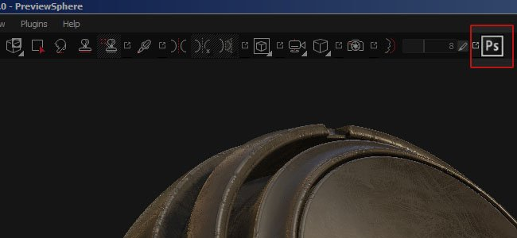
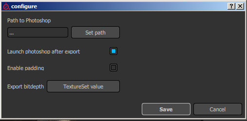

# Version 2.3

**Substance Painter 2.3** improve the scripting API in order to release its first official plugin : a Photoshop export with the full layer stack available.

Release Date : *15 September 2016*

## Major features

### New Photoshop export plugin

With this release we focused on adding new possibilities in the scripting API in order to implement **an advanced exporter for Photoshop**. To access this new export, simply click on the Photoshop icon available in the main toolbar (if the plugin is activated, which the case by default). The plugin allow to export the full layer stack available in a texture set and create a similar structure inside a PSD file. This feature **require to have Photoshop installed** on your computer in order to be able to generate the PSD file.

A few options are available via the configure button of the plugin menu :  
   
 

## Tutorial

Our latest tutorial explains the export process with the new plugin :

## Release Notes

### 2.3.1

(Released 7 October 2016)

**Added :**

* &#91;Plugin&#93;&#91;Photoshop&#93; Allow to specify which material/stack/channels to export
* &#91;Scripting&#93; Function names have some inconsistencies

**Fixed :**

* &#91;Export&#93; Alpha can be discarded in custom export presets
* &#91;Export&#93; Alpha gets incorrect gamma conversion on sRGB channels
* &#91;Export&#93; Non-square documents are exported as squared
* &#91;Export&#93; Impossible to export additional maps if one is missing
* &#91;Iray&#93; Some parameters (like emissive Intensity) have no effect
* &#91;NVIDIA&#93; Crash at Startup with NVIDIA Quadro K2200/GTX 750/760
* &#91;AMD&#93; Incorrect set of colors for thumbnails and previews
* &#91;AMD&#93; Freezes and driver failure on New File and File Open
* &#91;Log&#93; "software-version" is missing from log file

### 2.3.0

(Released 15 September 2016)

**Added :**

* &#91;Plugin&#93; New "Export to Photoshop" plugin (export complete layer stack)
* &#91;Export&#93; Allow to specify the width of the padding (in pixels or infinite)
* &#91;Export&#93; Allow to set the type of background outside of the UVs
* &#91;Shelf&#93; New material layering shader to blend 10 materials
* &#91;Shelf&#93; New clay shader to view details with the height/normal channel
* &#91;Shelf&#93; New baked lighting filter with environment input
* &#91;Shelf&#93; Updated some mask generators to add non-square transformations
* &#91;Viewport&#93; Add composited normal map (normal+height+bake) to the solo mode
* &#91;Scripting&#93; Allow to export additional maps
* &#91;Scripting&#93; Allow to query available Additional maps per Texture Set
* &#91;Scripting&#93; Allow to retrieve channel format
* &#91;Scripting&#93; Add examples in the baking documentation
* &#91;Scripting&#93; Allow to query the visibility of a layer
* &#91;Scripting&#93; Allow to query layer's blending mode and opacity
* &#91;Scripting&#93; Allow to export converted maps (final normal maps, mixed AO, etc.)
* &#91;Substance&#93; Read and connect custom usages
* &#91;Shortcuts&#93; Add modifier key (SHIFT) to cycle solo mode backward
* &#91;Export&#93; Updated default export preset to disable alpha
* &#91;UI&#93; Thumbnails are now only computed if the engine is available
* &#91;UI&#93; Display a mention when thumbnails are computing

**Fixed :**

* Crash with some old projects when opening them
* Crash with corrupted texture channels cache
* Crash when blending more than 4 materials with Material Layering workflow
* &#91;UI&#93; Tool shortcuts don't work if the toolbar is hidden
* &#91;UI&#93; Iray toolbar is labeled "Untitled" in the View Menu
* &#91;UI&#93; Plugin toolbars are named "Untilted" in the View Menu
* &#91;Baker&#93; Pressing Enter while editing a bake setting launches the bake process
* &#91;Baker&#93; Incorrect ranges for some parameters
* &#91;Import&#93; Impossible to import OBJ meshes because of very big numbers
* &#91;Import&#93; Some OBJ files are imported with too many sub-objects
* &#91;Export&#93; channel background is filled with black instead of default color at export
* &#91;Tool&#93; Particles don't work properly if FOV is too low
* &#91;Tool&#93; Brush preview color is incorrect with masks in sub-stacks
* &#91;Viewport&#93; When brush goes into empty areas in 2D view it becomes gigantic
* &#91;Viewport&#93; Blank brush preview when painting Normal textures
* &#91;Scripting&#93; Incorrect documentation : "ao" listed instead of "ambientocclusion"
* &#91;Scripting&#93; Process started with subprocess() is killed when closing Painter
* &#91;Shelf&#93; Baked lighting filter use incorrect AO input
* &#91;MacOS&#93; Removed Fire Hydrant project (incompatible)
* Default project opens when loading a \*.spt file (instead of \*.spp)
