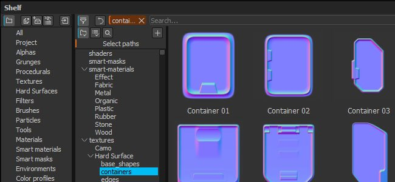
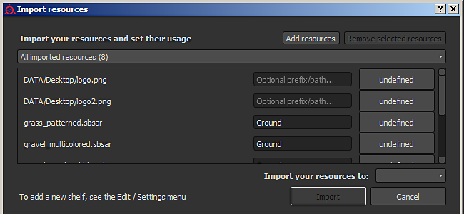
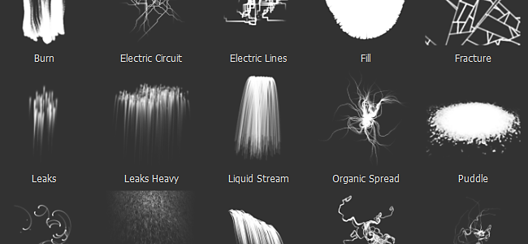

# Version 2.4

**Substance Painter 2.4** focus on improving the shelf window as well as the managements of resources.

Release Date : *27 October 2016*

## Major features

### New shelf window with advanced filtering

The new shelf window provide a **better organisation** of resources alongside **new ways of filtering content**. We added the possibility to create **custom presets** where each preset has its own filtering (allowing to quickly switch between different queries). These presets can also be i**solated into a new window**, offering a way to have **multiple views** of the shelf and not only one like before. The filtering also offer a way to **browse the hierarchy of folders on the disk**, becoming handy when refining a more general query. We also improved the **context menu** (when right-clicking on a resource) to provide **more useful information**.

For creating advanced queries, see the dedicated part of the documentation : [Advanced search queries](../../../interface/assets/advanced-search-queries/advanced-search-queries.md)

### New import resource window

With the rework of the shelf we also **improved the resource import window**. The window is now more consistant and can be **called in three different ways** : via the file menu, via the button in the shelf window, or just like before by drag and dropping a resource into the shelf window. The new window allow to **quickly set the usage** for **multiple resources** at once, which means you don't have to drag and drop resources into the right location first anymore. We also added the possibility to **specify a custom path** to create sub-folders in order to take advantage of the new tree view.

For more details, see the dedicated part of the documentation : [Adding resources via the import window](https://helpx.adobe.com/substance-3d/unlisted/documentation/spdoc/adding-content-via-the-import-window-151584824.html)

### New particle presets

We **reworked** the previous **particles preset** to be more ready to use (especially the **Rain** preset). We also took this opportunity to **add new presets** with new behaviors : take a look at **Electric Circuit, Electric Lines, Rococo and Veins Small** !

## Tutorial

The new shelf features and use is covered in our latest tutorial :

## Release Notes

### 2.4.1

(Released 28 October 2016)

**Fixed :**

* Crash when creating a project with a template
* Crash when closing export dialog during an export
* &#91;Mac&#93; Errors when saving project (fail to save export preset)
* &#91;Shelf&#93; Creating a new preset will display it twice
* &#91;Shelf&#93; Presets cannot be loaded in read-only mode without admin rights

### 2.4.0

(Released 27 October 2016)

**Added :**

* &#91;Shelf&#93; New interface to browse ressources (tree-view, filters and so on)
* &#91;Shelf&#93; Allow to save a search as a preset
* &#91;Shelf&#93; Allow to create a new window from a preset
* &#91;Shelf&#93; New interface for importing resources
* &#91;Shelf&#93; Don't copy default allegorithmic shelf in Documents folder
* &#91;Shelf&#93; New particles presets : Electric Circuit, Electric Lines, Rococo, Veins Small
* &#91;Shelf&#93; Improved older particles presets to be more easy to use (like "Rain")
* &#91;Shelf&#93; Add new information on resource contextual menu
* &#91;Viewport&#93; Improve performance when loading environment maps
* &#91;Viewport&#93; Add support of environment maps that are not power of two

**Fixed :**

* Crash when removing a mask
* Crash when painting after saving a preset
* Crash with environment blur on some GPUs
* Crash when assigning a wrong resource with the mini shelf
* &#91;Shelf&#93; Clean + Save remove tags and metadata for resources in the project
* &#91;Shelf&#93; importing a preset will display its ressources in the shelf
* &#91;Export&#93; Normal map generated from height channel has a low intensity
* &#91;Export&#93; Normal from mesh is not always present in final normal map
* &#91;Export&#93; Dilation with transparency can sometimes result with no transparency
* &#91;Scripting&#93; "alg.plugin\_root\_directory" can returns a truncated network path
* &#91;TextureSet&#93; Lock button is enabled when re-opening non-square projects
