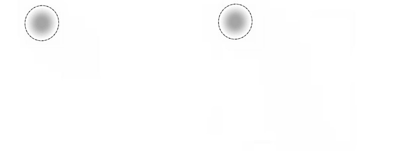
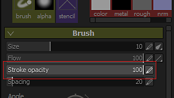
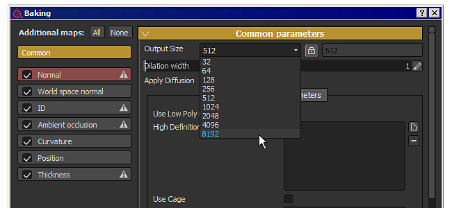
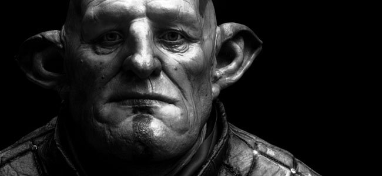
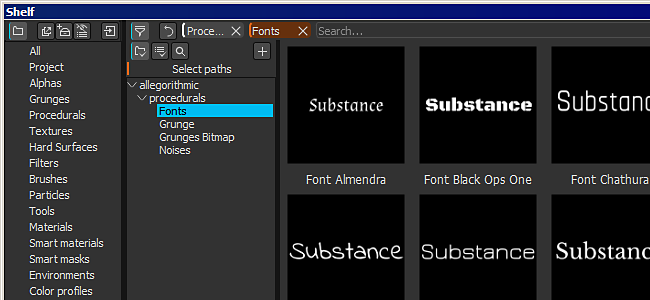
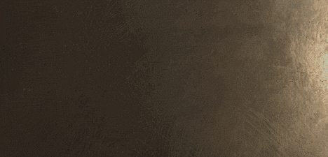
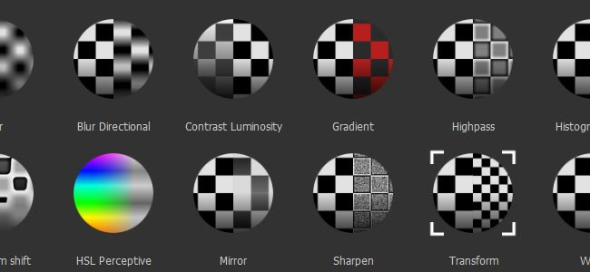
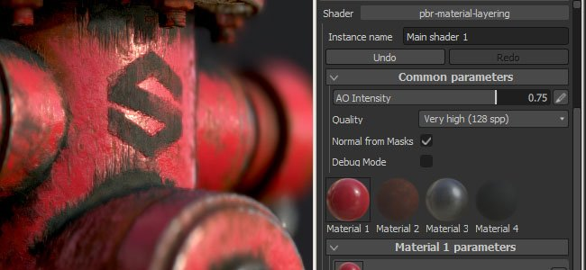

# Version 2.5

**Substance Painter 2.5** introduces a lot of new features : from the support of the opacity in the brush settings (in addition to the flow) to the ability to bake additional map in 8K and much more.

Release date : *21 February 2017*

## Major features

### New Brush opacity

{width="650px"}

There is now a new setting in the **brush parameters** when Painting in Substance Painter which is the **opacity**.  
The **opacity** control the **overall intensity of a brush stroke**, contrary to the **flow** setting which control the intensity of **each individual stamp** inside a brush stroke. This means that it is now possible to paint and repaint a same area **without creating overlapping values**. To do so, set the flow to 100 and the opacity value to the intensity you prefer. Because of how the opacity works, it is not possible to link it to the pen pressure. For that kind of control the flow is still the best choice.

We also added a **new modifier** alongside this new parameter which is on the **"A"** key by default. Pressing this key will allow **to continue the previous brush stroke** instead of creating a new one. This means you can paint a uniform color with the opacity you want while keeping the possibly to move the camera for example. Another example would be to continue the copy that you were doing with the clone tool.

### New baking at 8K and non-square resolutions

The baker have been improved to support resolutions up to **8192x8192** (8K plus anti-aliasing), meaning you can now export at 8K with 1:1 ratio with the additional maps.  
We also added support for **non-square** resolutions. It is now possible possible to bake a texture of **4096x2048** for example. To do so, simply click on the "**lock**" icon next to the dropdown to select the resolution.

### New support for Color Profile in the viewport

We added the support of **LUT** (textures) to control the rendering of the **viewport** in Substance Painter. To apply a profile, simply enable the "**Color Profile**" setting in the "**Display settings**" window and load the LUT in the dedicated slot. It work both with the **OpenGL** viewport (painting) and the **IRay** renderer. A few examples are available by default from common **Camera presets** to more **Artistic effects**. For more information, see the dedicated page of the documentation : [Color Profile](../../../features/post-processing/color-profile/color-profile.md)

### New Substance engine compatible with Substance Designer 6

We added the support for **Substance Designer 6**, this means resources created with **SD6** can be opened and used in **Substance Painter 2.5** !  
A good example is the ability to use the **new text node** of SD6 and integrate it into a substance. This way it is possible to create **dynamic text** and paint them directly without the need to leave the application. **We included 10 fonts** with each a different style by default to cover the most common use. You can find them in the "**procedural**" section of the **shelf**.

{width="400px"}

### New content in the shelf

Alongside a few fixes and improvements with the new shelf, we also added a bunch of **new filters** to improve the painting and texturing. We also **improved** the behavior of already existing filter (like the "**HSL**"). We also added new **templates** when creating **new projects** (such as **Unity 5** and **Unreal Engine 4**).

### New scripting improvements with support for custom shader UI

With this release we added a way to **script and control** the **shader parameters**. We also added the support for using a **custom UI** instead of the default one, opening a lot of new possibilities such as **animated shader**.  
For more details take a look at the scripting documentation available from the Help menu of the application.

## Tutorial

The new major features are covered in our latest Twitch stream :

## Release Notes

### 2.5.3

(Released 15 March 2017)

**Fixed :**

* &#91;Baker&#93; Crash when baking with specific meshes

**Known Issue :**

* &#91;Mac&#93; Particles can create texture corruption in some cases

### 2.5.2

(Released 14 March 2017)

**Fixed :**

* &#91;Tool&#93; Wacom tablet don't work on Linux
* &#91;Tool&#93; Black artifacts when using the smudge tool
* &#91;Bakers&#93; Baking fail if Match By Name is used with a cage
* &#91;Bakers&#93; Ambient Occlusion broken when baking with Normal Map only
* &#91;Shelf&#93; Generic filters don't handle alpha properly (Contrast/Luminosity, Highpass, etc.)
* &#91;Viewport&#93; Performance issue when loading a project with shadows enabled
* &#91;Viewport&#93; Dithering issue in 3D View on MacOS
* &#91;Viewport&#93; Particle previews incorrectly displayed when color profile is enabled
* &#91;Iray&#93; Crash when switching project back to OpenGL if Iray failed to initialize
* &#91;IRay&#93; Glossiness is ignored when rendering SpecGloss shader/mdl
* &#91;Shader&#93; Spec/Gloss shader doesn't match Iray and SD
* &#91;Shader&#93; sRGB conversion different from linear to sRGB LUT conversion
* &#91;Shader&#93; Incorrect rendering when loading project with outdated shaders
* &#91;Shader&#93; "pbr-coated" shader doesn't work anymore
* &#91;Export&#93; Some channels are still exported even if not present in the texture set
* &#91;Layers&#93; Blending mode "normal map inverse detail" doesn't work on grayscale channels
* &#91;UI&#93; Issue on "Color selection window" with HDPI monitor and display zoom at 150%

**Known Issue :**

* &#91;Mac&#93; Particles can create texture corruption in some cases

### 2.5.1

(Released 27 February 2017)

**Fixed :**

* &#91;Mac&#93; Wacom tablet input broken in 3D and 2D view
* &#91;Bakers&#93; Matching by name doesn't work anymore
* &#91;Bakers&#93; "Average Normals" setting doesn't work anymore
* &#91;Iray&#93; Incorrect rendering with missing baked normal map
* &#91;Iray&#93; Color Profiles behave differently in comparison to OpenGL renderer
* &#91;Iray&#93; Exporting render as bitmap doesn't include color profile correction
* &#91;Substance&#93; Material filters don't work anymore
* &#91;Tool&#93; Stroke opacity isn't stored in brush presets
* &#91;Tool&#93; Clone Brush UV Alignment doesn't work anymore
* &#91;Export&#93; Displacement channel should be centered in 0.5 when exporting in integer
* &#91;Template&#93; Absolute path is stored in Templates
* &#91;TextureSet&#93; Channel texture persist after removing the channel

**Known Issue :**

* &#91;Linux&#93; Wacom tablet input don't work in 3D and 2D view
* &#91;Mac&#93; Particles can create texture corruption in some cases
* &#91;Export&#93; In very rare case, black rectangles can appear on AMD GPUs

### 2.5.0

(Released 21 February 2017)

**Added :**

* Add support for AMD Radeon Pro and AMD FirePro GPUs
* &#91;Tool&#93; Add support for stroke opacity
* &#91;Tool&#93; Add a modifier that allow to continue the last brush stroke
* &#91;Iray&#93; Update to support Pascal GPUs
* &#91;Viewport&#93; Add support for Color Profiles (LUT)
* &#91;Substance&#93; Integrate new framework (SD6 engine)
* &#91;UI&#93; Increase "recent file" size list in File menu
* &#91;Import&#93; Use category from substances to fill the prefix in the import dialog
* &#91;Bakers&#93; Allow to bake 8K textures
* &#91;Bakers&#93; Allow to bake non-square resolutions
* &#91;Bakers&#93; Improve memory consumption when baking heavy high-poly meshes
* &#91;Shelf&#93; Lock shelves (and projects) to forbid concurrent editing and avoid corruptions
* &#91;Shelf&#93; Read category and keywords from substances to use them for filtering
* &#91;Shelf&#93; Allow to exclude ressources from the result of a search query
* &#91;Shelf&#93; Improved thumbnails time computation
* &#91;Shelf&#93; Allow to embed presets in projects
* &#91;Shelf&#93; Allow to quickly collapse/expand the tree-view with SHIFT
* &#91;Shelf&#93; Allow to save thumbnails when assets are read only (local cache)
* &#91;Shelf&#93; New content : new filters (transform, mirror, tri-planar, etc.)
* &#91;Shelf&#93; New content : new LUTs profiles (classic and artistic, such as Film Noir, Vintage, etc.)
* &#91;Shelf&#93; New content : 10 new Font Substances to quickly generate custom texts
* &#91;Shelf&#93; New templates : Unity 5 and Unreal Engine 4
* &#91;Shelf&#93; Improved HSL filter to be more artist friendly
* &#91;Shader&#93; Add support for specular level channel in PBR shaders
* &#91;Shader&#93; Add support for Dithering in Alpha Test shader
* &#91;Shader&#93; Add support for parallax occlusion mapping in PBR shaders
* &#91;Shader&#93; Allow to define custom UI for shader parameters
* &#91;MatLayering&#93; Create new Mask channel for material layering workflow
* &#91;Scripting&#93; Allow to write metadata in a SP project
* &#91;Scripting&#93; Allow to export with a specific export preset
* &#91;Scripting&#93; Allow to retrieve shader parameters as a JSON
* &#91;Scripting&#93; Add support for WebSocket connections
* &#91;Scripting&#93; Add the possibility to load shader instances
* &#91;Scripting&#93; Add the possibility to create a new project
* &#91;Scripting&#93; Allow to retrieve the url of the mesh imported in a project
* &#91;Scripting&#93; Allow non square baking
* &#91;Scripting&#93; Report errors when setting data via scripting API
* &#91;Substances&#93; Add user-data tag to specify normal map format

**Fixed :**

* Crash when picking color with substances
* Crash when loading a non RGBA32f image as environment map
* Crash related to painting on AMD GPUs
* &#91;Mesh&#93; OBJ import doesn't recognize materials without mtl file
* &#91;Mesh&#93; UDIM Texture set name generation can be incorrect on some meshes
* &#91;UI&#93; Undo/Redo button in Viewer Setting steal focus and stop mouse scrolling
* &#91;UI&#93; Some labels are incorrectly cropped in High-DPI
* &#91;Layer&#93; Replace mode for paint effect has an incorrect behavior on Mask
* &#91;Layer&#93; Subtract blending mode has an incorrect behavior with alpha
* &#91;Tool&#93; Brush size becomes huge in 2D View when painting on UV borders
* &#91;Tool&#93; Snapped straight line has erratic behavior with High-DPI
* &#91;Tool&#93; Stencil resolution is sometimes incorrect
* &#91;Bakers&#93; "Max Occluder Distance" values are clamped if "relative to bounding box" is "Off"
* &#91;Shader&#93; Stack and auto param channel definitions don't match
* &#91;3D View&#93; Inconsistent display of the normal channel depending of project setting
* &#91;Viewport&#93; Some normal maps have clamped values which appear as artifacts
* &#91;Viewport&#93; Post-effect are always disabled by default
* &#91;Export&#93; Normal mixing setting is incorrect if normal channel is missing
* &#91;Export&#93; Incorrect texture generation in some cases on AMD GPUs
* &#91;Export&#93; Shader parameters are not exported properly if located inside a group
* &#91;Export&#93; Editing an export preset in a custom shelf output a log error
* &#91;Shelf&#93; Tree-view filtering does not match exactly the folder name
* &#91;Shelf&#93; Renaming a shelf preset is hard to read
* &#91;Shelf&#93; Shader resource imported in the Shelf isn't preserved after relaunching
* &#91;Shelf&#93; Content : Weld tool preset is missing
* &#91;Shelf&#93; Content : Tile Generator doesn't work properly
* &#91;Shelf&#93; Content : Fixed incorrect mask on Rubber Tire Dirty smart material
* &#91;Shelf&#93; Content : Fixed incorrect group name on Leather bag material
* &#91;Iray&#93; Half of meshes are missing in Iray
* &#91;Linux&#93; Crash when dragging a resource above the 3D View
* &#91;Mac&#93; Preferences are reset at every launch on Sierra

**Known Issue :**

* &#91;Export&#93; In very rare case, black rectangles can appear on AMD GPUs
* &#91;Iray&#93; Color Profiles can behave in odd ways sometimes
