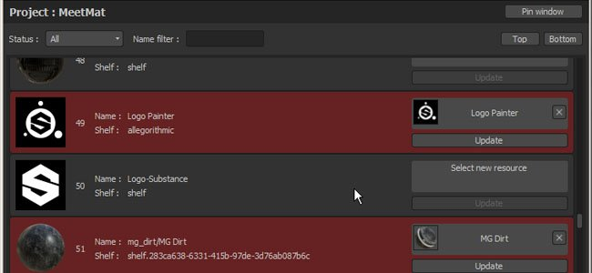
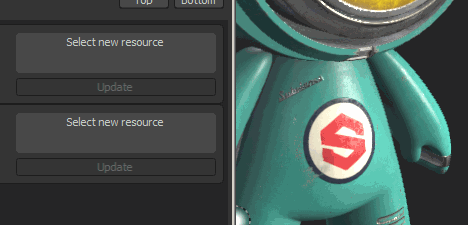
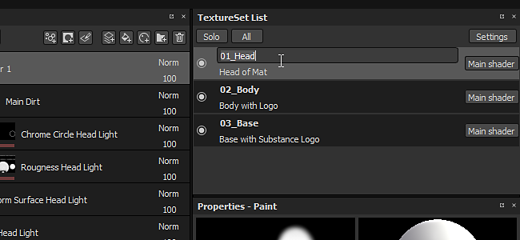
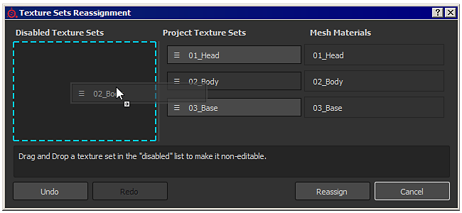

# Version 2.6

With **Substance Painter 2.6** our focus was to provide a way to manage the texture sets directly inside Substance Painter, without the need to make a new project or reimport your mesh with updated material names. We also wanted to provide a way to update resources used in projects, something we saw requested a lot in the past.

Release date : *27 April 2017*

## Major Features

### New sample project "Meet Mat"

This new sample project offer a new shiny and adorable character named "**Mat**". It contains three texture sets ready to be painted on.  
Participate in the **Meet Mat** contest with it to win some really cool prizes : <https://www.allegorithmic.com/contest/meet-mat-2017-substance-3d-painting-contest>

### New scripting API with ability to update resources in projects

The scripting API of Substance Painter has been improved to add new functions that allow to **replace resources** in project with other versions. To demonstrate this new feature, a new **plugin** created with the scripting API has been added and allow to browse all the resources contained in a given project. Resources marked as red are detected as "outdated" and can be automatically replaced. This feature is not limited to "outdated" resources, any asset can be replaced with something else. This offer a lot of new possibility and show even more how Substance Painter is a **non-destructive Painting tool** !

The **plugin** is available on GitHub, don't hesitate to help if you see potential improvements : <https://github.com/AllegorithmicSAS/painter-plugin-resources-updater>

### New ability to rename and reassign texture sets

It is now possible to change the name of a texture set directly inside Substance Painter. Renaming a texture set will affect the name of the textures that are exported on the disk (depending of the export preset used).  
To rename a texture set, simply double click on its name to modify it or use right-click to open the context menu. It is also possible to add custom descriptions to give more information about what texture sets do. This can be really helpful when working on an [UDIM project](https://helpx.adobe.com/substance-3d/unlisted/documentation/spdoc/uv-tile-udim-legacy-144310352.html). Use the "**settings**" button to configure the way descriptions are displayed in the list.

Texture Sets can now be reassigned to different Mesh Materials. This means it is possible to **recover** Texture Sets previously disabled (because they were missing on the mesh) or even **swap** them. Simply click on the new "**settings**" button in the Texture Set List window and click on the "**Reassign Texture Sets**" entry. It will open a new window dedicated to managing the Texture Sets and how they are linked to the Mesh Materials. The management can be done by **drag and dropping** a texture set name where you want.

## Tutorial

The new major features are covered in our latest video tutorial :

## Release Notes

### 2.6.2

(Released 20 October 2017)

**Added :**

* &#91;Texture Set&#93; Allow to delete disabled texture sets
* &#91;Shelf&#93; Allow multiple users to write inside the same shelf folder
* &#91;Scripting&#93; Be able to reload plugins folder
* &#91;Scripting&#93; Add a required minimal API version in plugin metadata to ensure compatibility
* &#91;IRay&#93; Export image dialog improvements

**Fixed :**

* &#91;Engine&#93; Disappearing strokes issue, when changing resolution (4K&gt;2K)
* &#91;Bakers&#93; ID Map Baking fail with Match By Name enabled
* &#91;Bakers&#93; Error messages are not explicit enough
* &#91;3D View&#93; Tangent space is not synched with bakers
* &#91;Tool&#93; Black artifacts when using the smudge tool
* &#91;Shader&#93; Non-PBR shader doesn't work anymore
* &#91;Shader&#93; "pbr-coated" is broken
* &#91;Shader&#93; Coating Roughness of "pbr-coated" shader has no impact anymore
* &#91;Shader&#93; Spec gloss shader doesn't match Iray and SD
* &#91;Shelf&#93; Crash when loading two files with the same name but different extensions
* &#91;Shelf&#93; Can't edit preset anymore in the shelves
* &#91;Shelf&#93; Cannot set a custom preview for assets imported in the shelf
* Resources loaded from the cache lose their usages
* Saving a project before creating a template returns write permission errors
* Incorrect project save if filename contains two periods
* Importing files with multiple dots (.) in the filename causes issues

### 2.6.1

(Released 12 May 2017)

**Added :**

* &#91;TextureSet&#93; Don't allow to reassign mesh materials to nothing

**Fixed :**

* Crash when switching of TextureSet after replacing baked map
* Crash when doing "Undo and Redo" after changing layer's blending mode
* Crash or Freeze when using the "color selection" effect with big ID map
* &#91;Export&#93; Texture Sets renamed are not sorted alphabetically in the export window
* &#91;TextureSet&#93; Reset to default name doesn't check for unicity
* &#91;TextureSet&#93; Renamed texture set become disabled after reopening project
* &#91;Shelf&#93; Missing default templates content
* &#91;Shelf&#93; Non-square textures are displayed as square
* &#91;Shader&#93; Once a texture set is disabled the associated shader is destroyed
* &#91;Scripting&#93; alg.baking.setTextureSetBakingParameters() doesn't work anymore
* &#91;Scripting&#93; Typo in websocket tutorial
* &#91;Scripting&#93; Various problems in AlgWidgets
* &#91;Log&#93; Incorrect detection of available virtual memory in some cases

### 2.6.0

(Released 27 April 2017)

**Added** :

* Add new sample project "Meet Mat"
* &#91;Plugin&#93; New "Resources Updater" plugin
* &#91;TextureSet&#93; Allow to rename and add a description to texture sets
* &#91;TextureSet&#93; Allow to reassign materials
* &#91;TextureSet&#93; Add a setting button in the texture set list window
* &#91;TextureSet&#93; Show "disabled" texture sets at the bottom of the list
* &#91;Substance&#93; Use additional maps at the current texture set resolution to improve performances
* &#91;Scripting&#93; Allow to update a resource used in a project (material, generator, etc.)
* &#91;Scripting&#93; Add a way to add/remove a shelf
* &#91;Scripting&#93; Allow to query info from resource in projects
* &#91;Scripting&#93; Allow to retrieve a list of available shelfs
* &#91;Scripting&#93; Improve AlgWidget thumbnail tutorial
* &#91;Export&#93; Disable/Enable bit depth based on file format support
* &#91;Log&#93; Add plugin name to print in console
* &#91;Log&#93; Remove error about hidden texture sets
* Update "Welcome Screen" with new icons and text for samples

**Fixed** :

* Crash when updating a mesh in specific projects
* &#91;Viewport&#93; Symmetry plane inner color is not visible anymore
* &#91;Viewport&#93; Some post-process effects are enabled when using the solo view
* &#91;Shaders&#93; "over\_premult" blending doesn't work properly
* &#91;Shaders&#93; Warning about alpha-test with the default shader
* &#91;Shelf&#93; Incorrect parsing of tags from Substances
* &#91;Shelf&#93; MatFX Rust Weathering doesn't work properly
* &#91;Shelf&#93; HSL filter is enabled on incorrect channels by default
* &#91;Shelf&#93; Sharpen is enabled on Height/Normal channel by default
* &#91;Export&#93; Vray export presets don't use an OpenGL normal map
* &#91;Tool&#93; Imprecision issues with clone/smudge tool create artifacts
