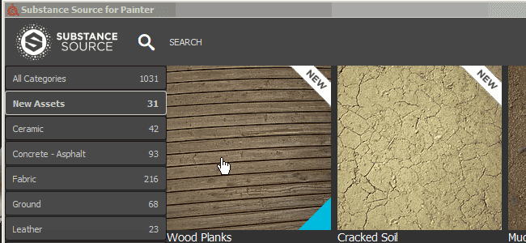
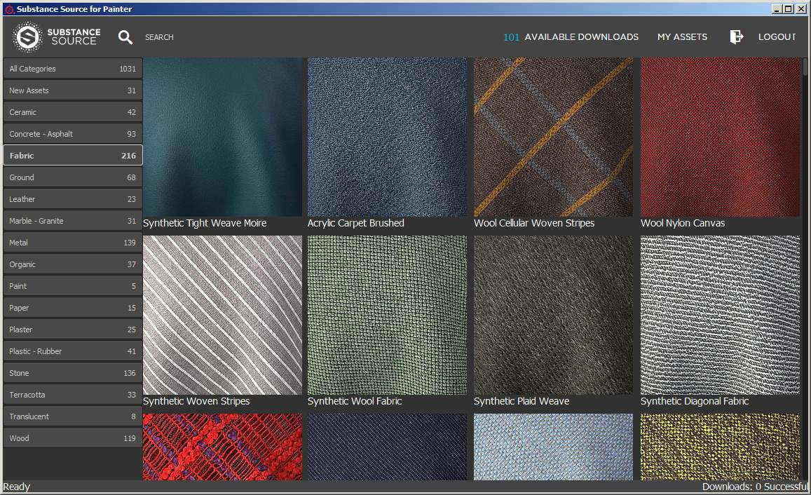
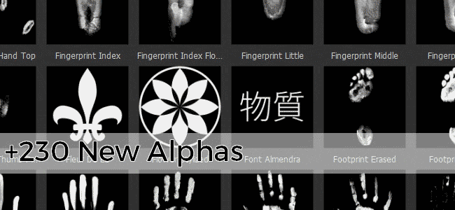
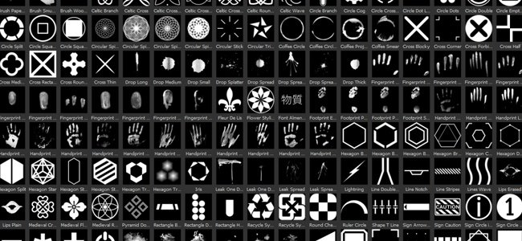
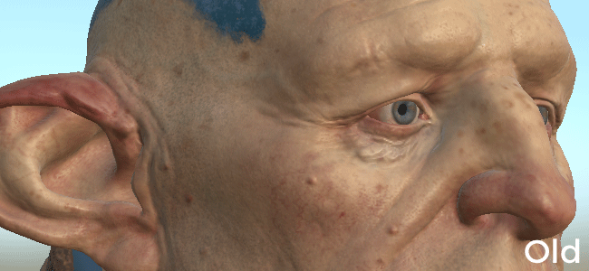

# Version 2017.1

Substance Painter changes its versioning number following the new Substance offer. For more details check out : <https://www.allegorithmic.com/welcome-to-substance>   
In this new version we wanted to focus on the content by providing a new plugin that allow to browse Substance Source and import materials directly into the shelf. We also added a lot of new assets to expand your creative possibilities.

Release Date : *20 June 2017*

## Major Features

### New plugin : Substance Source

With this new plugin it is now possible to **directly browse** our database of materials called **Substance Source** and download them **directly into the shelf**, ready to use and ready to work in your projects.  
To open Substance Source, simply click on the Substance Source logo **in the main toolbar** of the application. This should open a new window allowing to browse the library.

{width="650px"}

### New content : Alphas, Procedurals, Filters and more

In this new version we are adding **more than 300 new assets**. We added **sci-fi**, **geometric**, **medieval**, or even **Celtic** themed content in the alphas. It also includes a lot of **new brushes** and **scanned handprints/fingerprints**. We also provide some handy new filters such as the **MatFX Detail Edge Wear** which allow to generate **scratches** directly **from the normal information** painted on your mesh.

Here is the list of the new content :

* **4 New Fonts** (Japanese, Simplified Chinese, Typewriter, Segment)
* **230 New Alphas** (Mix of patterns and scanned images)
* **50 New Procedurals** (Mostly Fabric pattern for medieval and contemporary clothing)
* **2 New environment maps** (Mondarrain and Villa Nova Street)
* **9 New filters** (MatFX Detail Edge Wear, Clamp, HBAO, etc.)

We also updated some of the existing assets to make them work better, such as the **default environment map** which now look **less yellow :**

## Tutorial

The new content is covered in our latest video tutorial :

## Release Notes

### 2017.1

(Released 20 June 2017)

**Added :**

* &#91;Plugin&#93; New Substance Source plugin (allow to download assets in the shelf)
* &#91;Shelf&#93; 4 New Fonts (Japanese + Simplified Chinese, Typewriter, Segment)
* &#91;Shelf&#93; 230 New Alphas (Mix of patterns, brushes and fingerprint scans)
* &#91;Shelf&#93; 50 New Procedurals (Fabric patterns of medieval and contemporary clothing)
* &#91;Shelf&#93; 2 New environment maps (Mondarrain and Villa Nova Street)
* &#91;Shelf&#93; 9 New filters (MatFx Detail Edge Wear, Clamp, HBAO, etc.)
* &#91;Shelf&#93; Improved default Panorama environment map
* &#91;Shelf&#93; New Arnold 5 export presets
* &#91;Scripting&#93; Allow to import resource into the Shelf

**Known Issue :**

* &#91;Export&#93; Editing an export preset is very slow
