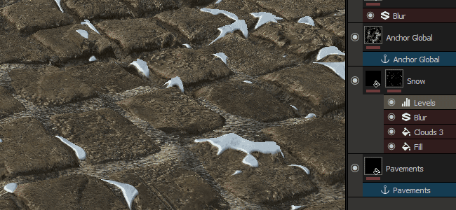

# Version 2017.2

**Substance Painter 2017.2** introduces a new powerful feature via the Anchor point system. It allows to create more advanced configurations in the layer stack which opens up a lot of new possibilities.

Release date : *27 July 2017*

## Major Features

### New Anchor point effect

**A new effect type** has been added to Substance Painter, next to the already existing such as **Filter** and **Level** you can now find the new **Anchor point**. This new effect allow to define a **location** in the **layer stack** that can then be **referenced** across the rest of the project in any other layers. This allow for example to use the height information from a layer into the mask of a layer just above this one, allowing a more natural blending (as illustrated by the gif above).

Because the Anchor works as an effect, in can be created in **many situations** : the **content** of a layer, the **mask** and even as a **pass-through** filter. The effect also work even if the layer where it is located is disabled. Note that the Anchor define only a location, not what you can retrieve from it. This information is defined where the reference to the anchor is created.

For more technical details and examples, see the dedicated page : [Anchor Point](../../../help/features/effects/anchor-point/anchor-point.md)

### New various improvements

Alongside the new Anchor point effect, we also worked on :

* The ability to rename some effects, such as the Fill and Paint
* New scripting functions, allowing to create a live-link with other applications such as Unity

## Tutorial

The new features are covered in details in our latest videos :

## Release Notes

### 2017.2

(Released 27 July 2017)

**Added :**

* &#91;Effect&#93; New Anchor Point that allow layer and mask referencing
* &#91;Layers&#93; Ability to rename Fill and Paint Effects
* &#91;Plugin&#93; Updated Substance Source plugin
* &#91;Scripting&#93; Allow to query Texture Set Resolution
* &#91;Scripting&#93; Allow to get the status of the Painting engine
* &#91;Performance&#93; Improved project loading and brush stamping optimizations

**Fixed :**

* &#91;Tool&#93; Performance issues when tweaking material parameters
* &#91;Engine&#93; Disappearing brush strokes when changing resolution (4K&gt;2K)
* &#91;3D View&#93; Tangent space is not synched with bakers
* &#91;Shelf&#93; Shelf path in the user documents isn't created automatically
* &#91;Shelf&#93; Make presets compatible with previous versions after an update
* &#91;Shader&#93; Non-PBR shader doesn't work anymore
* &#91;Bakers&#93; ID Map Baking fail with Match By Name enabled
* &#91;Sample&#93; Meet Mat sample project Texture Set names are incorrect
* Saving a project before creating a template returns write permission errors
