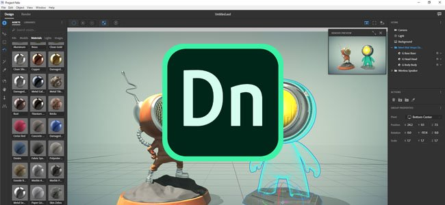
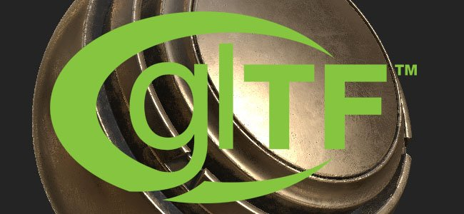
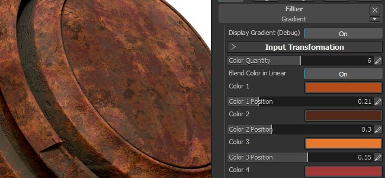
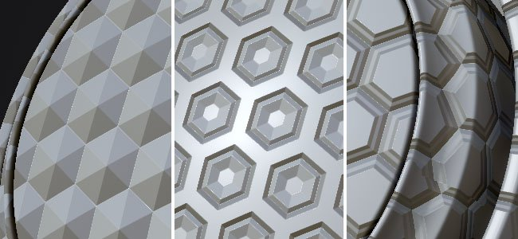
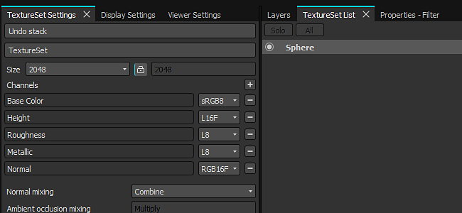

# Version 2017.3

**Substance Painter 2017.3** focus on new advanced export preset with the support of **Adobe Project Felix** and the open format **glTF**. This new release also focus on the user experience by improving the interface and adding an autosave plugin.

Release date : *28 September 2017*

## Major Features

### Adobe Standard Material export preset

One of the new exporter we include in this release is the support of the Adobe Standard Material, to be used with Adobe Dimension (previously Adobe Project Felix). We let you export the scene mesh and its textures to be imported into Project Felix in one click. To access it, simply choose "**Adobe Standard Material**" in the export textures window. For more information, see : [http://www.adobe.com/products/dimension.html](https://www.adobe.com/products/dimension.html)

You can also check out our blog post about it : <https://www.allegorithmic.com/blog/new-dimension-substance-ecosystem>

### glTF 2.0 export preset

We also added support for the **glTF** file format, with the export of the **scene mesh** and the **PBR textures** (metallic/roughness). To access it, simply choose "**glTF PBR Metal Roughness**" in the export textures window. **glTF** is an open-source file format directed by the Khronos group. You can view your glTF file from within **Windows 10** or simply use a WebGL viewer such as [**Babylon**](http://sandbox.babylonjs.com/).

For more information, see : <https://github.com/KhronosGroup/glTF>

### Autosave plugin

In this release we also included a new plug-in that has the possibility to **create backups** of the currently opened project. It creates a backup file on the side of the currently opened project.  
Because of this, we also added a "**Save As Copy**" entry in the File menu. The **autosave** can be stopped by disabling the plugin itself, its **settings** can be accessed **via the configure panel**. When the delay of the warning time is reached, a **progress bar** will appear below the button in the main toolbar, allowing to snooze it for a few minutes if needed (handy if you want to finish something before the backup).

If a backup is created but the project has not been saved (aka Untilted), the backup will be stored inside the **Documents/Allegorithmic/Substance Painter/autosave** folder. Otherwise, the backup will be next to the project itself (unless the path is overridden by the configuration panel).

### Improved gradient filter

The **gradient filter** has been completely revamped. Acting in a much more similar way to the **gradient map** node available in **Substance Designer**. It now supports up to **10 different colors**, with the possibility to specify **where the color is located inside **the gradient****, opening a lot of new doors. This allows to create more **advanced color patterns** but also to **remap heigh maps** and create **new shapes**.

The main slider (color quantity) defines the number of total color that are used to create the gradient. The button just below defines the color blending mode (sRGB or Linear). This is important if you want to have a proper blending between colors. For example blending a pure red and a pure green should give a nice yellow in-between. This won't be the case if the button is disabled (it will give a dark brown instead). When remapping the height or any other grayscale channels this button should be disabled to avoid doing the gamma conversion.

The button on top allow to replace the result of the filter with the gradient itself, to visualize the gradient in the 2D view.

### Interface and behavior improvements

In this release the **tabs** of the different docks of the application are now located **on the top instead of the bottom** of their respective windows. This choice was made to help the readability of the interface but also to be more consistant with other application. Following this change is the introduction of the **little cross** next to the tab title to **easily close it**. It is also possible to **right-click** on the tab to bring a **context menu** (that allow to close or undock the window). A shortcut to undock the window is to simply drag and drop the tab outside of the window area.

It is now also possible to **open projects** by simply drag and dropping them **into the viewport** from the file explorer. This also works with **mesh** files : drag and dropping a mesh file in an **empty viewport** will open the **new project window**, but doing it on an **already open project** will open the **project configuration dialog**, allowing to quickly **update a mesh**.

**Note** : if you have issus with the drag and drop, be sure to[ check our FAQ on the subject](../../../help/technical-support/technical-issues/miscellaneous-issues/impossible-drag-and-drop/impossible-to-drag-and-drop-files-into-the-shelf.md).

### Performance improvements

This version of Substance Painter also include a new and strong performance improvement regarding the way we manage the GPU memory (VRam). Uniform colors (such as fill layers) are now compressed into smaller textures, accelrating their transfert between the main memory and the GPU memory but also reducing their memory footprint and their computation time. This should be especially visible when opening huge projects and when reaching the limits of the GPU memory.

## Release Notes

### 2017.3.3

(Released 01 December 2017)

**Fixed :**

* &#91;Steam&#93; Version checker pop-up shouldn't be visible at launch
* &#91;Export&#93; PSD files have their groups locked when opened in Photoshop CS6

### 2017.3.2

(Released 20 November 2017)

**Added :**

* &#91;UI&#93; Improve new version dialog and add changelog
* &#91;UI&#93; Indicate if maintenance is expired in new version dialog
* &#91;License&#93; Update license system to handle Maintenance dates
* &#91;Export&#93; Rename Adobe Standard Material to Adobe Dimension

**Fixed :**

* &#91;Mac&#93; Painting leads to black squares and texture corruptions
* &#91;Engine&#93; Cache can sometimes disappear in the Viewport
* &#91;Engine&#93; Blocky artifacts appear when memory compression trigger
* &#91;Baking&#93; Strange error messages when baking specific meshes
* &#91;Export&#93; PSD are incorrectly written and are not recognized properly by Photoshop
* &#91;Layers&#93; It shouldn't be possible to copy/paste layer across multiple projects
* &#91;Substance&#93; UserData color space for Normal input is flipped in some cases
* &#91;Shelf&#93; Micro-normal in generators outputs inverted curvature
* &#91;Shelf&#93; HSL filter also affect alpha channel
* &#91;Linux&#93; Installation on Centos fails because of missing dependencies
* Installer doesn't remove all resources from previous install in certain cases

### 2017.3.1

(Released 26 October 2017)

**Added :**

* &#91;Export&#93; Allow to export the mesh from a project
* &#91;Shelf&#93; Remove "Sub-Shelf" from the tabs titles
* Save post-process settings in templates
* Make the TDR message more understandable
* Improve Settings window to report errors

**Fixed :**

* Crash when deleting several sub-shelves
* Crash when switching from a level to something else during an engine computation
* &#91;Mac&#93; Crash on Intel GPU during engine computations
* &#91;Mac&#93;&#91;Viewport&#93; Bad performances when dithering is enabled
* &#91;Mac&#93; MacOS 10.13 is recognized as "Unknown version" in the log file
* &#91;Baker&#93; Baking with a cage doesn't work anymore
* &#91;Layers&#93; Ctrl + C shortcut (copy action) doesn't work anymore
* &#91;Layers&#93; Pasting layers doesn't refresh UI with anchor's references
* &#91;Anchor&#93; Duplicate or Copy/Paste Layer with References breaks links
* &#91;Export&#93; 8K export can crash or deadlock application in some cases
* &#91;Export&#93; Multiple issues in generated glTF file format
* &#91;Import&#93; Re-importing a mesh with the same filename doesn't work anymore
* &#91;Plugin&#93; Auto-save window always appear on top of everything
* &#91;UI&#93; Infinite loop when you Press "Escape" on the TDR Dialog
* &#91;UI&#93; Reset UI display a second title bar on the shelf window

### 2017.3

(Released 28 September 2017)

**Added :**

* &#91;Export&#93; Allow to export mesh and textures for Adobe Project Felix
* &#91;Export&#93; Allow to export into glTF file format
* &#91;Engine&#93; Optimize textures size in VRAM by using block compression
* &#91;Viewport&#93; Be able to drag and drop a mesh or project in the viewport
* &#91;UI&#93; Improve warning message about TDR
* &#91;UI&#93; Log should be displayed only upon request
* &#91;UI&#93; Allow to clear the content of the log window
* &#91;UI&#93; Display warnings and errors in the status bar
* &#91;UI&#93; Display Tabs on top as in web browsers
* &#91;UI&#93; Improve "not paintable" context and messages
* &#91;UI&#93; Add a “save as copy” action in the file menu
* &#91;Layer&#93; Set default tiling setting to 1 by default
* &#91;Shelf&#93; Improved gradient filter to support 10 dynamic colors
* &#91;Shelf&#93; Add a space in the default query of the mini-shelf
* &#91;Shelf&#93; Add a 'Open in explorer' action for local resources in the shelf
* &#91;Shelf&#93; Add template and shader for Adobe Material Standard (Project Felix)
* &#91;Shelf&#93; Increase max tiling to 128 in Material Layering shaders
* &#91;Shelf&#93; Added sobel curvature for micro-details of Mask Generators
* &#91;Plugin&#93; Add autosave plugin with customizable time interval
* &#91;Scripting&#93; Add a "save as copy" function

**Fixed :**

* &#91;UI&#93; Layout is broken at the first launch
* &#91;Export&#93; PSD generated at export has format errors
* &#91;Export&#93; EXR always exports 8 bits height map
* &#91;Export&#93; Crash when exporting corrupted Additional maps
* &#91;Import&#93; Hard edges are not preserved on low poly meshes in some cases
* &#91;Import&#93; Improved error messages when importing meshes with issues
* &#91;Bakers&#93; ID Map Baking fail with Match By Name enabled
* &#91;Viewport&#93; Tangent space is not synched with bakers
* &#91;Effect&#93; Moving back a layer doesn't restore an anchor's reference
* &#91;Effect&#93; Refresh issue when creating a link in between two Masks with anchors
* &#91;Effect&#93; Masks anchors above mask shouldn't be listed
* &#91;Effect&#93; Extract Alpha setting from Anchors doesn't work
* &#91;Engine&#93; Mask inverts itself after first brush stroke
* &#91;Engine&#93; Crash when switching Texture Set on specific project
* &#91;Shelf&#93; Crash when deleting a preset which is in a project
* &#91;Shelf&#93; Typo in advanced Tri-Planar filter
* &#91;Shelf&#93; MG Mask Builder AO Noise Scale doesn't work properly
* &#91;Shelf&#93; MG Mask Builder has inverted curvature parameters
* &#91;Shelf&#93; Imported alphas generate a material sphere preview instead of a flat one
